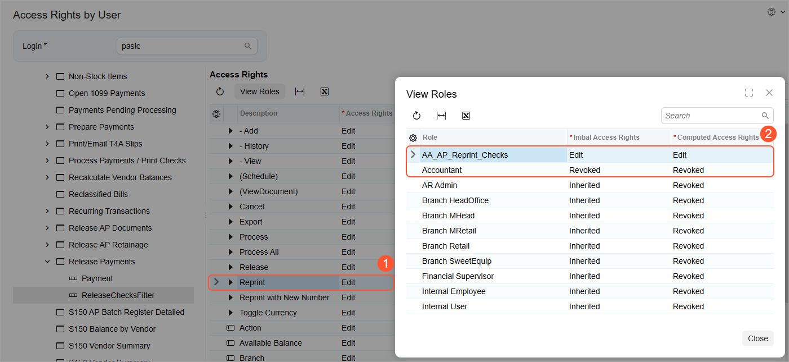

# User Roles: To Configure a Role with Granular Access {#_6220c9e5-41bb-4773-a6a8-75130311c399 .task}

In the following activity, you will learn how to create a role with granular access to a system object.

**Attention:** This activity is based on the *U100* dataset. If you are using another dataset or if any system settings have been changed in *U100*, these changes can affect the workflow of the activity and the results of the processing. To avoid issues, restore the *U100* dataset to its initial state.

## Story { .section}

Suppose that the CFO of the SweetLife Fruits &amp; Jams company has decided that only employees authorized by the CFO are allowed to reprint checks. To accommodate this requirement, you, as a system administrator, have decided to create a granular role that will give access to only the reprinting of checks and forbid access to this operation for all other roles. As a result, only users that have full access to accounts payable \(that is, only users that are assigned a role that gives this access\) can be authorized to reprint checks by being assigned this granular role on request from the CFO.

## Process Overview { .section}

You will use the [User Roles](SM_20_10_05.md) \(SM201005\) form to create the *AA\_AP\_Reprint\_Checks* role. You will use the *AA* prefix for the role to have it at the top of the list, combined with *\_AP* to indicate the functional area.

You will use the [Access Rights by Screen](SM_20_10_20.md) \(SM201020\) form to modify access to the *Reprint* and *Reprint With New Number* operations as follows:

1.  You will determine roles that also have full access to the [Release Payments](AP_50_52_00.md) \(AP505200\) form. You can exclude from consideration the roles that have the *View Only* and *Revoked* access to the form, as well as the roles that you are not using for managing user access \(for example, predefined roles delivered with Acumatica ERP\). In this activity, you can assume that the *Accountant* and *Purchasing Manager* roles meet these criteria. That is, these roles are used for user access management and have a restriction level higher than *View Only*.

    **Tip:** To form the list of roles that need modification, you can use filters for the table columns in the right pane of the form or create an advanced filter in the same pane.

2.  You will modify access rights to a form container for these roles. The *Reprint* and *Reprint With New Number* operations are stored in the *ReleaseChecksFilter* container of the [Release Payments](AP_50_52_00.md) form. Initially, all three roles will have the *Inherited* restriction level set to the container and form elements. Thus, before modifying access rights to the actions, you need to modify access to their parent container.

    You will change the restriction level set for the container from *Inherited* to a specific one. In this case, you will revoke access to the container for the newly created role \(*AA\_AP\_Reprint\_Checks*\), because you need to grant access to only two elements for this role. For the other two roles, you will set the *Delete* level for the container, because you need to restrict access to only two elements and allow access to all others.

    After you have modified access to the container, its nested elements will still have the *Inherited* restriction level. \(While calculating the restriction level for a user, the system takes into account only the roles for which an explicit level is set.\)

3.  Because you will use the granular role in combination with other roles, you will explicitly revoke access to the form elements for other two roles and grant access to the *Reprint* and *Reprint With New Number* operations for only the granular role.

The following table summarizes changes that need to be done. For details on how the system calculates a restriction level for a user, see [User Roles: Calculation of the Restriction Level for a User](User_Roles_User_Access_Level_Calculation.md).

|Roles / System Objects|Release Payments \(form\)|ReleaseChecksFilter \(form container\)|Reprint and Reprint with New Number \(form elements stored in the container\)|
|Initial Level|Configured Level|Initial Level|Configured Level|Initial Level|Configured Level|
|----------------------|-------------------------|--------------------------------------|-----------------------------------------------------------------------------|
|-------------|----------------|-------------|----------------|-------------|----------------|
|*AA\_AP\_Reprint\_Checks*|*Revoked*|*Revoked*|*Inherited*|*Revoked*|*Inherited*|*Edit*|
|*Accountant*|*Delete*|*Delete*|*Inherited*|*Delete*|*Inherited*|*Revoked*|
|*Purchasing Manager*|*Delete*|*Delete*|*Inherited*|*Delete*|*Inherited*|*Revoked*|

## System Preparation { .section}

Launch the Acumatica ERP website, and sign in to a company with the *U100* dataset preloaded. You should sign in as a system administrator, by using the *gibbs* username and the *123* password.

## Step 1: Creating a Role { .section}

To create a role, do the following:

1.  On the [User Roles](SM_20_10_05.md) \(SM201005\) form, add a new record.
2.  In the **Role Name** box, type `AA_AP_Reprint_Checks`.
3.  In the **Role Description** box, type `Role to reprint AP checks`.
4.  On the form toolbar, click **Save**.

## Step 2: Modifying the Access Rights to the Container and Form Elements { .section}

To modify the restriction levels for the container and form elements, do the following:

1.  Open the [Access Rights by Screen](SM_20_10_20.md) \(SM201020\) form.
2.  In the left pane, expand the **Payables** &gt; **Release Payments** nodes, and select the **ReleaseChecksFilter** node, which is the container for the reprint operations.
3.  In the right pane, do the following:
    -   In the **Access Rights** column, select *Revoked* for the *AA\_AP\_Reprint\_Checks* role.
    -   In the **Access Rights** column, select *Delete* for the *Accountant* and *Purchasing Manager* roles.
    -   On the form toolbar, click **Save**.
4.  In the left pane, expand the **ReleaseChecksFilter** node, and select the **Reprint** element.
5.  In the right pane, do the following:
    -   In the **Access Rights** column, select *Edit* for the *AA\_AP\_Reprint\_Checks* role.
    -   In the **Access Rights** column, select *Revoked* for the *Accountant* and *Purchasing Manager* roles.
6.  On the form toolbar, click **Save**.
7.  By performing similar actions to those in Instructions 3–5 of this step, modify the access rights for the **Reprint With New Number** element. \(That is, you need to select the **Reprint With New Number** node and then select *Edit* for the *AA\_AP\_Reprint\_Checks* role, and select *Revoked* for the *Accountant* and *Purchasing Manager* roles.\)

You have created and configured a role with access to only one form, and you have restricted the access to two operations on this form for other roles in the system that have access to this form.

## Step 3 \(Optional\): Verifying the Configured Access { .section}

To verify the configured access to the actions, do the following:

1.  Open the [Access Rights by User](SM_20_10_55.md) \(SM201055\) form.
2.  In the **Login** box, select *pasic*. This user is assigned the *Accountant* role.
3.  In the left pane, expand the **Payables** &gt; **Release Payments** nodes, and select the **ReleaseChecksFilter** node.
4.  In the right pane, verify that access to the **Reprint** and **Reprint With New Number** elements is revoked. That is, the *Revoked* option is displayed in the **Access Rights** column.
5.  Open the [Users](SM_20_10_10.md) \(SM201010\) form.
6.  In the **Login** box, select *pasic*.
7.  On the **Roles** tab, for the row with *AA\_AP\_Reprint\_Checks* in the **Role Name** column, select the check box in the **Selected** column.
8.  On the form toolbar, click **Save**.
9.  Open the [Access Rights by User](SM_20_10_55.md) form.
10. In the **Login** box, again select *pasic*. You have assigned this user the *AA\_AP\_Reprint\_Checks* role, and before that the user was already assigned the *Accountant* role.
11. In the left pane, expand the **Payables** &gt; **Release Payments** nodes, and select the **ReleaseChecksFilter** node.
12. In the right pane, verify that the *Edit* option is displayed in the **Access Rights** column for the **Reprint** and **Reprint with New Number** elements. This indicates that the user has access to these elements.
13. In the right pane, select the row with the **Reprint** element, and click **View Roles** on the table toolbar.
14. In the **View Roles** dialog box, which opens, review the list of roles assigned to the selected user and the access rights that each role has to the element, as shown in the following screenshot. The system gives the user the most permissive restriction level to the element \(see Item 1 in the screenshot\) among the roles with explicitly defined restriction levels \(Item 2\). The system ignores the roles with the *Inherited* level of access rights.

    

**Parent topic:**[Configuring User Roles](../UserGuide/User_Roles_Mapref.md)

