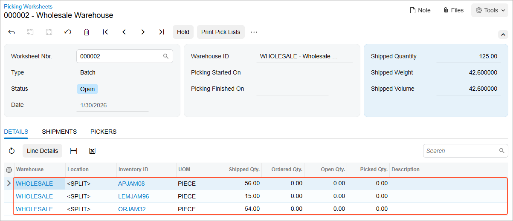
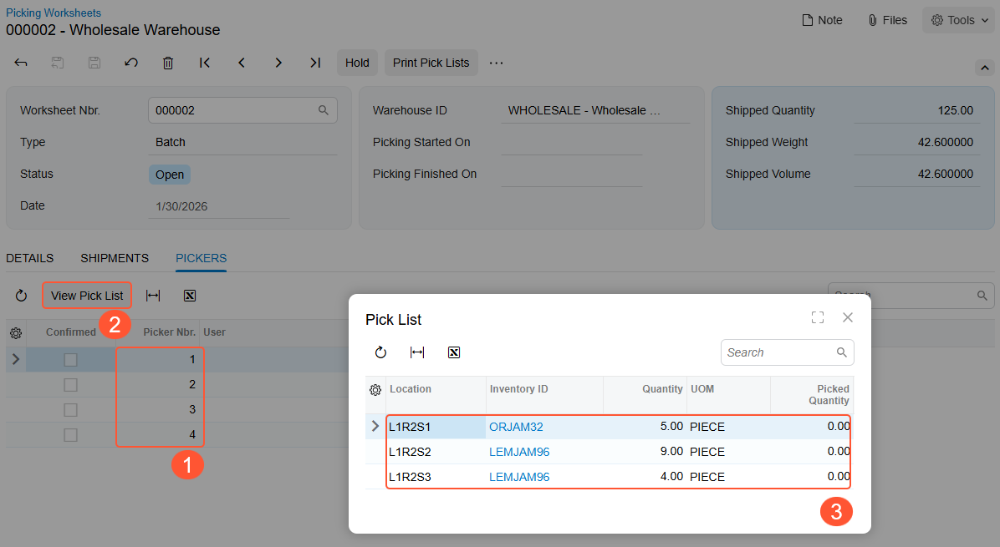
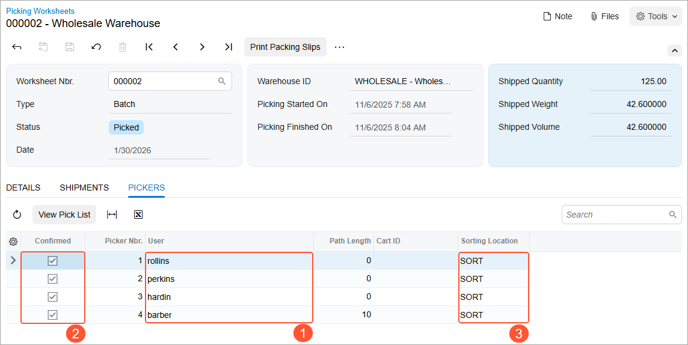
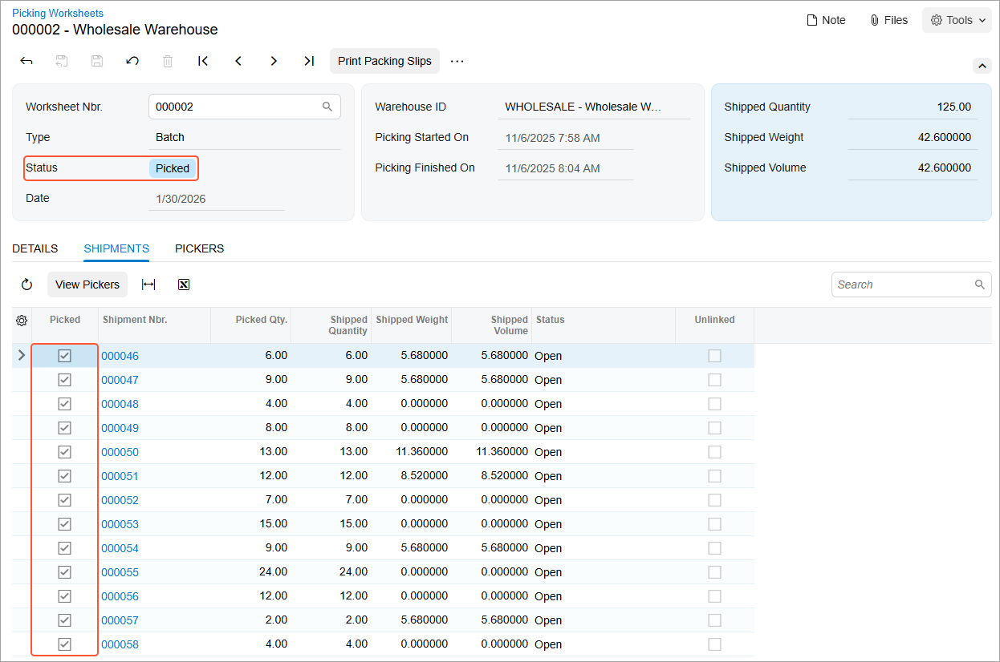

# Batch Picking: Process Activity {#_14cbf88c-7a75-4241-a360-5faf8f0473ab .task}

In the following activity, you will learn how to process shipments in a batch by using the [Pick, Pack, and Ship](SO_30_20_20.md) \(SO302020\) form.

**Attention:** This activity is based on the *U100* dataset. If you are using another dataset or if any system settings have been changed in *U100*, these changes can affect the workflow of the activity and the results of the processing. To avoid issues, restore the *U100* dataset to its initial state.

## Story { .section}

Suppose that the Wholesale warehouse of SweetLife was temporarily closed because of inventory counting. During this time, multiple orders have been entered into the system, and they now require shipping. The warehouse manager wants to speed up the process of picking and packing items by creating a batch picking worksheet and assigning this work to multiple pickers. After the warehouse workers pick the items and transfer them to a sorting location, a warehouse worker acting as the packer needs to pack the items and confirm the shipments.

You will perform these actions, acting as all of these employees.

## Configuration Overview { .section}

In the *U100* dataset, the following tasks have been performed to support this activity:

-   On the [Enable/Disable Features](CS_10_00_00.md) \(CS100000\) form, the following features have been enabled in the *Inventory and Order Management* group of features:
    -   *Warehouse Management*
    -   *Fulfillment*
    -   *Advanced Picking*
-   On the [Warehouses](IN_20_40_00.md) \(IN204000\) form, the *WHOLESALE* warehouse has been created. On the **Locations** tab, the following warehouse locations have been defined: *L1R2S1*, *L1R2S2*, *L1R2S3*, *L2R1S1*, *L2R1S3*, *L2R2S1*, *L2R2S3*, *L3R1S1*, *L3R1S2*, *L3R2S1*, *L3R2S2*, and *SORT*.
-   On the [Stock Items](IN_20_25_00.md) \(IN202500\) form, the following stock items have been created, and the corresponding barcodes have been defined:
    -   *ORJAM32*, which has the *OJ32* barcode
    -   *LEMJAM96*, which has the *LJ96* barcode
    -   *APJAM08*, which has the *AJ08* barcode
-   On the [Boxes](CS_20_76_00.md) \(CS207600\) form, the *MEDIUM* box has been defined.
-   On the [Sales Orders](SO_30_10_00.md) \(SO301000\) form, the following sales orders have been created for multiple customers: *000047*, *000048*, *000049*, *000050*, *000051*, *000052*, *000053*, *000054*, *000055*, *000056*, *000057*, *000058*, and *000059*.
-   On the [Shipments](SO_30_20_00.md) \(SO302000\) form, the following shipment documents have been created for these sales orders: *000046*, *000047*, *000048*, *000049*, *000050*, *000051*, *000052*, *000053*, *000054*, *000055*, *000056*, *000057*, and *000058*.

## Process Overview { .section}

In this activity, you will do the following:

1.  Acting as a warehouse manager, open the [Create Pick Lists](SO_50_30_50.md) \(SO503050\) form, select the shipments to be processed in a batch, specify the maximum number of pickers, and create a picking worksheet.
2.  You will do the following:
    1.  Acting as a picker, open the [Pick, Pack, and Ship](SO_30_20_20.md) \(SO302020\) form, switch to Pick mode, and scan the reference number of the batch pick list. Then you will scan the barcodes and quantities of the items being picked. After you finish picking, you will scan the barcode of the sorting location and confirm the pick list.
    2.  Acting as the second picker, do the same on the [Pick, Pack, and Ship](SO_30_20_20.md) form.
    3.  Acting as the third picker, do the same on the [Pick, Pack, and Ship](SO_30_20_20.md) form.
3.  Acting as a pack line operator, verify that batch is picked and prepare the printable packing slips on the [Picking Worksheets](SO_30_25_00.md) \(SO302500\) form.
4.  Acting as a packer, open the [Pick, Pack, and Ship](SO_30_20_20.md) form, switch to Pack mode, and scan the reference number of the batch pick list. Then you will scan the barcode of the box to which the items will be packed, and scan the barcodes and the quantity of items being packed. After all the items are packed, you will confirm the shipment.

**Tip:** In any working mode, you enter a command or barcode by typing it in the **Scan** box and pressing Enter. In production systems, you will scan the appropriate barcodes rather than manually entering them.

## System Preparation { .section}

Before you start the automated picking and packing operations, you need to perform the following instructions:

1.  Launch the Acumatica ERP website, and sign in to a company with the *U100* dataset preloaded. You should sign in as a warehouse manager with the *angelo* username and *123* password.
2.  In the info area at the upper-right corner of the top pane of the Acumatica ERP screen, make sure that the business date is set to *1/30/2026*. If a different date is displayed, click the Business Date menu button and select *1/30/2026* from the calendar. For simplicity, you'll create and process all documents in this activity using this business date.
3.  On the **Warehouse Management** tab of the [Sales Orders Preferences](SO_10_10_00.md) \(SO101000\) form, make sure that the **Display the Pick Tab** and the **Display the Pack Tab** check boxes are selected.

## Step 1: Preparing the Batch Picking Worksheet { .section}

As the warehouse manager, prepare the batch picking worksheet as follows:

1.  Open the [Create Pick Lists](SO_50_30_50.md) \(SO503050\) form, and in the **Action** box, select *Create Batch Pick Lists*.
2.  In the **Warehouse ID**, select *WHOLESALE*.
3.  In the **End Date** box, make sure *1/30/2026* is specified.
4.  In the **Max. Number of Pickers** box, type `4`.
5.  In the table, select the unlabeled check box in the rows of the shipments with reference numbers from *000046* through *000058*.
6.  On the form toolbar, click **Process**. The system processes the shipments. Close the **Processing** dialog box after the processing has completed.
7.  On the [Picking Worksheets](SO_30_25_00.md) \(SO302500\) form, review the details of the created worksheet of the *Batch* type with the *Open* status \(see the following screenshot\). The **Details** tab lists all the items that have to be packed in the batch. Notice that *&lt;SPLIT&gt;* is shown in the **Location** column for all lines, indicating that each item has to be picked from multiple locations. You can select any line and then click **Line Details** on the table toolbar to review the list of locations from which the items will be picked.

    

8.  Review the **Pickers** tab. The system has calculated the optimal path and determined that the appropriate number of pickers is four \(see Item 1\).
9.  Click the first line in the table, and click **View Pick List** \(Item 2\) on the table toolbar to review the items included in the pick list for the first picker \(Item 3\).

    

10. Sign out of the system.

## Step 2a: Picking the Items in a Batch \(Picker 1\) { .section}

Acting as the first picker in the picking worksheet, you will do the following:

1.  Sign in to the system as the first picker by using the *rollins* username and the *123* password.
2.  Open the [Pick, Pack, and Ship](SO_30_20_20.md) \(SO302020\) form, and make sure the **Pick** tab is opened.
3.  In the **Scan** box, enter `000001/1`, which is the reference number of the pick list for the first picker.
4.  Pick the first line by doing the following:
    1.  Enter `L1R2S1` to select the location from which you are picking items.
    2.  Enter `OJ32` to pick the item. \(*OJ32* is the barcode for *ORJAM32*, the 32-ounce jar of orange jam.\)

        The system highlights the line in bold and specifies *1* as the **Picked Quantity**.

    3.  Set the quantity of the item to `5` as follows:
        1.  On the form toolbar, click **Set Qty**. The system prompts you to enter the item quantity.
        2.  In the **Scan** box, enter `5`.
5.  Pick the second line by doing the following:
    1.  Enter `L1R2S2` to select the location from which you are picking items.
    2.  Enter `LJ96` to pick the item. \(*LJ96* is the barcode for *LEMJAM96*, the 96-ounce jar of lemon jam.\)
    3.  Set the quantity of the item to `9`.
6.  Pick the third line by doing the following:
    1.  Enter `L1R2S3` to select the location from which you are picking items.
    2.  Enter `LJ96` to pick the item.
    3.  Set the quantity to `4`.
7.  On the form toolbar, click **Confirm Pick List**.
8.  In the **Scan** box, enter `SORT` to specify the sorting location to which you have transferred the picked items.

    As the first picker, you have finished picking the items.

9.  Sign out of the system.

## Step 2b: Picking the Items in a Batch \(Picker 2\) { .section}

Acting as the second picker in the picking worksheet, you will do the following:

1.  Sign in to the system as the second picker by using the *perkins* username and the *123* password.
2.  Open the [Pick, Pack, and Ship](SO_30_20_20.md) \(SO302020\) form, and make sure the **Pick** tab is opened.
3.  In the **Scan** box, enter `000001/2`, which is the reference number of the pick list for the second picker. The system loads the shipment lines to the table on the **Pick** tab, and shows the reference number of the picking worksheet that is currently being processed in the **Worksheet Nbr.** box of the Summary area.
4.  Pick the first line by doing the following:
    1.  Enter `L2R1S1` to select the location from which you are picking items.
    2.  Enter `OJ32` to pick the item.

        The system highlights the line in bold and specifies *1* as the **Picked Quantity**.

    3.  Set the quantity of the item to `24` as follows:
        1.  On the form toolbar, click **Set Qty**. The system prompts you to enter the item quantity.
        2.  In the **Scan** box, enter `24`. The system highlights the line in green and inserts *8* as the **Picked Quantity**.
5.  Pick the second line by doing the following:
    1.  Enter `L2R1S3` to select the location from which you are picking items.
    2.  Enter `OJ32` to pick the item.
    3.  Set the quantity of this item to `13`.
6.  On the form toolbar, click **Confirm Pick List**.
7.  In the **Scan** box, enter `SORT` to specify the sorting location to which you have transferred the picked items.

    As the second picker, you have finished picking the items.

8.  Sign out of the system.

## Step 2c: Picking the Items in a Batch \(Picker 3\) { .section}

Acting as the third picker in the picking worksheet, you will do the following:

1.  Sign in to the system as the third picker by using the *hardin* username and the *123* password.
2.  Open the [Pick, Pack, and Ship](SO_30_20_20.md) \(SO302020\) form, and make sure the **Pick** tab is opened.
3.  In the **Scan** box, enter `000001/3`, which is the reference number of the pick list for the third picker.
4.  Pick the first line by doing the following:
    1.  Enter `L2R2S1` to select the location from which you are picking items.
    2.  Enter `AJ08` to pick the item. \(*AJ08* is the barcode for *APJAM08*, the 8-ounce jar of apple jam.\)

        The system highlights the line in bold and specifies *1* as the **Picked Quantity**.

    3.  Set the quantity of the item to `16` as follows:
        -   On the form toolbar, click **Set Qty**. The system prompts you to enter the item quantity.
        -   In the **Scan** box, enter `16`. The system highlights the line in green and inserts *24* as the **Picked Quantity**.
5.  Pick the second line by doing the following:
    1.  Enter `L2R2S3` to select the location from which you are picking items.
    2.  Enter `AJ08` to pick the item.
    3.  Set the quantity of the item to `13`.
6.  Pick the last line by doing the following:
    1.  Enter `L2R2S3` to select the location from which you are picking items.
    2.  Enter `LJ96` to pick the item.
    3.  Enter `LJ96` again to add second unit to the current line.
7.  On the form toolbar, click **Confirm Pick List**.
8.  In the **Scan** box, enter `SORT` to specify the sorting location to which you have transferred the picked items.

    As the third picker, you have finished picking the items.

9.  Sign out of the system.

## Step 2d: Picking the Items in a Batch \(Picker 4\) { .section}

Acting as the fourth picker in the picking worksheet, you will do the following:

1.  Sign in to the system as the fourth warehouse worker by using the *barber* username and the *123* password.
2.  Open the [Pick, Pack, and Ship](SO_30_20_20.md) \(SO302020\) form, and make sure the **Pick** tab is opened.
3.  In the **Scan** box, enter `000001/4`, which is the reference number of the pick list for a fourth picker.
4.  Pick the first line by doing the following:
    1.  Enter `L3R1S1` to select the location from which you are picking items.
    2.  Enter `AJ08` to pick the item.

        The system highlights the line in bold and inserts *1* as the **Picked Quantity**.

    3.  Set the quantity of the item to `10` as follows:
        -   On the form toolbar, click **Set Qty**. The system prompts you to enter the item quantity.
        -   In the **Scan** box, enter `10`. The system highlights the line in green and inserts *10* as the **Picked Quantity**.
5.  Pick the second line by doing the following:
    1.  Enter `L3R1S2` to select the location from which you are picking items.
    2.  Enter `AJ08` to pick the item.
    3.  Set the quantity of this item to `13`.
6.  Pick the third line by doing the following:
    1.  Enter `L3R2S1` to select the location from which you are picking items.
    2.  Enter `OJ32` to pick the item.
    3.  Set the quantity of this item to `12`.
7.  Pick the last line by doing the following:
    1.  Enter `L3R2S2` to select the location from which you are picking items.
    2.  Enter `AJ08` to pick the item.
    3.  Set the quantity of this item to `4`.
8.  On the form toolbar, click **Confirm Pick List**.
9.  In the **Scan** box, enter `SORT` to specify the sorting location to which you have transferred the picked items.

    As the fourth picker, you have finished picking the items.

10. Sign out of the system.

You have picked all the items for the picking worksheet, and now you can proceed with packing the shipments.

## Step 3: Preparing the Packing Slips { .section}

You will now act as the pack line operator who prepares packing slips for the processed shipments. Do the following:

1.  Sign in to the system as a pack line operator by using the *rueb* username and the *123* password.
2.  On the [Picking Worksheets](SO_30_25_00.md) \(SO302500\) form, open the batch picking worksheet, and review the **Pickers** tab. The usernames of the workers who performed the picking operations are shown in the **User** column \(Item 1 below\); the selected check boxes in each line of the **Confirmed** \(Item 2\) column indicate that each picker has confirmed the completion of the picking. The values in the **Sorting Location** column \(Item 3\) indicate that the pickers have finished the picking and taken the picked items to the sorting location.

    

3.  Review the **Shipments** tab, as shown in the following screenshot. All shipments have been picked, as the selected check boxes in the **Picked** column indicate; the picking worksheet now is assigned the *Picked* status.

    

4.  On the form toolbar, click **Print Packing Slips**. The system opens the printable packing slips on the [Batch Packing Slip](SO_64_40_05.md) \(SO644005\) report form. In the production system, you would print the packing slips and give them to a warehouse worker who will perform packing of shipments.
5.  Sign out of the system.

## Step 4: Packing Items for a Shipment in the Batch { .section}

At this point in the batch picking, all of the shipments from the batch can be packed. For the purposes of this activity, you will pack just one of the shipments, acting as a warehouse worker who handles packing.

To pack this shipment, do the following:

1.  Sign in to the system as a warehouse worker who will perform packing operations by using the *sauer* username and the *123* password.
2.  Open the [Pick, Pack, and Ship](SO_30_20_20.md) \(SO302020\) form and make sure that Pack mode is active.
3.  In the **Scan** box of the Summary area, enter `000046`, which is the reference number of a shipment ready for packing.
4.  Enter `MEDIUM` to select the box into which you are packing the items.
5.  Enter `AJ08` to select the item being packed. The system highlights the first line of the shipment in bold and specifies *1* as the **Packed Quantity**.
6.  Set the quantity of this item to `4` as follows:
    1.  On the form toolbar, click **Set Qty**. The system prompts you to enter the item quantity.
    2.  In the **Scan** box, enter `4`. The system highlights the first line of the shipment in green and inserts 4 as the **Packed Quantity**, indicating that four 8-ounce jars of apple jam have been packed into the selected box.
7.  Enter `LJ96` to select another item being packed to the current box
8.  Enter `LJ96` again to pack one more unit of this item.
9.  On the form toolbar, click **Confirm Shipment**.

**Parent topic:**[Automated Fulfillment of Orders with Batch Picking](../UserGuide/WMS_Batch_Picking_Mapref.md)

