# Working Modes and Supported Commands {#_148b8b0f-81c5-4438-ada1-916e833c7ff1 .concept}

This topic lists the commands that can be used to quickly switch to another mode or to perform an action in the current mode.

The listed commands can be used on the following forms:

-   [Scan Warehouse Path](IN_20_40_25.md) \(IN204025\)
-   [Scan and Receive](IN_30_10_20.md) \(IN301020\)
-   [Scan and Transfer](IN_30_40_20.md) \(IN304020\)
-   [Scan and Issue](IN_30_20_20.md) \(IN302020\)
-   [Receive and Put Away](PO_30_20_20.md) \(PO302020\)
-   [Pick, Pack, and Ship](SO_30_20_20.md) \(SO302020\)
-   [Scan and Count](IN_30_50_20.md) \(IN305020\)
-   [Item Lookup](IN_20_25_20.md) \(IN202520\)
-   [Storage Lookup](IN_40_90_20.md) \(IN409020\)
-   [Scan Labor](AM_30_20_20.md) \(AM302020\)
-   [Scan Materials](AM_30_00_30.md) \(AM300030\)
-   [Scan Move](AM_30_20_10.md) \(AM302010\)

Some commands can be used on any form or in any mode, while other commands are restricted to a specific form or mode. The applicable forms are specified in the description of each table.

**Tip:** In any working mode, you enter a command or barcode by typing it in the **Scan** box and pressing Enter. In production systems, you will scan the appropriate barcodes rather than manually entering them.

|Command|Description of Performed Operation|Barcode|
|-------|----------------------------------|-------|
|`@count`|Opens the [Scan and Count](IN_30_50_20.md) \(IN305020\) form and switches to Scan and Count mode.||
|`@inissue`|Opens the [Scan and Issue](IN_30_20_20.md) \(IN302020\) form and switches to Scan and Issue mode.||
|`@inreceive`|Opens the [Scan and Receive](IN_30_10_20.md) \(IN301020\) form and switches to Scan and Receive mode.||
|`@intransfer`|Opens the [Scan and Transfer](IN_30_40_20.md) \(IN304020\) form and switches to Scan and Transfer mode.|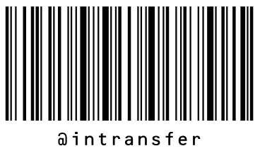|
|`@item`|Opens the [Item Lookup](IN_20_25_20.md) \(IN202520\) form and switches to Item Lookup mode.||
|`@pack`|Opens the [Pick, Pack, and Ship](SO_30_20_20.md) form and switches to Pack mode.

 This command cannot be used if the **Display the Pack Tab** check box is cleared on the **Warehouse Management** tab \(**Fulfillment Workflow** section\) of the [Sales Orders Preferences](SO_10_10_00.md) form.

|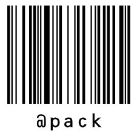|
|`@pick`|Opens the [Pick, Pack, and Ship](SO_30_20_20.md) \(PO302020\) form and switches to Pick mode.

 This command cannot be used if the **Display the Pick Tab** check box is cleared on the **Warehouse Management** tab \(**Fulfillment Workflow** section\) of the [Sales Orders Preferences](SO_10_10_00.md) \(SO101000\) form.

||
|`@poreturn`|Opens the [Receive and Put Away](PO_30_20_20.md) \(PO302020\) form and switches to Return mode.

 This command cannot be used if the **Display the Return Tab** check box is cleared on the **Warehouse Management** tab \(**Receiving Workflow** section\) of the [Purchase Orders Preferences](PO_10_10_00.md) \(PO101000\) form.

||
|`@potransfer`|Opens the [Receive and Put Away](PO_30_20_20.md) \(PO302020\) form and switches to Receive Transfer mode.

 This command cannot be used if the **Display the Receive Transfer Tab** check box is cleared on the **Warehouse Management** tab \(**Receiving Workflow** section\) of the [Purchase Orders Preferences](PO_10_10_00.md) \(PO101000\) form.

||
|`@putaway`|Opens the [Receive and Put Away](PO_30_20_20.md) form and switches to Put Away mode.

 This command cannot be used if the **Display the Put Away Tab** check box is cleared on the **Warehouse Management** tab \(**Receiving Workflow** section\) of the [Purchase Orders Preferences](PO_10_10_00.md) form.

|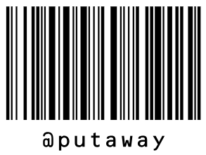|
|`@receive`|Opens the [Receive and Put Away](PO_30_20_20.md) \(PO302020\) form and switches to Receive mode.

 This command cannot be used if the **Display the Receive Tab** check box is cleared on the **Warehouse Management** tab \(**Receiving Workflow** section\) of the [Purchase Orders Preferences](PO_10_10_00.md) \(PO101000\) form.

||
|`@ship`|Opens the [Pick, Pack, and Ship](SO_30_20_20.md) form and switches to Ship mode. This mode is not available in the Acumatica mobile app.

 This command cannot be used if the **Display the Ship Tab** check box is cleared on the **Warehouse Management** tab \(**Fulfillment Workflow** section\) of the [Sales Orders Preferences](SO_10_10_00.md) form.

||
|`@soreturn`|Opens the [Pick, Pack, and Ship](SO_30_20_20.md) form and switches to Return mode.

 This command cannot be used if the **Display the Return Tab** check box is cleared on the **Warehouse Management** tab \(**Fulfillment Workflow** section\) of the [Sales Orders Preferences](SO_10_10_00.md) \(SO101000\) form.

||
|`@storage`|Opens the [Storage Lookup](IN_40_90_20.md) \(IN202520\) form and switches to Storage Lookup mode.|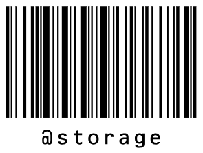|

|Command|Description of Performed Operation|Barcode|
|-------|----------------------------------|-------|
|`*ok`|Confirms the entered data or the current operation.||
|`*reset`|Clears the unconfirmed lines and returns to the first step in the mode, keeping the current document selected.||
|`*cancel`|Clears the unconfirmed lines and returns to the initial step of the mode \(such as scanning a document number or a warehouse\).||
|`*save`|Saves your progress on the current operation. On most of the forms, either you do not need to save changes or the system saves the changes automatically.||
|`*qty`|Enables Quantity Editing mode for a confirmed line.

 **Attention:** This command is not available on the following forms:

-   [Scan Warehouse Path](IN_20_40_25.md) \(IN204025\)
-   [Item Lookup](IN_20_25_20.md) \(IN202520\)
-   [Storage Lookup](IN_40_90_20.md) \(IN409020\)

||
|`*remove`|Activates Remove mode, in which the user reduces the scanned quantity of an item.**Attention:** This command is not available on the following forms:

-   [Scan Warehouse Path](IN_20_40_25.md) \(IN204025\)
-   [Item Lookup](IN_20_25_20.md) \(IN202520\)
-   [Storage Lookup](IN_40_90_20.md) \(IN409020\)

||

|Command|Description of Performed Operation|Barcode|
|-------|----------------------------------|-------|
|`*next`|Lets you enter the path value to assign to the next scanned warehouse location.||

|Mode|Command and Barcode|Description of Performed Operation|
|----|-------------------|----------------------------------|
|-   **Receive**
-   **Return**
-   **Receive Transfer**
-   **Putaway**

|`*release`

|Releases the following documents and transactions:

 -   Purchase receipt with the *Receipt* type in Receive mode
-   Purchase receipt with the *Transfer Receipt* type in Receive Transfer mode
-   Purchase receipt with the *Return* type in Return mode
-   Inventory transfer related to the currently processed purchase receipt in Putaway mode

|
|-   **Receive**
-   **Receive Transfer**

|`*confirm`

|Changes the status of the purchase receipt to *Received*. If you use this command, you can release the purchase receipt only on the [Purchase Receipts](PO_30_20_00.md) \(PO302000\) form.|
|**Receive**|`*complete*polines`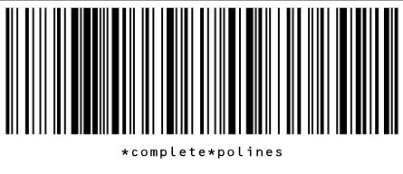

|Releases the purchased receipt and completes all lines of the related purchase order, regardless of whether they were received in full.|

|Mode|Command and Barcode|Description of Performed Operation|
|----|-------------------|----------------------------------|
|**Pick**

 Paper-based: Single shipment

|`*confirm*pick`

|Marks as picked the document which is currently being processed.|
|**Pick**

 -   Paper-based: Wave and Batch pick lists
-   Paperless: All

|`*confirm*pick`

|Confirms the pick list which is currently being processed.|
|**Pick** and **Pack**

 -   Paper-based: Single shipments
-   Paperless: *Single-Shipment* pick lists

 **Return** and **Ship**

 Paper-based: Single shipments

|`*confirm*shipment`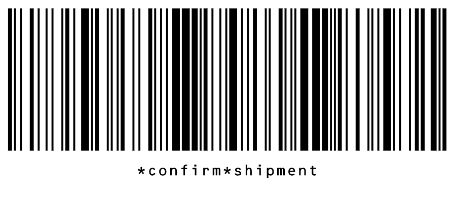

|Confirms the document which is currently being processed.|
|**Pick**

 Paperless picking: All

|`*next*picklist`

|Suggests another pick list.

 The system uses the last scanned location as the current location of the picker to suggest the nearest pick list.

|
|**Pick**

 Paperless picking: All

|`*confirm*pick*and*next`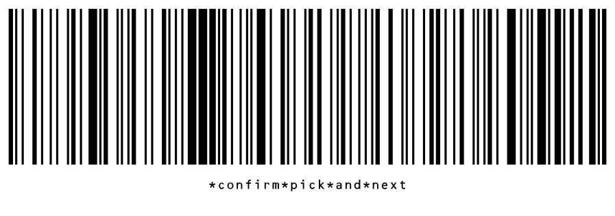

|Confirms the current pick list and suggests another pick list.

 The system uses the last scanned location as the current location of the picker to suggest the nearest pick list.

|
|**Pick**

 Paperless picking: All

|`*confirm*line*qty`

|The system confirms the line with an incomplete quantity. You can return to this line later to pick the remaining quantity.|
|**Pick**

 -   Paper-based: Wave pick lists
-   Paperless picking: *Single-Shipment* and *Wave* shipments and pick lists

|`*add*tote`

|Adds a tote to a pick list.|
|**Pack**

 -   Paper-based: Single shipments
-   Paperless: *Single-Shipment* pick lists

|`*package*confirm`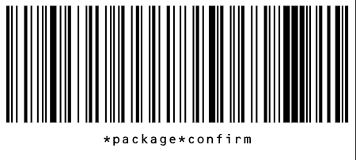

|Confirms the package.|
|**Pack**

 -   Paper-based: Single shipments
-   Paperless: *Single-Shipment* pick lists

|`*pack*all*into*box`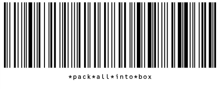

|Moves all items that are not packed yet to the scanned package.|
|**Pack**-only

 Paperless: *Single-Shipment* pick lists

|`*confirm*pack`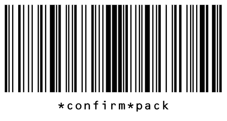

|Confirms the package in the paperless pack-only workflow.|
|**Pack**-only

 Paperless: *Single-Shipment* pick lists

|`*confirm*pack*and*next`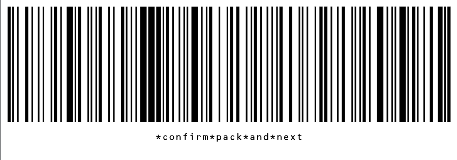

|Confirms the package in the paperless pack-only workflow and suggests the next pick list.|
|**Ship Mode**

 Paper-based: Single shipments

|`*get*labels`

|Gets the return labels.|
|**Ship Mode**

 Paper-based: Single shipments

|`*refresh*rates`

|Refreshes rates of carriers.|

|Command|Description of Performed Operation|Barcode|
|-------|----------------------------------|-------|
|`*cart*in`|Enables Cart Loading mode.|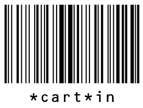|
|`*cart*out`|Enables Cart Unloading mode.||

|Command|Description of Performed Operation|Barcode|
|-------|----------------------------------|-------|
|`*release`|Releases the inventory transaction that is being processed.||

|Command|Description of Performed Operation|Barcode|
|-------|----------------------------------|-------|
|`*release`|Releases the production transaction that is being processed.||

|Command|Description of Performed Operation|Barcode|
|-------|----------------------------------|-------|
|`*confirm`|Confirms a physical inventory document.||

|Command|Description of Performed Operation|Barcode|
|-------|----------------------------------|-------|
|`*switch*ls`|Displays or hides the **Lot/Serial Nbr.** and **Expiration Date** columns on the **Storage** tab of the [Storage Lookup](IN_40_90_20.md) \(IN409020\) form. When you enable the display of lot or serial numbers, the system shows each lot or serial number in a separate line.||

