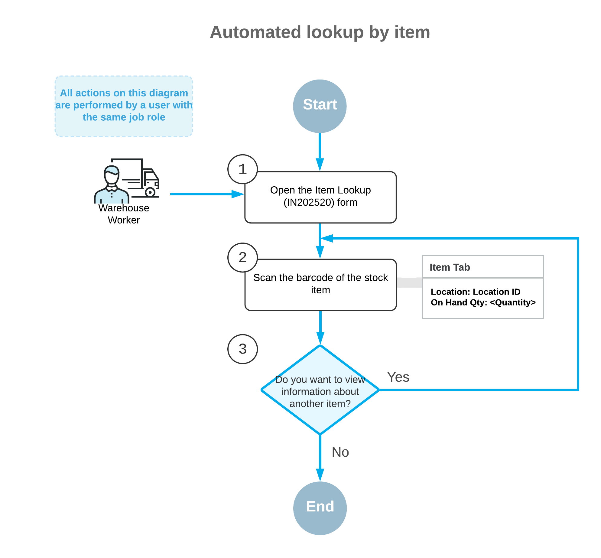
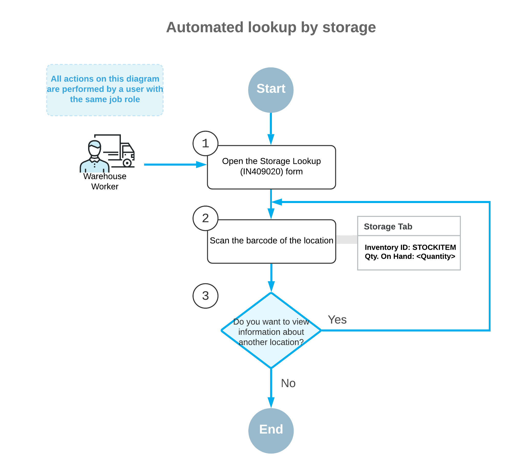

# Item and Storage Lookup: General Information {#_b5b608de-139a-4d93-87e3-8ae667ea513f .concept}

In everyday work of warehouse workers, there could be a need to find some items in the system or get information about items stored in a particular location \(storage\). If the *Inventory Operations* feature is enabled on the [Enable/Disable Features](CS_10_00_00.md) \(CS100000\) form, in Acumatica ERP, you can search for items by scanning barcodes of items and locations by using a barcode scanner or a mobile device with a scanning option, as described in this topic.

## Learning Objectives { .section}

In this chapter, you will do the following:

-   Search for information about stock items by scanning an item barcode with a barcode scanner or a mobile device with a scanning option
-   Search for the list of items stored in a particular location by scanning a location barcode with a barcode scanner or a mobile device with a scanning option

## Applicable Scenarios { .section}

You can use automated lookup if your organization uses barcode scanners or mobile devices with a scanning option to perform warehouse operations and all stock items and locations in warehouses are barcoded. You can look up for items and locations in either of the following cases:

-   In a warehouse, you find a stock item that is not in a location and you would like to find an appropriate location for the item.
-   You would like to view the list of stock items stored in a particular warehouse location as it is registered in the system.

## Item Lookup { .section}

As you perform any of the warehouse operations, you may need to search for items. For example, you might find a box that is not in a location and want to find out what is in the box and where the box should be placed. To get information about a particular item by scanning the item barcode, you use the [Item Lookup](IN_20_25_20.md) \(IN202520\) form.

On this form, you can find information about the location where the item is stored, the quantity of items in the location or locations, and other information about the item \(such as item class and base units of measure\).

The general process of item lookup is shown in the following diagram.

## Location Lookup { .section}

If you want to view the list of items in a specific location, you can scan the barcode of the location when the [Storage Lookup](IN_40_90_20.md) \(IN409020\) form is opened on your mobile device. On this form, you can see the list of items and their quantities stored in the location.

The general process of the lookup by location is shown in the following diagram.

**Parent topic:**[Automated Item and Storage Lookup](../UserGuide/WMS_Item_and_Storage_Lookup_Mapref.md)

