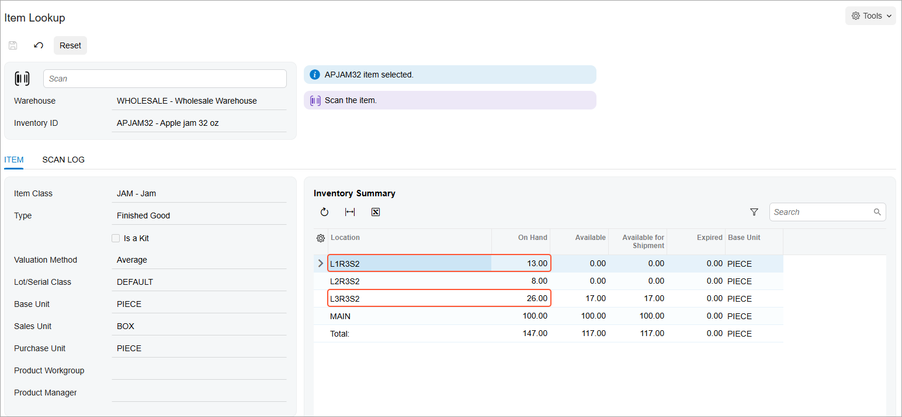

# Item and Storage Lookup: Process Activity {#_1cd56287-5e87-40df-a728-321adad90a40 .task}

In this activity, you will learn how to search for information about stock items by using the [Item Lookup](IN_20_25_20.md) \(IN202520\) form and for information about items stored in a particular location by using the [Storage Lookup](IN_40_90_20.md) \(IN409020\) form.

**Attention:** This activity is based on the *U100* dataset. If you are using another dataset or if any system settings have been changed in *U100*, these changes can affect the workflow of the activity and the results of the processing. To avoid issues, restore the *U100* dataset to its initial state.

## Story { .section}

Suppose that you are a warehouse worker in the Wholesale warehouse of the SweetLife Fruits &amp; Jams company. When you walk around the warehouse you find items and boxes that have been inappropriately placed on the floor or on tables. Your work task is to find out what these items are and where they should be stored, so that you can move the items to the appropriate storage.

## Configuration Overview { .section}

In the *U100* dataset, the following tasks have been performed to support this activity:

-   On the [Enable/Disable Features](CS_10_00_00.md) \(CS100000\) form, the following features have been enabled in the *Inventory and Order Management* group of features:
    -   *Multiple Warehouse Locations*
    -   *Warehouse Management*
    -   *Inventory Operations*
-   On the [Warehouses](IN_20_40_00.md) \(IN204000\) form, the *WHOLESALE* warehouse has been created. On the **Locations** tab, the following warehouse locations have been defined: *MAIN*, *L1R3S2*, *L2R3S2*, and *L3R3S2*.
-   On the [Stock Items](IN_20_25_00.md) \(IN202500\) form, the *APJAM32* stock item, which has the *AJ32B* alternate ID with the *Barcode* type defined on the **Cross-Reference** tab, has been created.

    **Tip:** For simplicity, in this activity, the alternate ID will be further referred to as *barcode*.

## Process Overview { .section}

In this activity, acting as a warehouse worker, you will do the following:

1.  Look up an item by scanning the item barcode on the [Item Lookup](IN_20_25_20.md) \(IN409020\) form and review information about the item, such as the location and availability.
2.  Search for a list of the items stored in a particular location by using the [Storage Lookup](IN_40_90_20.md) \(IN409020\) form.

**Tip:** In any working mode, you enter a command or barcode by typing it in the **Scan** box and pressing Enter. In production systems, you will scan the appropriate barcodes rather than manually entering them.

## System Preparation { .section}

Before you start looking up items, sign in to a company with the *U100* dataset preloaded as a warehouse worker with the *perkins* username and the *123* password.

## Step 1: Looking Up an Item by Scanning the Item Barcode { .section}

Suppose that as you are walking through the warehouse, you notice a box on the floor near some shelves; the box has 10 apple jars, each 32 ounces. You do not see other warehouse workers nearby, so you decide to find out what this box contains and where it should be placed. Do the following:

1.  Open the [Item Lookup](IN_20_25_20.md) \(IN202520\) form.
2.  In the **Scan** box, type `AJ32B`, which is the barcode affixed to the box you found, and press Enter. Notice that *APJAM32* item \(for which this barcode is specified in the item settings\) is shown in the **Inventory ID** box.
3.  In the table on the **Item** tab, notice that the item is stored in the following locations: *MAIN*, *L1R3S2*, *L2R3S2*, and *L3R3S2*, as shown in the following screenshot.

    

    You know the box did not come from the *MAIN* location because it is a receiving location, and you first need to make sure that the box was not taken from any of the racks with sorted items. Because you know that the box you found contains 10 jars, this box could have been taken from the *L1R3S2* or *L3R3S2* locations, as shown in the previous screenshot. \(The *L2R3S2* location contains only 8 jars of this item, so the box definitely is not from this shelf.\)

Now you need to find out if the *L1R3S2* or *L3R3S2* locations contain less jam than the quantity that is recorded in the system.

## Step 2: Looking Up Items Stored in a Location { .section}

Suppose that you have counted the quantities of boxes and jars of the *APJ32B* item on the *L1R3S2* and *L3R3S2* shelves. You have found out that the *L1R3S2* shelf contains one box of 10 jars and 3 single jars; the *L3R3S2* contains one box of 10 jars and 6 single jars. To find out if the *L1R3S2* or *L3R3S2* location contain less jam than the quantity that is recorded in the system, do the following:

1.  Open the [Storage Lookup](IN_40_90_20.md) \(IN409020\) form.
2.  In the **Scan** box, enter `L1R3S2`.
3.  In the table on the **Storage** tab, you can see that the on-hand quantity of the *APJAM32* item is *13*, which corresponds to one box of 10 jars and 3 separate jars. All the specified items are on the shelf, so the box you have found is not from this shelf.
4.  In the **Scan** box, enter `L3R3S2`.
5.  In the table on the **Storage** tab, you can see that the on-hand quantity of the *APJAM32* item is *26*, which corresponds to two boxes of 10 jars each and 6 separate jars. You have found only one box on this shelf, so the box you have found on the floor should be placed on this shelf.

**Parent topic:**[Automated Item and Storage Lookup](../UserGuide/WMS_Item_and_Storage_Lookup_Mapref.md)

