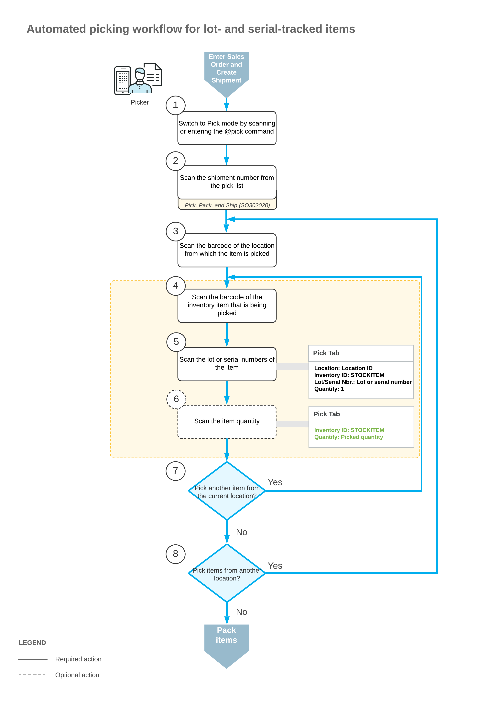
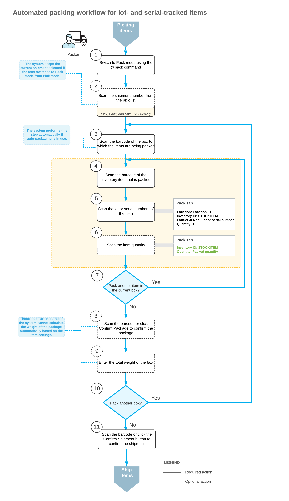

# Automated Operations with Lot- and Serial-Tracked Items: Picking and Packing Items {#_26399b30-72a2-4c3d-8249-8f3505f17ff0 .concept}

If the *Lot and Serial Tracking* feature is enabled on the [Enable/Disable Features](CS_10_00_00.md) \(CS100000\) form and the tracking of stock items by lot or serial number has been configured in the system, when you pick and pack lot- or serial-tracked items by using the [Pick, Pack, and Ship](SO_30_20_20.md) \(SO302020\) form or the corresponding screen in the Acumatica mobile app, the system may prompt you to enter the lot or serial number during this process.

In this topic, you will read about the workflow for the automated picking and packing of lot- and serial-tracked inventory items in Acumatica ERP. The workflow in this topic is based on the assumption that your system has the recommended configuration described in [Automated Operations with Lot- and Serial-Tracked Items: Implementation Checklist](WMS_LotSerial_Tracking_Implem_Checklist.md).

## Workflow for the Automated Picking of Lot- and Serial-Tracked Items { .section}

The automated processing of picking lot- or serial-tracked items involves the actions shown in the following diagram.

To process the picking of lot- or serial-tracked items in Pick mode, you perform the following steps:

1.  *Switch to Pick mode*.

    You open the [Pick, Pack, and Ship](SO_30_20_20.md) \(SO302020\) form \(or the corresponding screen in the Acumatica mobile app\) and switch to Pick mode by scanning or entering the `@pick` barcode.

2.  *Scan the shipment number*.

    To start the automated processing, you scan the reference number of the shipment to be processed. The system displays the lines of the scanned document in the table and inserts the reference number of the document that is currently selected for processing in the **Shipment Nbr.** box.

3.  *Scan the location barcode*.

    When you scan the barcode of the location from which the item is picked, the system searches for the location in the lines of the document that is currently selected.

4.  *Scan the item barcode*.

    When you scan the item barcode of the picked item, the system searches for the item in the lines of the currently selected document.

5.  *Scan the lot or serial number of the item*.

    You scan the lot or serial number of the item being picked. The system displays the picked quantity in the **Picked Quantity** column and highlights the line \(in bold if the line has been picked partially, or in green if the line has been picked in full\). If the UOM defined by the barcode of the scanned item corresponds to a non-base unit of measure, the system converts the item quantity defined by this barcode to the picked quantity in the base unit of measure for this item.

    You can scan all lot or serial numbers of an item one by one.

6.  Optional: *Scan the item quantity*.

    To change the picked quantity in the line that is currently being processed, you switch to Quantity Editing mode by scanning or entering the `*qty` barcode, and manually enter the quantity in the UOM defined by the barcode of the scanned item.

7.  *Pick another line*.

    If another item needs to be picked for the currently selected location, you scan the item barcode \(return to Step 4\) and repeat the process for the item.

8.  *Pick items from another location*.

    If you need to pick items from another location, you scan the location barcode \(return to Step 3\) and repeat the process for the location.

9.  *Complete the picking process*.

    If you have finished the picking operation for the currently selected document, you scan the `@pack` barcode to switch to Pack mode and proceed with packing.

## Workflow for the Automated Packing of Lot- and Serial-Tracked Items { .section}

The automated processing of packing lot- or serial-tracked items that have been picked involves the actions shown in the following diagram.

To process the packing of lot- or serial-tracked items in Pack mode, you perform the following steps:

1.  *Switch to Pack mode*.

    You open the [Pick, Pack, and Ship](SO_30_20_20.md) \(SO302020\) form \(or the corresponding screen in the Acumatica mobile app\) and switch to Pack mode by scanning or entering the `@pack` barcode.

2.  *Scan the document number*.

    To start the automated processing, you scan the reference number of shipment to be processed. \(If you have switched to Pack mode from Pick mode with the document selected, the document is selected automatically.\) The system shows the lines of the scanned document in the table and inserts the reference number of the document that is currently selected for processing in the **Shipment Nbr.** box.

3.  *Scan the barcode of the box*.

    You scan the barcode of the box into which the items will be packed.

    **Tip:** If the *Automatic Packaging* feature is enabled on the [Enable/Disable Features](CS_10_00_00.md) \(CS101000\) form, this step is performed automatically.

4.  *Scan the item barcode*.

    When you scan the barcode of the packed item, the system searches for the item in the lines of the document that is currently selected. If the UOM defined by the barcode of the scanned item corresponds to a non-base unit of measure, the system converts the item quantity defined by this barcode to the packed quantity in the base unit of measure for this item.

5.  *Scan the lot or serial number of the item*.

    You scan the lot or serial number of the item being packed. If the barcode of the scanned item is specified for a non-base unit of measure, the system converts this quantity to the packed quantity in the base unit of measure for this item; the system also shows the packed quantity in the **Packed Quantity** column, and highlights the line \(in bold if the line has been processed partially, or in green if the line has been processed in full\).

    You can scan all lot or serial numbers of an item one by one.

    **Tip:** If the **Default Auto-Generated Lot/Serial Nbr.** check box is selected on the [Sales Orders Preferences](SO_10_10_00.md) \(SO101000\) form, the system specifies the lot or serial number for the item automatically.

6.  Optional: *Scan the item quantity*.

    To change the packed quantity in the line that is currently being processed, you switch to Quantity Editing mode by scanning or entering the `*qty` barcode, and manually enter the quantity in the UOM defined by the barcode of the scanned item.

7.  *Pack another line*.

    If another item needs to be packed in the current box, you return to scanning the item barcode \(return to Step 4\) and repeat the process for the item.

8.  *Confirm the box*.

    If all items have been packed in the box, you confirm the current box by scanning the `*ok` barcode or by clicking the **OK** button.

    **Tip:** This step is performed automatically for the shipments that are being packed in a single box that the system has suggested automatically.

9.  *Enter the box weight*.

    You enter the total weight of the box.

    **Tip:** This step is performed automatically for the shipments that are being packed in a single box that the system has suggested automatically.

10. *Pack another box*.

    If more items need to be packed for the current shipment, you return to scanning the barcode of the box barcode \(return to Step 3\) and repeat the process for another box.

11. *Complete the packing process*.

    If you have finished the packing operation and do not need to specify shipping options, you scan the `*confirm*shipment` barcode or click the **Confirm Shipment** button on the form toolbar. The system confirms the shipment that is currently being processed on the [Shipments](SO_30_20_00.md) \(SO302000\) form.

**Parent topic:**[Automated Operations with Lot- and Serial-Tracked Items](../UserGuide/WMS_LotSerial_Tracking_Mapref.md)

