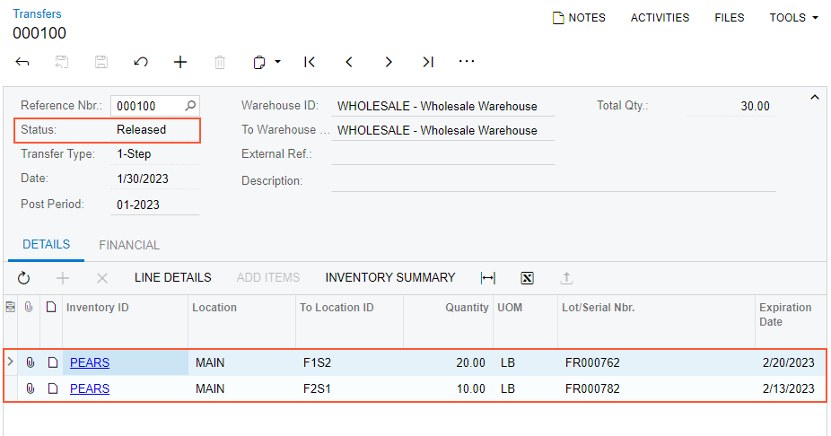
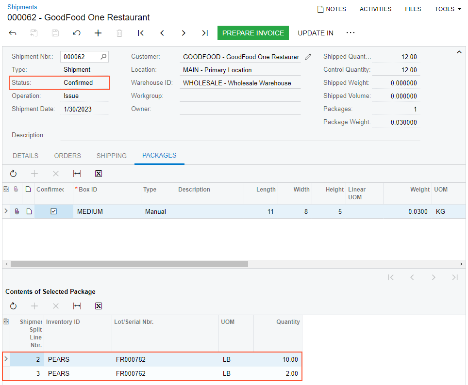
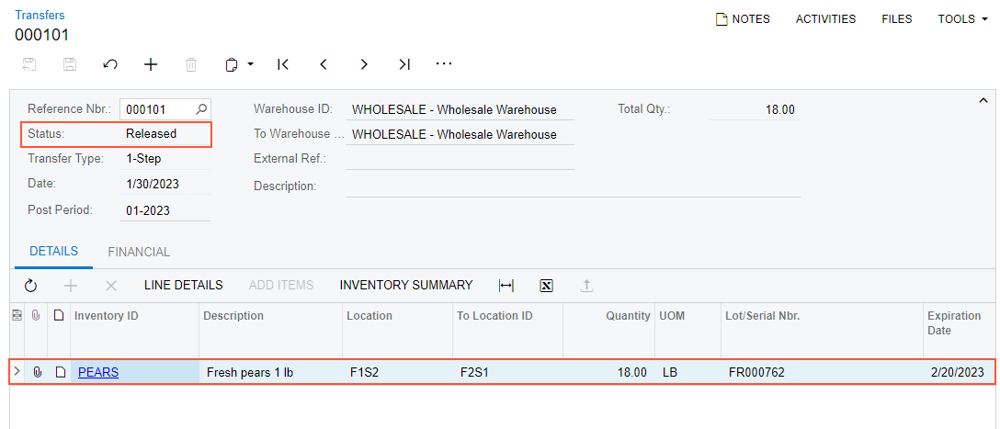

# Automated Operations with Lot- and Serial-Tracked Items: To Process Purchase and Sales Orders, and Transfers {#_839b291f-4a97-44be-bdcf-9ed855f06d3b .task}

In the following activity, you will learn how to process purchase and sales orders, and transfers with lot-tracked stock items in automated mode.

**Attention:** This activity is based on the *U100* dataset. If you are using another dataset or if any system settings have been changed in *U100*, these changes can affect the workflow of the activity and the results of the processing. To avoid issues, restore the *U100* dataset to its initial state.

## Story { .section}

Suppose that on 1/27/2026, the purchasing manager of the wholesale warehouse of the SweetLife Fruits &amp; Jams company entered a purchase order for 30 pounds of pears \(three boxes of 10 pounds each, and the boxes can have different expiration dates\) from the Glory Fruit Case vendor. The vendor supplies each box with a lot number that must be used for tracking the enclosed items in the Wholesale warehouse. Then, on 1/29/2026, the sales manager entered a sales order for 12 pounds of pears being sold to GoodFood One Restaurant.

As the warehouse worker, you will receive the items in the purchase order and put them away in the fruit locations. Then you will pick and pack the items for the sales order. Finally, at the request of the warehouse manager, you will move the remaining items \(those not included in the sales order\) from one location to another.

## Configuration Overview { .section}

In the *U100* dataset, the following tasks have been performed to support this activity:

-   On the [Enable/Disable Features](CS_10_00_00.md) \(CS100000\) form, the following features have been enabled in the *Inventory and Order Management* group of features:
    -   *Inventory*
    -   *Lot and Serial Tracking*
    -   *Warehouse Management*
    -   *Fulfillment*
    -   *Receiving*
    -   *Inventory Operations*
-   On the [Warehouses](IN_20_40_00.md) \(IN204000\) form, the *WHOLESALE* warehouse has been created. On the **Locations** tab, the following warehouse locations have been defined: *F1S2*, *F2S1*, and *MAIN*.
-   On the [Stock Items](IN_20_25_00.md) \(IN202500\) form, the *PEARS* stock item has been created. For this stock item, the *PE1LB* barcode has been specified on the **Cross-Reference** tab of the form, and the *ALTFRT* lot class has been assigned.
-   On the [Lot/Serial Classes](IN_20_70_00.md) \(IN207000\) form, the *ALTFRT* lot class has been created. The lot class is defined so that the fruits with the earliest expiration date are issued first. Also, auto-generation of lot numbers is configured for the lot class.
-   On the [Boxes](CS_20_76_00.md) \(CS207600\) form, the *MEDIUM* box has been defined.
-   On the [Vendors](AP_30_30_00.md) \(AP303000\) form, the *GLORYFRUIT* vendor has been created.
-   On the [Customers](AR_30_30_00.md) \(AR303000\) form, the *GOODFOOD* customer has been created.
-   On the [Purchase Orders](PO_30_10_00.md) \(PO301000\) form, the *000025* purchase order to *GLORYFRUIT* has been created.
-   On the [Sales Orders](SO_30_10_00.md) \(SO301000\) form, the *000061* sales order to *GOODFOOD* has been created.

## Process Overview { .section}

In this process activity, you will act as a warehouse worker in the Wholesale warehouse. You will receive the items for a purchase order in automated mode and specify the lot number and expiration date for each unit of the items, and then put the received items away in the appropriate storage locations. Then you will create a shipment for a sales order on the [Sales Orders](SO_30_10_00.md) \(SO301000\) form, and pick and pack the items for this shipment in the automated mode. Finally, you will prepare an inventory transfer to record the movement of the items from one location to another on the [Scan and Transfer](IN_30_40_20.md) \(IN304020\) form.

**Tip:** In any working mode, you enter a command or barcode by typing it in the **Scan** box and pressing Enter. In production systems, you will scan the appropriate barcodes rather than manually entering them.

## System Preparation { .section}

Before you start processing purchase and sales documents, and transfer transactions with lot-tracked stock items in automated mode, do the following:

1.  Launch the Acumatica ERP website, and sign in to a company with the *U100* dataset preloaded. You should sign in as warehouse worker with the *perkins* username and the *123* password.
2.  In the info area at the upper-right corner of the top pane of the Acumatica ERP screen, make sure that the business date is set to *1/30/2026*. If a different date is displayed, click the Business Date menu button and select *1/30/2026* from the calendar. For simplicity, you'll create and process all documents in this activity using this business date.
3.  On the [Enable/Disable Features](CS_10_00_00.md) \(CS100000\) form, enable the *Lot and Serial Tracking* feature.

## Step 1: Receiving and Putting Away Items { .section}

Suppose that the Glory Fruit Case vendor has delivered the 30 pounds of pears to the Wholesale warehouse: three boxes of 10 pounds each. Two of the boxes \(that is, 20 pounds of pears\) have one lot number and expiration date, and the third box \(that is, 10 pounds of pears\) has a different lot number and expiration date. You will prepare the needed documents to reflect the receipt of the pears as follows:

1.  Open the [Receive and Put Away](PO_30_20_20.md) \(PO302020\) form, and make sure the **Receive** tab is opened.
2.  In the **Scan** box, type `000025`, which is the reference number of the purchase order for which you will perform receiving items and putting them away to storage locations. Press Enter. The system creates the purchase receipt for the purchase order and loads the purchase receipt line to the table on the **Receive** tab. The reference number of the purchase receipt that is currently being processed is displayed in the **Receipt Nbr.** box of the Summary area.
3.  Enter `MAIN` to select the location in which you have received the items.
4.  Enter `PE1LB` to select the item being received.
5.  Enter `FR000762` to specify the lot number of the first and second boxes of pears. \(These boxes have the same lot number.\)
6.  Enter *02/20/2026* to specify the expiration date of these boxes, which have the same expiration date. The system highlights the purchase receipt line in bold, and specifies *1* as the **Received Qty.** The two boxes with the lot number and expiration date you have specified contain 20 pounds, so the quantity of the line should be 20.
7.  Set the quantity of the current line to `20` as follows:
    1.  On the form toolbar, click **Set Qty**. The system prompts you to enter the item quantity.
    2.  In the **Scan** box, type `20`.
8.  Enter `PE1LB` to select the item being received. You are now processing the third box of 10 pounds of pears, which has a different lot number and expiration date than the first two boxes had.
9.  Enter `FR000782` to specify the lot number of the third box of pears.
10. Enter *02/13/2026* to specify the expiration date of this box. The system splits the line, and specifies 1 as the **Received Quantity** in the newly added line. The box with the lot number and expiration date you just entered contains 10 pounds, so the quantity of the line should be 10.
11. Set the quantity of the current line to `10`. On the **Receive** tab, the system highlights both lines in green, indicating that these lines have been received in full.
12. On the form toolbar, click **Release Receipt**. The system releases the purchase receipt and generates a corresponding inventory receipt transaction to record the receipt of the items to the *MAIN* location of the warehouse.
13. Enter `@putaway` to switch to Put Away mode. Notice that the purchase receipt is still selected and its reference number is shown in the **Receipt Nbr.** box of the Summary area.
14. Enter `F1S2` to select the location to which the items \(the 20 pounds of pears in the first two boxes\) are being put away.
15. Enter `PE1LB` to select the item to be put away to this location.
16. Enter `FR000762` to specify the lot number of the first and second box of pears.
17. Set the quantity to `20`.
18. Enter `F2S1` to select the location to which the rest of the items \(the remaining 10 pounds of pears, which are in the third box\) are being put away.
19. Enter `PE1LB` to select the item to be put away to this location.
20. Enter `FR000782` to specify the lot number of the third box of pears.
21. Set the quantity to `10`.
22. On the form toolbar, click **Release Transfer**.
23. On the **Transfers** tab, click the reference number in the **Reference Nbr.** column.
24. On the [Transfers](IN_30_40_00.md) \(IN304000\) form, which opens in a pop-up window, make sure that the generated transfer has the *Released* status shown in the **Status** box, and make sure that the lot number and expiration date have been assigned to the lines, as shown in the screenshot.

    

## Step 2: Creating a Shipment { .section}

To create a shipment for some of the pears that have been received and put away, do the following:

1.  On the [Sales Orders](SO_30_10_00.md) \(SO301000\) form, open a sales order to *GOODFOOD* dated 1/29/2026, and make sure it has a line with the *PEARS* item and quantity *12*.
2.  On the form toolbar, click **Create Shipment** to prepare a shipment.
3.  In the **Specify Shipment Parameters** dialog box, which opens, make sure that the *1/30/2026* date and the *WHOLESALE* warehouse are selected, and click **OK**. The system creates a shipment and opens it on the [Shipments](SO_30_20_00.md) \(SO302000\) form. In the **Shipment Nbr.**, box, notice the reference number of the shipment; you will need it in the next step.

## Step 3: Picking and Packing Items for the Shipment { .section}

To perform automated picking and packing of the ordered items, do the following:

1.  Open the [Pick, Pack, and Ship](SO_30_20_20.md) \(SO302020\) form, and make sure that the **Pick** tab is opened.
2.  In the **Scan** box, type the reference number of the shipment that you have prepared earlier in this activity. The system loads the shipment lines to the **Pick** tab, and in the **Shipment Nbr.** box of the Summary area, shows the reference number of the shipment that is currently being processed. Notice that the system has split the line so that 10 units for the shipment are taken from the box with the earlier expiration date, and the rest of the shipment \(2 units\) are taken from another box.
3.  Enter `F2S1` to select the location from which the item is picked.
4.  Enter `PE1LB` to select the item that is being picked from the selected location.
5.  Enter `FR000782` to specify the lot number. The system highlights the second line of the shipment in bold and specifies *1* as the **Picked Quantity**.
6.  Set the quantity to `10` as follows:
    1.  On the form toolbar, click **Set Qty**. The system prompts you to enter the quantity.
    2.  In the **Scan** box, type `10`. The system highlights the first line of the shipment in green and specifies *10* as the **Picked Quantity**.
7.  Enter `F1S2` to select the location from which the item is picked for the remainder of the order.
8.  Enter `PE1LB` to select the item being picked from the selected location.
9.  Enter `FR000762` to specify the lot number.
10. Set the quantity to `2`. You have picked items for both lines, and now can processed with packing them in the box.
11. Enter `@pack` to switch to Pack mode. Notice that the shipment is still selected and its reference number is shown in the **Shipment Nbr.** box of the Summary area.
12. Enter `MEDIUM` to select the box for packaging the shipment.
13. Enter `PE1LB` to select the item to be packed to the selected box.
14. Enter `FR000782` to specify the lot number.
15. Set the quantity to `10`.
16. Enter `PE1LB` to select the item to be packed to the selected box.
17. Enter `FR000762` to specify the lot number.
18. Set the quantity to `2`. All items are packed in the box, so you can confirm the package.
19. On the form toolbar, click **OK** to confirm the package.
20. On the form toolbar, click **Confirm Shipment**.

## Step 4: Reviewing the Shipment { .section}

Review the shipment in the system as follows:

1.  On the [Shipments](SO_30_20_00.md) \(SO302000\) form, open the shipment that you have processed earlier in this activity. Notice that it is assigned the *Confirmed* status.
2.  Review the **Packages** tab. Notice that one box with the *MEDIUM* identifier is shown in the upper table, and the **Contents of Selected Package** table shows the items that have been packed into this box, as shown in the following screenshot.

    

## Step 5: Transferring Items { .section}

Suppose that the warehouse manager has decided to clean the *F1S2* location and asked you to move all items from this location to the *F2S1* location, which has already been cleaned. In the *F1S2* location, you found 18 pounds of pears and moved them to the *F2S1* location. Now you acting as a warehouse worker need to record this movement in the system by creating an inventory transfer. Do the following:

1.  Open the [Scan and Transfer](IN_30_40_20.md) \(IN304020\) form.
2.  In the **Scan** box, enter `F1S2` as the origin location.
3.  Enter `F2S1` as the destination location.
4.  Enter `PE1LB` as the item to be transferred.
5.  Enter `FR000762` to specify the lot number. The system adds a line with one unit of the item to the table on the **Transfer** tab.
6.  Set the quantity of the line to `18` as follows:
    1.  On the form toolbar, click **Set Qty**. The system prompts you to enter the quantity.
    2.  In the **Scan** box, enter `18`.
7.  On the form toolbar, click **Save**. The system creates the transfer with the data you have entered. You can view the transfer number in the **Reference Nbr.** box of the Summary area.
8.  On the form toolbar, click **Release**. The system releases the transfer.
9.  Click the Edit button next to the **Reference Nbr.** box, and on the [Transfers](IN_30_40_00.md) \(IN304000\) form, which opens in a pop-up window, review the inventory transfer transaction. Make sure that it includes the needed line and is assigned the *Released* status, as shown in the following screenshot.

    

    You have successfully moved pears between the locations.

**Parent topic:**[Automated Operations with Lot- and Serial-Tracked Items](../UserGuide/WMS_LotSerial_Tracking_Mapref.md)

