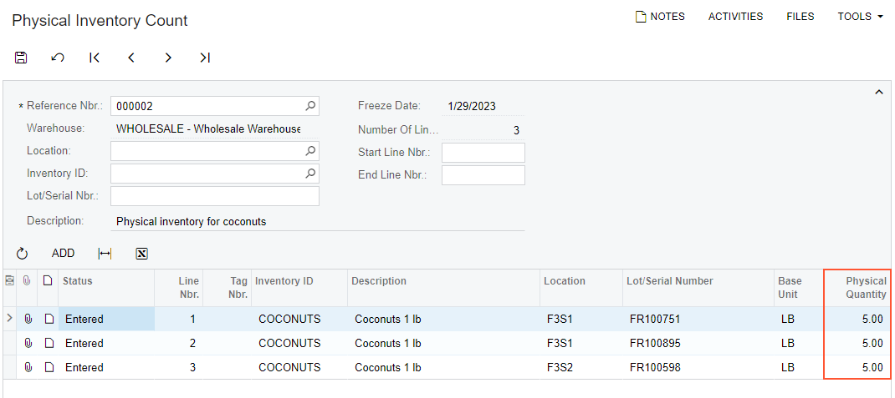

# Automated Operations with Lot- and Serial-Tracked Items: To Count Items in Physical Inventory {#_f00788b5-82c1-414c-9223-da13e7ca7db0 .task}

In this activity, you will learn how to perform automated counting of lot-tracked items during a physical inventory.

**Attention:** This activity is based on the *U100* dataset. If you are using another dataset or if any system settings have been changed in *U100*, these changes can affect the workflow of the activity and the results of the processing. To avoid issues, restore the *U100* dataset to its initial state.

## Story { .section}

Suppose that you are a warehouse worker in the SweetLife Fruits &amp; Jams company, and you have been assigned to perform a physical inventory count by entering the barcodes of stock items and locations. You will count the quantities of coconuts in particular warehouse locations added to the physical inventory document, which your manager has provided to you.

## Configuration Overview { .section}

In the *U100* dataset, the following tasks have been performed to support this activity:

-   On the [Enable/Disable Features](CS_10_00_00.md) \(CS100000\) form, the following features have been enabled in the *Inventory and Order Management* group of features:
    -   *Multiple Warehouse Locations*
    -   *Lot and Serial Tracking*
    -   *Advanced Physical Count*
    -   *Warehouse Management*
    -   *Inventory Operations*
-   On the [Warehouses](IN_20_40_00.md) \(IN204000\) form, the *WHOLESALE* warehouse has been created. For this warehouse, on the **Locations** tab, the *F3S1* and *F3S2* warehouse locations have been added.
-   On the [Stock Items](IN_20_25_00.md) \(IN202500\) form, the *COCONUTS* stock item has been created. For this stock item, the *CNBOX* barcode has been specified on the **Cross-Reference** tab of the form.
-   On the [Physical Inventory Types](IN_20_89_00.md) \(IN208900\) form, the *CNCNT* inventory type has been created.
-   On the [Prepare Physical Count](IN_50_40_00.md) \(IN504000\) form, the *000002* physical inventory document has been created, and it has the *Counting in Progress* status.

## Process Overview { .section}

As you count lot-tracked items within a physical inventory in this activity, you will scan the barcode of the physical inventory document; you will then scan the location barcode, the barcode of each item you find in this location, and the barcodes of the lot numbers that correspond to each item. When you have counted all items in all locations added to the physical inventory document, you will confirm the document.

**Tip:** In any working mode, you enter a command or barcode by typing it in the **Scan** box and pressing Enter. In production systems, you will scan the appropriate barcodes rather than manually entering them.

## System Preparation { .section}

Before you start performing the activity, do the following:

1.  Sign in to a company with the U100 dataset preloaded as a warehouse worker with the *perkins* username and the *123* password.
2.  On the [Enable/Disable Features](CS_10_00_00.md) \(CS100000\) form, make sure that the *Lot and Serial Tracking* feature is enabled.

## Step 1: Entering the Counted Quantities of Items { .section}

Suppose that you have started counting coconuts. Do the following to enter the counted quantities into the system:

1.  Open the [Scan and Count](IN_30_50_20.md) \(IN305020\) form.
2.  In the **Scan** box, type `000002` \(which is the reference number of the physical inventory count\). Press Enter. The list of items that you should count is displayed on the **Count** tab.
3.  Enter `F3S1`, which is the barcode of the first location.

    Suppose that in this location, you find two boxes of coconuts with different lot numbers.

4.  Enter `CNBOX`, which is the barcode that corresponds to a box of 5 pounds of coconuts.
5.  Enter `FR100895` to specify the lot number of the coconuts. The system adds 5 units of the *COCONUTS* item to the corresponding table row.
6.  Enter `CNBOX` to add another box of coconuts with a different lot number.
7.  Enter `FR100751` to specify the lot number of the coconuts. The system adds 5 units of the *COCONUTS* item to the corresponding table row.

    You have finished counting items in the *F3S1* location and can start counting items in the next location.

8.  Enter `F3S2`, which is the barcode of the second location.

    Suppose that in this location, you find one box of coconuts.

9.  Enter `CNBOX` to add the box of coconuts.
10. Enter `FR100598` to specify the lot number of the coconuts. The system adds 5 units of the *COCONUTS* item to the corresponding table row.

    You have finished counting items in the *F3S2* location and need to confirm the counted data.

## Step 2: Reviewing the Quantities and Confirming the Entered Data { .section}

After you have entered the quantities of all items in the physical inventory document, you need to review the quantities and confirm the entered data. Do the following:

1.  While you are still viewing the *000002* physical inventory document on the [Scan and Count](IN_30_50_20.md) \(IN305020\) form, review the lines of the table on the **Count** tab. They should have the settings indicated in the following table.

    |Line Nbr.|Location|Inventory ID|Lot/Serial Number|Physical Quantity|
    |---------|--------|------------|-----------------|-----------------|
    |*1*|*F3S1*|*COCONUTS*|*FR100751*|*5*|
    |*2*|*F3S1*|*COCONUTS*|*FR100895*|*5*|
    |*3*|*F3S2*|*COCONUTS*|*FR100598*|*5*|

2.  On the form toolbar, click **Confirm** to confirm the entered data. The system confirms the data and clears the physical inventory document number. The form is ready for a new count.
3.  On the [Physical Inventory Count](IN_30_50_10.md) \(IN305010\) form, open the *000002* physical inventory document for which you have performed count. In the **Physical Quantity** column, make sure all counted quantities are shown \(see the screenshot below\).

    

You have successfully counted coconuts in the warehouse locations and entered data into the system.

**Parent topic:**[Automated Operations with Lot- and Serial-Tracked Items](../UserGuide/WMS_LotSerial_Tracking_Mapref.md)

