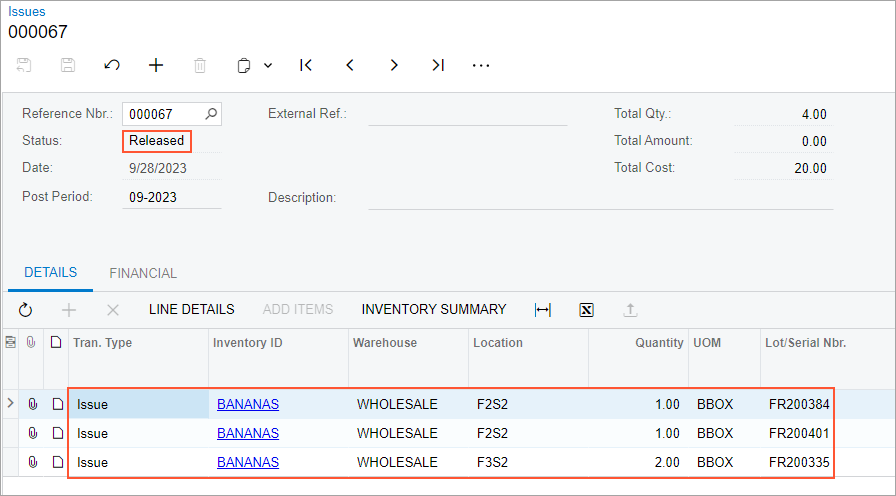

# Automated Operations with Lot- and Serial-Tracked Items: To Issue Items {#_645a65fd-9c1e-47b3-89fc-6ab7285a222e .task}

In this activity, you will learn how to perform automated issuing of lot-tracked items.

**Attention:** This activity is based on the *U100* dataset. If you are using another dataset or if any system settings have been changed in *U100*, these changes can affect the workflow of the activity and the results of the processing. To avoid issues, restore the *U100* dataset to its initial state.

## Story { .section}

Suppose that you, as a warehouse worker of the SweetLife Fruits &amp; Jams company, have a task to check the boxes of bananas in refrigerators in order to find rotten bananas and write them off. To record writing off boxes with rotten bananas in the system, you will create and process an inventory issue.

## Configuration Overview { .section}

In the *U100* dataset, the following tasks have been performed to support this activity:

-   On the [Enable/Disable Features](CS_10_00_00.md) \(CS100000\) form, the following features have been enabled in the *Inventory and Order Management* group of features:
    -   *Multiple Warehouse Locations*
    -   *Lot and Serial Tracking*
    -   *Warehouse Management*
    -   *Inventory Operations*
-   On the [Warehouses](IN_20_40_00.md) \(IN204000\) form, the *WHOLESALE* warehouse has been created. For this warehouse, on the **Locations** tab, the *F2S2* and *F3S2* warehouse locations have been added.
-   On the [Stock Items](IN_20_25_00.md) \(IN202500\) form, the *BANANAS* stock item has been created. For this stock item, the *BBOX* unit of measure has been defined on the **General** tab and the *BNBOX* barcode has been defined on the **Cross-Reference** tab of the form.

## Process Overview { .section}

When you issue lot-tracked items in this activity, you will scan the barcode of the location where the items are stored; you then scan a barcode of each item to be issued and the barcodes of the lot numbers that correspond to each item. When you have added all items in all locations to the issue, you will release the issue.

**Tip:** In any working mode, you enter a command or barcode by typing it in the **Scan** box and pressing Enter. In production systems, you will scan the appropriate barcodes rather than manually entering them.

## System Preparation { .section}

Before you start issuing lot-tracked items, do the following:

1.  Sign in to a company with the *U100* dataset preloaded. You should sign in as warehouse worker with the *perkins* username and the *123* password.
2.  On the [Enable/Disable Features](CS_10_00_00.md) \(CS100000\) form, enable the *Lot and Serial Tracking* feature.

## Step 1: Processing the Issue of Items { .section}

Suppose that when you were checking the boxes with bananas in the refrigerator locations, as instructed by your manager, you have found four boxes with rotten bananas: two boxes with different lot numbers in the *F2S2* location, and two boxes with the same lot number in the *F3S2* location. To process the issue transaction in the system, do the following:

1.  Open the [Scan and Issue](IN_30_20_20.md) \(IN302020\) form.
2.  In the **Scan** box, type `F2S2`, which is the barcode of the location where the first box of bananas is stored. Press Enter.
3.  Enter `BNBOX`, which is the barcode that corresponds to a box of 10 pounds of bananas.
4.  Enter `FR200384` to specify the lot number of the box. The system adds 1 unit of the *BANANAS* item in the *BBOX* unit of measure to the table on the **Issue** tab.
5.  Enter `BNBOX` for the second box of bananas.
6.  Enter `FR200401` to specify the lot number of the box. The system adds 1 unit of the *BANANAS* item in the *BBOX* unit of measure to the table on the **Issue** tab.
7.  Enter `F3S2`, which is the barcode of the location where the second box of bananas is stored.
8.  Enter `BNBOX` to add the box of bananas.
9.  Enter `FR200335` to specify the lot number of the box. The system adds 1 unit of the *BANANAS* item in the *BNBOX* unit of measure to the table on the **Issue** tab.
10. Set the quantity to `2` as follows:
    1.  On the form toolbar, click **Set Qty**. The system prompts you to enter the quantity.
    2.  In the **Scan** box, enter `2`. The system changes the quantity of the *BANANAS* item with the *FR200335* lot number to *2*.
11. On the form toolbar, click **Save**. The system saves your changes and creates the inventory issue, whose identifier you can view in the **Reference Nbr.** box of the Summary area.

You have added four boxes of bananas to the issue. Now you will review the inventory issue and release the issue.

## Step 2: Releasing and Reviewing the Issue { .section}

To release and review the issue, do the following:

1.  While you are still viewing the inventory issue on the **Issue** tab of the [Scan and Issue](IN_30_20_20.md) \(IN302020\) form, make sure that the settings of the rows you have entered correspond to the settings in the following table.

    |Inventory ID|Lot/Serial Nbr.|Expiration Date|Location|Quantity|UOM|
    |------------|---------------|---------------|--------|--------|---|
    |*BANANAS*|*FR200384*|*2/3/2026*|*F2S2*|*1*|*BBOX*|
    |*BANANAS*|*FR200401*|*2/6/2026*|*F2S2*|*1*|*BBOX*|
    |*BANANAS*|*FR200335*|*2/4/2026*|*F3S2*|*2*|*BBOX*|

2.  On the form toolbar, click **Release** to release the inventory issue.
3.  Click the Edit button next to the **Reference Nbr.** box, and on the [Issues](IN_30_20_00.md) \(IN302000\) form, which opens in a pop-up window, review the inventory issue transaction. Make sure that it includes the needed lines and is assigned the *Released* status, as shown in the screenshot below.

    

You have successfully created and released the inventory issue to record the removal of four boxes of bananas from their warehouse locations.

**Parent topic:**[Automated Operations with Lot- and Serial-Tracked Items](../UserGuide/WMS_LotSerial_Tracking_Mapref.md)

