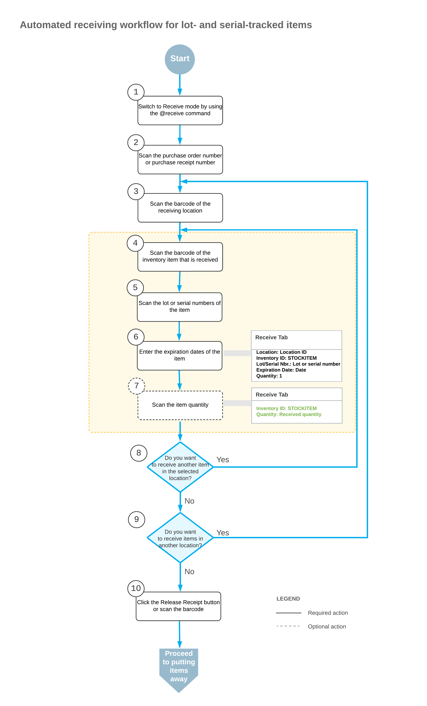
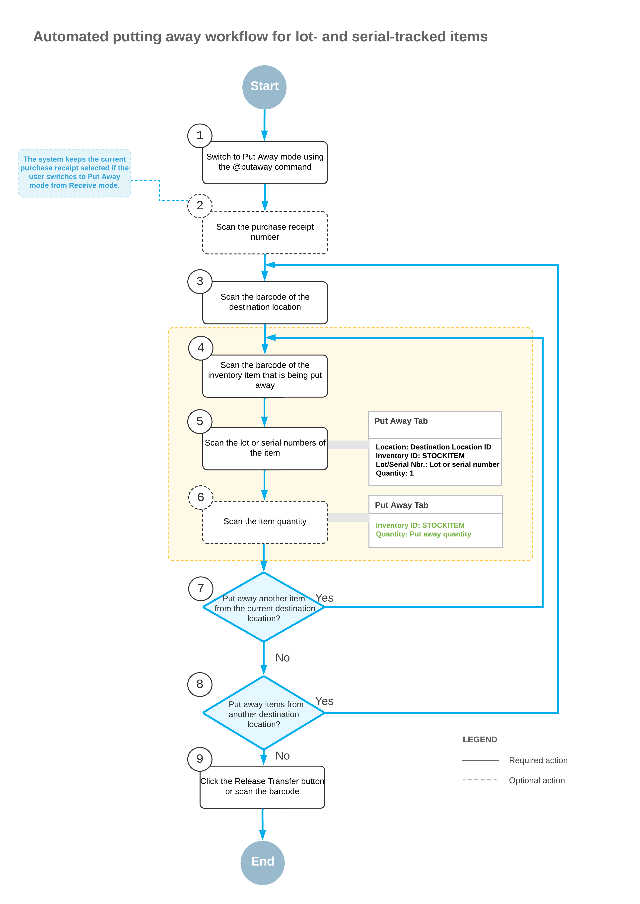

# Automated Operations with Lot- and Serial-Tracked Items: Receiving and Putting Away Items {#_ff656df0-ce04-485b-bb77-6d196c76cbe7 .concept}

If the *Lot and Serial Tracking* feature is enabled on the [Enable/Disable Features](CS_10_00_00.md) \(CS100000\) form and the tracking of stock items by lot or serial number has been configured in the system, when you receive and put away lot- or serial-tracked items by using the [Receive and Put Away](PO_30_20_20.md) \(PO302020\) form or the corresponding screen in the Acumatica mobile app, the system may prompt you to enter the lot or serial number during this process.

In this topic, you will read about the workflow for the automated receiving and putting away of lot- and serial-tracked inventory items in Acumatica ERP. The workflow in this topic is based on the assumption that your system has the recommended configuration described in [Automated Operations with Lot- and Serial-Tracked Items: Implementation Checklist](WMS_LotSerial_Tracking_Implem_Checklist.md).

## Workflow for the Automated Receiving of Lot- or Serial-Tracked Items { .section}

The automated processing of receiving items involves the actions shown in the following diagram.

To process the receipt of lot- or serial-tracked items in Receive mode, you perform the following steps:

1.  *Switch to Receive mode*.

    You open the [Receive and Put Away](PO_30_20_20.md) \(PO302020\) form \(or the corresponding screen in the Acumatica mobile app\) and switch to Receive mode by scanning or entering the *@receive* barcode.

2.  *Scan the document number*.

    To start the automated processing, you scan the reference number of the purchase order, purchase receipt, or purchase return document to be processed. The system displays the lines of the scanned document in the table. If you have scanned the purchase order number, the system creates and saves the related purchase receipt automatically. In the **Receipt Nbr.** box, the system inserts the reference number of the receipt or return that is currently selected for processing.

3.  *Scan the barcode of the receiving location*.

    You scan the barcode of the warehouse location where the items are being received.

4.  *Scan the item barcode*.

    When you scan the barcode of the received item, the system searches for the item in the lines of the document that is currently selected.

5.  *Scan the lot or serial number of the item*.

    You scan the lot or serial number of the item being received.

    **Tip:** If the **Use Default Auto-Generated Lot/Serial Nbr.** check box is selected on the [Purchase Orders Preferences](PO_10_10_00.md) \(PO101000\) form, the system assigns and inserts the lot or serial number for the item automatically.

6.  *Scan or enter the expiration date of the item*.

    You scan the expiration date of the item being received. The system highlights the processed line in bold. If the UOM defined by the barcode of the scanned item corresponds to a non-base unit of measure, the system converts the item quantity defined by this barcode to the received quantity in the base unit of measure for this item. If the scanned item barcode corresponds to a non-base unit of measure, the system converts this quantity to the received quantity in the base unit of measure for this item.

    You can scan all lot or serial numbers of an item one by one.

    **Tip:** If the **Use Default Expiration Date** check box is selected on the [Purchase Orders Preferences](PO_10_10_00.md) form, the system fills in the expiration date for the item automatically.

7.  Optional: *Scan the item quantity*.

    To change the received quantity in the line that is currently being processed, you switch on Quantity Editing mode by scanning or entering the `*qty` barcode, and manually enter the quantity in the UOM defined by the barcode of the scanned item.

8.  *Receive another line*.

    If you need to receive at least one other item for the document currently being processed, you return to scanning the item barcode \(that is, return to Step 4\) and repeat the process for the item.

9.  *Receive items in another location*.

    If items must be received in another warehouse location, you scan the barcode of this location \(return to Step 3\) and repeat the process for the next location.

10. *Complete the receiving process*.

    If you have finished the receiving operation and all items have been received for the purchase order \(or the items were received partially and more items will be received in the future\), you scan the `*release` barcode or click the **Release Receipt** button. The system releases the purchase receipt.

## Workflow for the Automated Putting Away of Items { .section}

The automated processing of putting away items involves the actions shown in the following diagram.

To process the putting away of lot- or serial-tracked items in Put Away mode, you perform the following steps:

1.  *Switch to Put Away mode*.

    You open the [Receive and Put Away](PO_30_20_20.md) \(PO302020\) form \(or the corresponding screen in the Acumatica mobile app\) and switch to Put Away mode by scanning or entering *@putaway* barcode.

2.  *Scan the document number*.

    To start the automated processing, you scan the reference number of the released purchase receipt to be processed. \(If you switched to Put Away mode from Receive mode with a document selected, the system selected the document automatically.\) The system displays the lines of the scanned document in the table. In the **Receipt Nbr.** box, the system inserts the reference number of the document that is currently selected for processing.

3.  *Scan the barcode of the destination location*.

    You scan the barcode of the destination location in which you are putting away items. If the items of a particular line are put away in multiple locations, the system splits the line by locations and shows *&lt;SPLIT&gt;* in the **Location** column. You can review the IDs of the locations to which the items are put away by clicking **Transfer Allocations** on the table toolbar of the **Put Away** tab.

    Once you have specified the destination location, the system automatically creates a one-step inventory transfer document that reflects the movement of the items from the receiving location to the storage location.

4.  *Scan the barcode of the item*.

    When you scan the item barcode of the received item, the system searches for the item in the lines of the document that is currently selected. If the UOM defined by the barcode of the scanned item corresponds to a non-base unit of measure, the system converts the item quantity defined by this barcode to the put away quantity in the base unit of measure for this item. To indicate the line or lines with the scanned barcode, the system selects the **Matched** check box in these lines. The system highlights the lines in bold if they are processed partially, and in green if they are processed in full.

5.  *Scan the lot or serial number of the item*.

    Scan the lot or serial number of the item to be put away. You can scan all lot or serial numbers of an item one by one.

6.  Optional: *Scan the item quantity*.

    To change the quantity being put away in the line that is currently being processed, you switch to Quantity Editing mode by scanning or entering the `*qty` barcode, and manually enter the quantity in the UOM defined by the barcode of the scanned item.

7.  *Scan another item*.

    If at least one other item needs to be put away, you return to scanning the barcode of the item \(that is, return to Step 4\) and repeat the process for the item.

8.  *Scan another destination location*.

    If items must be transferred to another destination location, you scan the barcode of this location \(return to Step 3\) and repeat the process.

9.  *Complete the process of putting items away*.

    When you have finished the operation of putting away items, you scan the `*release` barcode or click the **Release Transfer** button. The system releases the inventory transfer document that was prepared during the automated operation; the items are moved to the destination locations.

**Parent topic:**[Automated Operations with Lot- and Serial-Tracked Items](../UserGuide/WMS_LotSerial_Tracking_Mapref.md)

