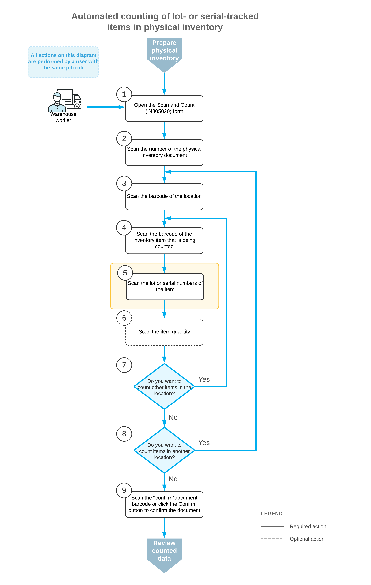

# Automated Operations with Lot- and Serial-Tracked Items: Counting Items in Physical Inventory {#_3e9a47e7-8e44-44b7-aba2-3642c99af782 .concept}

If the *Lot and Serial Tracking* feature is enabled on the [Enable/Disable Features](CS_10_00_00.md) \(CS100000\) form and the tracking of stock items by lot or serial number has been configured in the system, when you count lot- or serial-tracked items by using the [Scan and Count](IN_30_50_20.md) \(IN305020\) form or the corresponding screen in the Acumatica mobile app, the system prompts you to enter the lot or serial number during this process.

This topic describes the workflow for the automated counting of lot- or serial-tracked items during physical inventory. The workflow in this topic is based on the assumption that your system has the recommended configuration described in [Automated Operations with Lot- and Serial-Tracked Items: Implementation Checklist](WMS_LotSerial_Tracking_Implem_Checklist.md).

## Workflow for the Automated Scanning and Counting of Lot- and Serial-Tracked Items { .section}

The automated processing of scanning and counting lot- or serial-tracked items involves the actions shown in the following diagram.

To count inventory items \(and use Scan and Count mode\), you perform the following steps:

1.  *Open the [Scan and Count](IN_30_50_20.md) \(IN305020\) form*.

    You open the [Scan and Count](IN_30_50_20.md) form \(or the corresponding screen in the Acumatica mobile app\) to start the counting process.

2.  *Scan the document number*.

    To start the automated counting, you scan the reference number of the physical inventory document. The lines of the scanned document are shown in the table. The reference number of the document selected for processing is displayed in the **Reference Nbr.** box.

3.  *Scan the location barcode*.

    You scan the barcode of the location where the items to be counted are stored. All items that you scan after scanning the location barcode will be assigned to this location.

4.  *Scan the item barcode*.

    You scan the barcode of the item that is stored in the selected location.

5.  *Scan the lot or serial number of the item*.

    You scan the lot or serial number of the item. The system changes the status of the line for this item to *Entered*. You can scan all lot or serial numbers of an item one by one.

6.  Optional: *Scan the item quantity*.

    To change the counted quantity in the line that is currently being processed, you switch to Quantity Editing mode by scanning or entering the `*qty` barcode or by clicking **Set Qty** on the form toolbar; you then manually enter the quantity in the base unit of measure.

7.  Optional: *Scan the barcode of the next item in the same location*.

    If you have more items to count in the same location, you scan the barcode of the next item \(return to Step 4\) and repeat the process for the item.

8.  Optional: *Scan the barcode of the next location*.

    If items in another location must be counted, you return to scanning the warehouse location \(return to Step 3\) and repeat the process for the items in this location.

9.  *Confirm the physical inventory count*.

    When you have finished counting items, you scan the `*confirm` command or click **Confirm** on the form toolbar. The system saves your changes to the physical inventory document.

**Parent topic:**[Automated Operations with Lot- and Serial-Tracked Items](../UserGuide/WMS_LotSerial_Tracking_Mapref.md)

