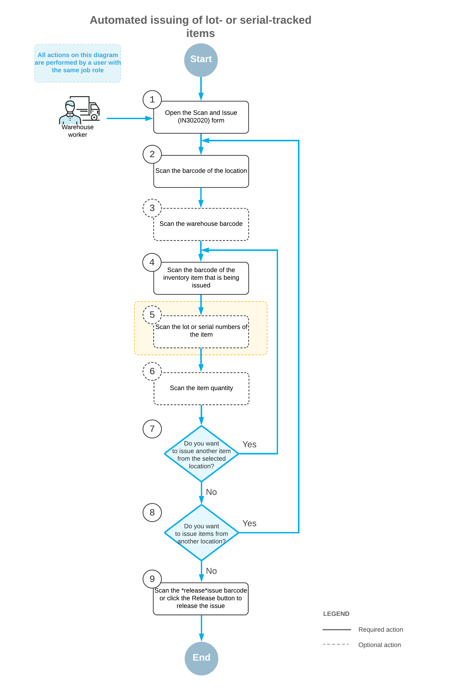

# Automated Operations with Lot- and Serial-Tracked Items: Issuing Items {#_debe266c-98fb-4f24-a526-e2010828d32f .concept}

If the *Lot and Serial Tracking* feature is enabled on the [Enable/Disable Features](CS_10_00_00.md) \(CS100000\) form and the tracking of stock items by lot or serial number has been configured in the system, when you issue lot- or serial-tracked items by using the [Scan and Issue](IN_30_20_20.md) \(IN302020\) form or the corresponding screen in the Acumatica mobile app, the system prompts you to enter the lot or serial number during this process.

This topic describes the workflow for the automated issuing of lot- or serial-tracked items. The workflow in this topic is based on the assumption that your system has the recommended configuration described in [Automated Operations with Lot- and Serial-Tracked Items: Implementation Checklist](WMS_LotSerial_Tracking_Implem_Checklist.md).

## Workflow for the Automated Issuing of Lot- and Serial-Tracked Items { .section}

The automated processing of issuing lot- or serial-tracked items involves the actions shown in the following diagram.

To issue items by using a barcode scanner or a mobile device with a scanning option, you perform the following steps:

1.  *Open the [Scan and Issue](IN_30_20_20.md) \(IN302020\) form*.

    You open the [Scan and Issue](IN_30_20_20.md) form \(or the corresponding screen in the Acumatica mobile app\).

2.  *Scan the location barcode*.

    You scan the barcode of the warehouse location where the items to be issued are stored.

3.  Optional: *Scan the warehouse barcode*.

    If the location whose identifier you scanned in the previous step is assigned to multiple warehouses, you scan the warehouse barcode. The system inserts the warehouse ID in the **Warehouse** box.

4.  *Scan the item barcode*.

    You scan the barcode of the item that must be issued from the selected location.

5.  Optional: *Scan the lot or serial number of the item*.

    The system may prompt you to enter the lot or serial number of the item, depending on the lot or serial class settings specified on the [Lot/Serial Classes](IN_20_70_00.md) \(IN207000\) form.

    If the assignment method of the lot or serial class dictates that the lot or serial number be specified on receipt of the item and the issue method dictates that the lot or serial number must be entered by a user, the system prompts you to scan the lot or serial number.

    If the assignment method of the lot or serial class dictates that the lot or serial number be specified on issue of the item, the system prompts you to scan the lot or serial number only if the number is not generated automatically and must be entered manually.

    You can scan all lot or serial numbers of an item one by one.

6.  Optional: *Scan the item quantity*.

    To change the issued quantity in the line that is currently being processed, you switch to Quantity Editing mode by scanning or entering the `*qty` barcode or by clicking **Set Qty** on the form toolbar; you then manually enter the quantity in the base unit of measure.

7.  Optional: *Scan the barcode of the next item to be issued from the selected location*.

    If another item must be issued from the currently selected location, you scan the barcode of the next item \(return to Step 4\) and repeat the process for this item.

8.  Optional: *Scan the barcode of the next location*.

    If items must be issued from another warehouse location, you scan the barcode of this location \(return to Step 2\) and repeat the process for this location.

9.  *Release the inventory issue*.

    When you have finished issuing items, you scan the `*release` command or click **Release** on the form toolbar. The system releases the inventory issue on the [Issues](IN_30_20_00.md) \(IN302000\) form.

**Parent topic:**[Automated Operations with Lot- and Serial-Tracked Items](../UserGuide/WMS_LotSerial_Tracking_Mapref.md)

