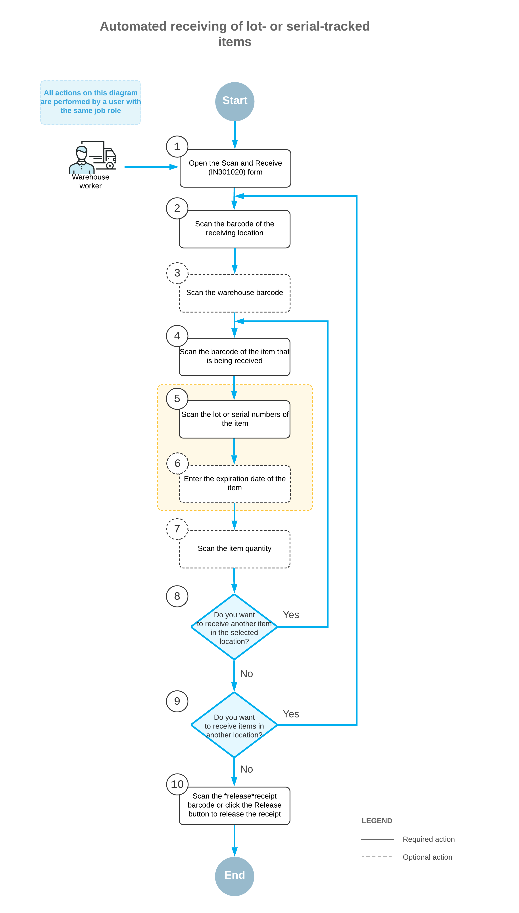

# Automated Operations with Lot- and Serial-Tracked Items: Receiving Items {#_1c52d9a5-9c6d-4027-aa07-26e8b54ac463 .concept}

If the *Lot and Serial Tracking* feature is enabled on the [Enable/Disable Features](CS_10_00_00.md) \(CS100000\) form and the tracking of stock items by lot or serial number has been configured in the system, when you receive lot- or serial-tracked items by using the [Scan and Receive](IN_30_10_20.md) \(IN301020\) form or the corresponding screen in the Acumatica mobile app, the system prompts the user to enter the lot or serial number during this process.

This topic describes the workflow for the automated receiving of lot- or serial-tracked items. The workflow in this topic is based on the assumption that your system has the recommended configuration described in [Automated Operations with Lot- and Serial-Tracked Items: Implementation Checklist](WMS_LotSerial_Tracking_Implem_Checklist.md).

## Workflow for the Automated Receiving of Lot- and Serial-Tracked Items { .section}

The automated processing of receiving lot- or serial-tracked items involves the actions shown in the following diagram.

To receive items by using a barcode scanner or a mobile device with a scanning option, you perform the following steps:

1.  *Open the [Scan and Receive](IN_30_10_20.md) \(IN301020\) form*.

    You open the [Scan and Receive](IN_30_10_20.md) form \(or the corresponding screen in the Acumatica mobile app\).

2.  *Scan the location barcode*.

    You scan the barcode of the warehouse location, where the items are to be received.

3.  Optional: *Scan the warehouse barcode*.

    If the location whose identifier you scanned in the previous step is assigned to multiple warehouses, you scan the warehouse barcode. The system inserts the warehouse ID in the **Warehouse** box.

4.  *Scan the item barcode*.

    You scan the barcode of the item being received.

5.  Optional: *Scan the lot or serial number of the item*.

    If the lot or serial class with the *When Received* assignment method specified on the [Lot/Serial Classes](IN_20_70_00.md) \(IN207000\) form is assigned to the item, the system prompts you to enter the lot or serial number of the item only if the number is not generated automatically and must be entered manually. You can scan all lot or serial numbers of an item one by one.

6.  Optional: *Scan the expiration date of the item*.

    If, on the previous step, you have entered the lot class with the *When Received* assignment method and the *Expiration* issue method specified on the [Lot/Serial Classes](IN_20_70_00.md) form, the system prompts you to enter the expiration date of the item.

7.  Optional: *Scan the item quantity*.

    To change the received quantity in the line that is currently being processed, you switch to Quantity Editing mode by scanning or entering the `*qty` barcode or by clicking **Set Qty** on the form toolbar; you then manually enter the quantity in the UOM coded in the scanned item barcode.

8.  Optional: *Scan the barcode of the next item to be received*.

    If more items need to be received in the currently selected location, you scan the barcode of the next item barcode \(that is, return to Step 4\), and repeat the process for the item.

9.  Optional: *Scan the barcode of the next location*.

    If items must be received in another warehouse location, you scan the barcode of this location \(that is, return to Step 2\) and repeat the process for this location.

10. *Release the inventory receipt*.

    When you have finished receiving items, you scan the `*release` command or click **Release** on the form toolbar. The system releases the inventory receipt.

**Parent topic:**[Automated Operations with Lot- and Serial-Tracked Items](../UserGuide/WMS_LotSerial_Tracking_Mapref.md)

