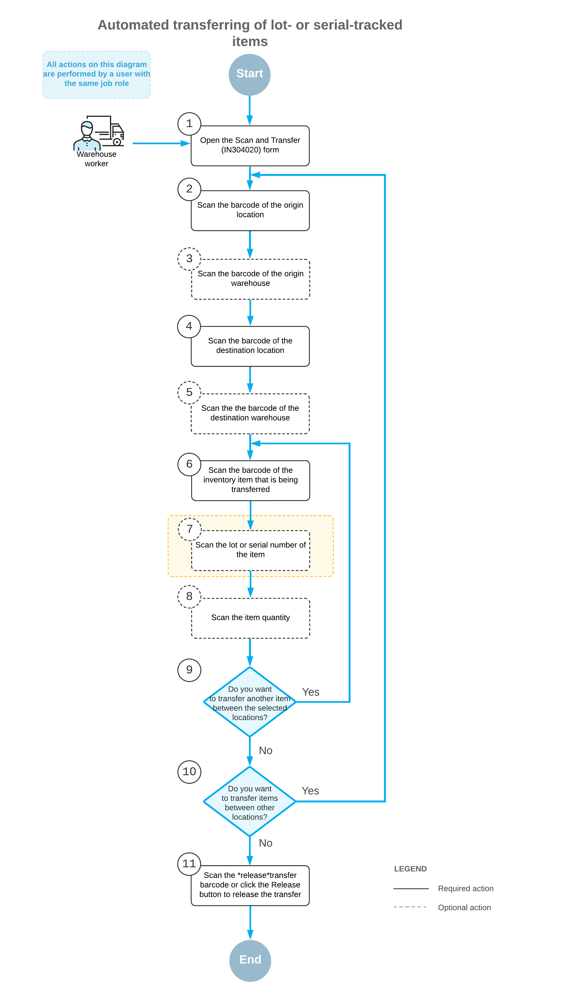

# Automated Operations with Lot- and Serial-Tracked Items: Transferring Items {#_4d2b15da-3668-413e-8bcb-6a9ca31c71eb .concept}

If the *Lot and Serial Tracking* feature is enabled on the [Enable/Disable Features](CS_10_00_00.md) \(CS100000\) form and the tracking of stock items by lot or serial number has been configured in the system, when you transfer lot- or serial-tracked items by using the [Scan and Transfer](IN_30_40_20.md) \(IN304020\) form or the corresponding screen in the Acumatica mobile app, the system may prompt you to enter the lot or serial number during this process.

This topic describes the workflow for the automated transfer of items that are tracked by lot or serial numbers. The workflow in this topic is based on the assumption that your system has the recommended configuration described in [Automated Operations with Lot- and Serial-Tracked Items: Implementation Checklist](WMS_LotSerial_Tracking_Implem_Checklist.md).

## Workflow for the Automated Scanning and Transferring of Lot- and Serial-Tracked Items { .section}

The automated processing of scanning and transferring lot- or serial-tracked items involves the actions shown in the following diagram.

To transfer items by using a barcode scanner or a mobile device with a scanning option, you perform the following steps:

1.  *Open the [Scan and Transfer](IN_30_40_20.md) \(IN304020\) form*.

    You open the [Scan and Transfer](IN_30_40_20.md) form \(or the corresponding screen in the Acumatica mobile app\).

2.  *Scan the origin location barcode*.

    You scan the barcode of the origin location \(that is, the location where the item to be transferred is currently being stored\).

3.  Optional: *Scan the origin warehouse barcode*.

    If the location whose identifier you scanned in the previous step is assigned to multiple warehouses, you scan the origin warehouse barcode. The system inserts the warehouse ID in the **Warehouse** box.

4.  *Scan the destination location barcode*.

    You scan the barcode of the destination location \(that is, the location to which you are transferring items\).

5.  Optional: *Scan the destination warehouse barcode*.

    If the location whose identifier you scanned in the previous step is assigned to multiple warehouses, you scan the destination warehouse barcode. The system inserts the warehouse ID in the **To Warehouse** box.

    **Attention:** If the destination warehouse differs from the origin warehouse and the warehouses are assigned to different buildings \(or the building is not specified in the settings of either of the warehouses\), the system displays an error message, and the transfer cannot be performed.

6.  *Scan the item barcode*.

    You scan the barcode of the item to be transferred.

7.  Optional: *Scan the lot or serial number of the item*.

    You scan the lot or serial number of the item. You can scan all lot or serial numbers of an item one by one.

8.  Optional: *Scan the item quantity*.

    To change the transferred quantity in the line that is currently being processed, you switch to Quantity Editing mode by scanning or entering the `*qty` barcode or by clicking **Set Qty** on the form toolbar; you then manually enter the quantity in the base unit of measure.

9.  Optional: *Scan the barcode of the next item to be transferred between the selected locations*.

    If another item must be transferred between the currently selected locations, you scan the barcode of the next item \(return to Step 6\) and repeat the process for the next item.

10. Optional: *Scan the barcode of the next origin location*.

    If items must be transferred between another locations, you scan the barcode of the next origin location \(return to Step 2\) and repeat the process.

11. *Release the inventory transfer*.

    When you have finished transferring items, you scan the `*release` command or click **Release** on the form toolbar. The system releases the inventory transfer on the [Transfers](IN_30_40_00.md) \(IN304000\) form.

**Parent topic:**[Automated Operations with Lot- and Serial-Tracked Items](../UserGuide/WMS_LotSerial_Tracking_Mapref.md)

