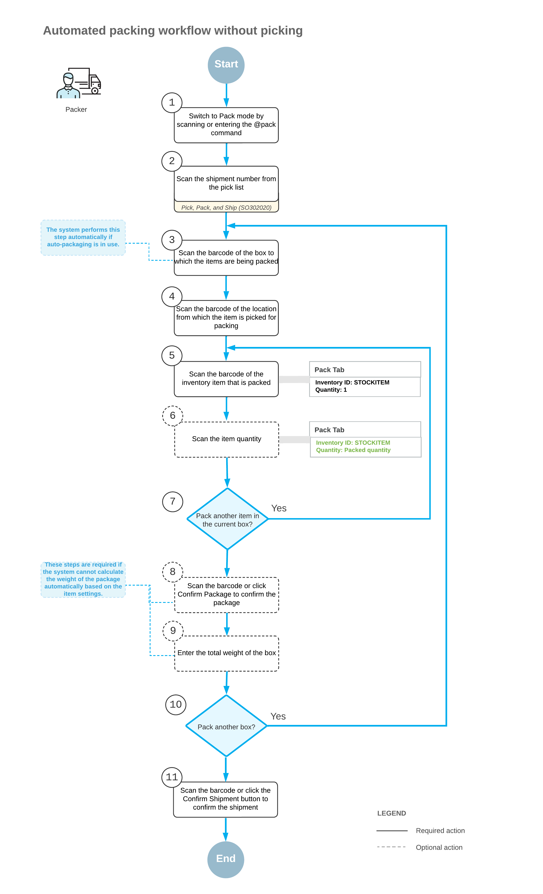

# Packing Operations: General Information {#_3b80e401-ac24-447b-b8a0-992289d70c89 .concept}

If the *Warehouse Management* and *Fulfillment* features are enabled on the [Enable/Disable Features](CS_10_00_00.md) \(CS100000\) form, you can perform the automated packing of inventory items for shipping by using a barcode scanner or a mobile device with a scanning option. You can perform automated packing for open shipments prepared for sales orders and transfer orders—that is, the shipments of the *Shipment* and *Transfer* operation type specified on the [Shipments](SO_30_20_00.md) \(SO302000\) form, respectively.

In this topic, you will read about the workflow for the automated packing of inventory items in Acumatica ERP. The workflow in this topic is based on the assumption that your system has the recommended configuration described in [Packing Operations: Implementation Checklist](WMS_Pack_Implem_Checklist.md).

## Learning Objectives { .section}

In this chapter, you will do the following:

-   Enable the needed system features
-   Specify the minimum required configuration for the automated packing workflow
-   Learn the recommended settings that you can specify to make the system fit your business requirements
-   Pack items for a shipment in an automated mode
-   Confirm a shipment after packing the items

## Applicable Scenario { .section}

In your company's warehouses, there is no separate packing line, so each warehouse worker goes through the warehouse with a printed pick list, picks the items from the warehouse locations specified in the pick list, and immediately packs the items into a box for shipping. The warehouse worker then confirms the shipment. To track the performed operations, the warehouse worker scans the appropriate barcodes by using a barcode scanner or mobile device.

## Workflow for the Automated Packing of Items { .section}

The automated processing of packing items involves the actions shown in the following diagram.

To process the packing of items \(and use Pack mode\) without picking them, you perform the following steps:

1.  *Switch to Pack mode*.

    You open the [Pick, Pack, and Ship](SO_30_20_20.md) \(SO302020\) form \(or the corresponding screen in the Acumatica mobile app\) and switch to Pack mode by scanning or entering *@pack* barcode.

2.  *Scan the document number*.

    To start the automated processing, you scan the reference number of the shipment to be processed. The system shows the lines of the scanned document in the table and inserts the reference number of the document that is currently selected for processing in the **Shipment Nbr.** box.

3.  *Scan the barcode of the box*.

    You scan the barcode of the box to which the items will be packed.

4.  *Scan the location barcode*.

    When you scan the barcode of the location from which the item is being taken for packing, the system searches for the location in the lines of the document that is currently selected.

5.  *Scan the item barcode*.

    When you scan the item barcode of the packed item, the system searches for the item in the lines of the document that is currently selected. If the UOM defined by the barcode of the scanned item corresponds to a non-base unit of measure, the system converts the item quantity defined by this barcode to the packed quantity in the base unit of measure for this item; the system also displays the packed quantity in the **Packed Quantity** column, and highlights the line \(in bold if the line is processed partially, or in green if the line is processed in full\).

6.  Optional: *Scan the item quantity*.

    To change the packed quantity in the line that is currently being processed, you switch to Quantity Editing mode by scanning or entering the `*qty` barcode, and manually enter the quantity in the UOM defined by the barcode of the scanned item.

7.  *Pack another line*.

    If another item needs to be packed in the current box, you return to scanning the item barcode \(that is, return to Step 4\) and repeat the process for the item.

8.  Optional: *Confirm the package*.

    If all items are packed in a single box, you confirm the box by scanning the `*ok` barcode or by clicking the **Confirm Package** button. If the items are packed in multiple boxes, the system automatically confirms the current box when you scan the barcode of the next box to be packed for the current shipment.

9.  Optional: *Enter the box weight*.

    If the **Confirm Weight for Each Package** check box is selected on the **Warehouse Management** tab of the [Sales Orders Preferences](SO_10_10_00.md) \(SO101000\) form, the system requires you to confirm the weight of each box after you confirm the package.

    If you want to accept the automatically calculated weight of the box, you can do that by clicking **OK** on the form toolbar or by scanning the `*ok` command. If you want to change the calculated weight of the box, you must enter the new value to continue to the next step.

10. Optional: *Enter the new package dimensions*.

    If the **Confirm Dimensions for Packages with Editable Dimensions** check box is selected on the **Warehouse Management** tab of the [Sales Orders Preferences](SO_10_10_00.md) form and you confirm a package that includes a box with the **Editable Dimensions** check box selected on the [Boxes](CS_20_76_00.md) \(CS207600\) form, the system requires you to confirm the existing dimensions or enter different dimensions for the box.

    If you want to accept the default dimensions of the box, you can do that by clicking **OK** on the form toolbar or by scanning the `*ok` command. If you want to change the dimensions of the box, you must enter the length, width, and height \(in this order\) in one string with a space as a separator to continue to the next step.

    The following example shows the entry of dimensions: `20 15 40`.

11. *Pack another box*.

    If at least one other item needs to be packed for the current shipment, you return to scanning the barcode of the box \(that is, return to Step 3\) and repeat the process for another box.

12. *Complete the packing process*.

    If you have finished the packing operation and you do not need to specify shipping options, you scan the `*confirm*shipment` barcode or click the **Confirm Shipment** button on the form toolbar. The system confirms the shipment that is currently being processed on the [Shipments](SO_30_20_00.md) \(SO302000\) form.

**Parent topic:**[Automated Packing Operations](../UserGuide/WMS_Pack_Mapref.md)

