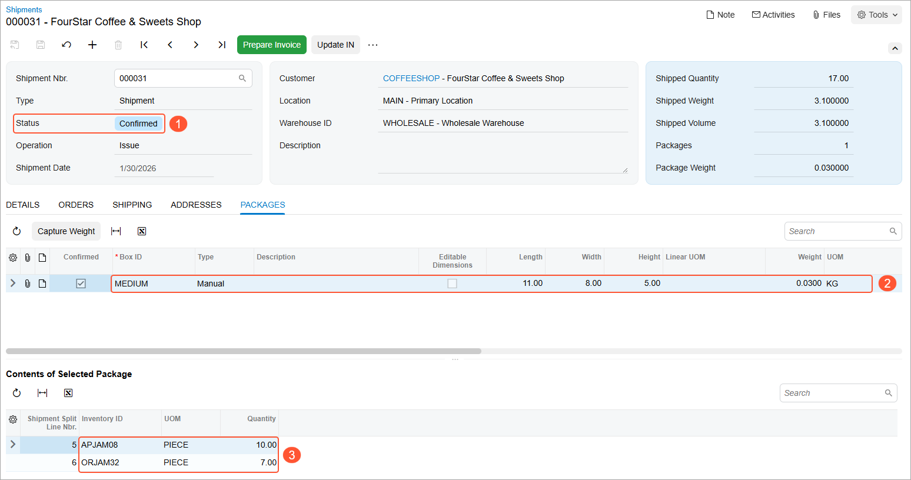

# Packing Operations: Process Activity {#_535ae6af-06b9-4d74-b852-0968d9d101f6 .task}

In the following activity, you will learn how to perform the packing of items for a shipment by using the [Pick, Pack, and Ship](SO_30_20_20.md) \(SO302020\) form.

**Attention:** This activity is based on the *U100* dataset. If you are using another dataset or if any system settings have been changed in *U100*, these changes can affect the workflow of the activity and the results of the processing. To avoid issues, restore the *U100* dataset to its initial state.

## Story { .section}

Suppose that you are a warehouse worker of the wholesale warehouse of the SweetLife Fruits &amp; Jams company. Your warehouse manager gives you a task to pack a shipment. In your organization, the pack workflow is used, which means that you go through the warehouse locations, take the items, and pack the items into boxes for shipping.

## Configuration Overview { .section}

In the *U100* dataset, the following tasks have been performed to support this activity:

-   On the [Enable/Disable Features](CS_10_00_00.md) \(CS100000\) form, the following features have been enabled in the *Inventory and Order Management* group of features:
    -   *Multiple Warehouse Locations*
    -   *Warehouse Management*
    -   *Fulfillment*
-   On the [Warehouses](IN_20_40_00.md) \(IN204000\) form, the *WHOLESALE* warehouse has been created. On the **Locations** tab, the following warehouse locations have been defined: *L3R2S2* and *L2R1S3*.
-   On the [Stock Items](IN_20_25_00.md) \(IN202500\) form, the following stock items have been created, and the corresponding alternate IDs with the *Barcode* type have been defined on the **Cross-Reference** tab:

    **Tip:** For simplicity, in this activity, the alternate IDs will be further referred to as *barcodes*.

    -   *APJAM08*, which has the *AJ08* barcode
    -   *ORJAM32*, which has the *OJ32* barcode
-   On the [Boxes](CS_20_76_00.md) \(CS207600\) form, the *MEDIUM* box has been defined.
-   On the [Sales Orders](SO_30_10_00.md) \(SO301000\) form, the *000032* sales order for the *COFFEESHOP* customer has been created.
-   On the [Shipments](SO_30_20_00.md) \(SO302000\) form, the *000031* shipment has been created for this sales order.

## Process Overview { .section}

In this activity, acting as a packer, you will do the following:

1.  Open the [Pick, Pack, and Ship](SO_30_20_20.md) \(SO302020\) form and scan the number of the shipment. Then you will scan the following barcodes required for the shipment packing:

    1.  The box to which you pack the items
    2.  The location from which you take the items
    3.  The packed items
    4.  The quantities of the packed items.
    When the packing is finished, you will confirm the shipment.

2.  Review the shipment.

**Tip:** In any working mode, you enter a command or barcode by typing it in the **Scan** box and pressing Enter. In production systems, you will scan the appropriate barcodes rather than manually entering them.

## System Preparation { .section}

Before you start the automated packing operations, you need to perform the following instructions:

1.  Sign in to a company with the U100 dataset preloaded as a warehouse worker with the *perkins* username and the *123* password.
2.  On the **Warehouse Management** tab of the [Sales Orders Preferences](SO_10_10_00.md) \(SO101000\) form, do the following:
    1.  Clear the **Display the Pick Tab** check box.
    2.  Make sure that the **Display the Pack Tab** check box is selected.
    3.  On the form toolbar, click **Save**.

## Step 1: Packing Items for Shipping { .section}

To record that items to be added to a shipment have been picked from the warehouse locations and packed into boxes, do the following:

1.  Open the [Pick, Pack, and Ship](SO_30_20_20.md) \(SO302020\) form, and make sure the **Pack** tab is opened.

    **Tip:** If the **Pack** tab does not appear by default, you can type `@pack` in the **Scan** box and press Enter to switch to Pack mode.

2.  In the **Scan** box, enter `000031`, which is the reference number of the shipment for which you are performing picking and packing operations. The system loads the shipment lines to the table on the **Pack** tab, and shows the reference number of the shipment that is currently being processed in the **Shipment Nbr.** box of the Summary area.
3.  Enter `MEDIUM` to select the box to which the items are packed.
4.  Enter `L3R2S2` to specify the first location from which the items are taken.
5.  Enter `AJ08` to pack the item. \(*AJ08* is the barcode for *APJAM08*, the 8-ounce jar of apple jam, which is included in the *000031* shipment.\)

    The system highlights the first line of the shipment in bold and specifies *1* as the **Picked Quantity** and **Packed Quantity**.

6.  Set the quantity of the current line to `10` as follows:
    1.  On the form toolbar, click **Set Qty**. The system prompts you to enter the item quantity.
    2.  In the **Scan** box, type `10`. The system highlights the first line of the shipment in green and specifies *10* as the **Picked Quantity** and **Packed Quantity**.
7.  Enter `L2R1S3` to specify the next location from which the items are taken.
8.  Enter `OJ32` to pack the item. \(*OJ32* is the barcode for *ORJAM32*, the 32-ounce jar of orange jam, which is included in the *000031* shipment.\)
9.  Set the quantity of the item to `7`.
10. On the form toolbar, click **Confirm Package** to confirm the package.
11. On the form toolbar, click **Confirm Shipment** to confirm the shipment document, which is assigned the *Confirmed* status.

## Step 2: Reviewing the Shipment { .section}

To review the result and make sure that the shipment has been confirmed, do the following:

1.  While you are still viewing the shipment on the [Pick, Pack, and Ship](SO_30_20_20.md) \(SO302020\) form, click the link in the **Shipment Nbr.** box. On the [Shipments](SO_30_20_00.md) \(SO302000\) form, which opens, review the shipment that you have processed in the previous step. It is now assigned the *Confirmed* status \(Item 1 below\).
2.  Review the **Packages** tab. Notice that one *MEDIUM* box \(Item 2\) is shown in the upper table, and the **Contents of Selected Package** table shows the items \(Item 3\) that you have packed into this box, as shown in the following screenshot.

    

## Step 3: Resuming the Picking of Items for Shipment on the Pick Tab { .section}

Suppose that you need to process the shipment for which you are performing picking and packing operations. To cause the system to show the **Pick** tab on the [Pick, Pack, and Ship](SO_30_20_20.md) \(SO302020\) form, do the following:

1.  On the **Warehouse Management** tab of the [Sales Orders Preferences](SO_10_10_00.md) \(SO101000\) form, select the **Display the Pick Tab** check box.
2.  On the form toolbar, click **Save**.

**Parent topic:**[Automated Packing Operations](../UserGuide/WMS_Pack_Mapref.md)

