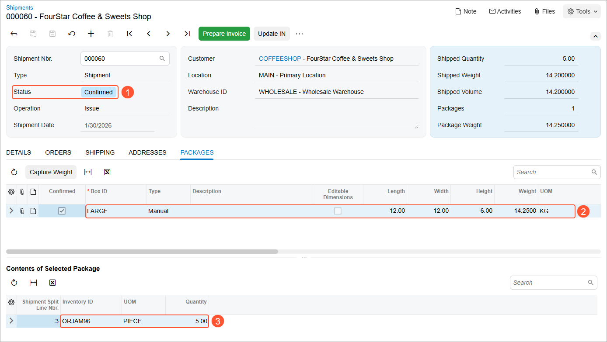

# Paperless Picking: To Process Single-Shipment Pick Lists {#_eb899684-4976-4f19-8ba8-cfe9a76a759f .task}

In the following activity, you will learn how to process a single-shipment pick list. That is, you will prepare, pick, and pack a pick list of the *Single-Shipment* type in the paperless picking workflow.

**Attention:** This activity is based on the *U100* dataset. If you are using another dataset or if any system settings have been changed in *U100*, these changes can affect the workflow of the activity and the results of the processing. To avoid issues, restore the *U100* dataset to its initial state.

## Story { .section}

Suppose that in the Wholesale warehouse of SweetLife three shipments require shipping. Two of the shipments are the urgent ones, and the warehouse manager wants to assign picking of these shipments to a picker who picks items faster than any other picker in the warehouse. The third shipment can be picked by any warehouse worker.

## Configuration Overview {#section_tz4_djx_cnb .section}

In the *U100* dataset, the following tasks have been performed to support this activity:

-   On the [Enable/Disable Features](CS_10_00_00.md) \(CS100000\) form, the following features have been enabled in the *Inventory and Order Management* group of features:
    -   *Warehouse Management*
    -   *Fulfillment*
-   On the [Warehouses](IN_20_40_00.md) \(IN204000\) form, the *WHOLESALE* warehouse has been created. On the **Locations** tab, the following warehouse locations have been defined: *L3R1S2*, *L3R2S2*, and *L3R3S2*. On the **Totes** tab, the following totes have been defined: *T14* and *T15*.
-   On the [Stock Items](IN_20_25_00.md) \(IN202500\) form, the following stock items have been created, and the corresponding barcodes have been defined:
    -   *ORJAM96*, which has the *OJ96* barcode
    -   *LEMJAM96*, which has the *LJ96* barcode
    -   *APJAM96*, which has the *AJ96* barcode
-   On the [Boxes](CS_20_76_00.md) \(CS207600\) form, the *LARGE* box has been defined.
-   On the [Sales Orders](SO_30_10_00.md) \(SO301000\) form, the following sales orders have been created for the *COFFEESHOP* customer: *000063*, *000063*, and *000065*.
-   On the [Shipments](SO_30_20_00.md) \(SO302000\) form, the following shipment documents have been created for these sales orders: *000059*, *000060*, and *000061*.

## Process Overview { .section}

1.  Acting as a warehouse manager, you will open the [Create Pick Lists](SO_50_30_50.md) \(SO503050\) form, select the shipments to be processed, and create single-shipment pick lists.
2.  You will open the [Manage Picking Queue](SO_50_30_75.md) \(SO503075\) form, raise the priority of two pick lists out of three.
3.  On the same form, you will assign these two pick lists to a selected picker.
4.  On the same form, you will send all created pick lists to the picking queue.
5.  Acting as a picker, you will pick items in the first urgent pick list by using the [Pick, Pack, and Ship](SO_30_20_20.md) \(SO302020\) form.
6.  On the same form, you will pick items in the second urgent pick list.
7.  Acting as a packer, you will pack one of the shipments of the wave by using the [Pick, Pack, and Ship](SO_30_20_20.md) form and review the confirmed shipment on the [Shipments](SO_30_20_00.md) \(SO302000\) form.

**Tip:** In any working mode, you enter a command or barcode by typing it in the **Scan** box and pressing Enter. In production systems, you will scan the appropriate barcodes rather than manually entering them.

## System Preparation { .section}

Before you start performing paperless picking, do the following:

1.  Launch the Acumatica ERP website, and sign in to a company with the *U100* dataset preloaded. You should sign in as the warehouse manager by using the *angelo* username and the *123* password.
2.  In the info area at the upper-right corner of the top pane of the Acumatica ERP screen, make sure that the business date is set to *1/30/2026*. If a different date is displayed, click the Business Date menu button and select *1/30/2026* from the calendar. For simplicity, you'll create and process all documents in this activity using this business date.
3.  On the **Warehouse Management** tab of the [Sales Orders Preferences](SO_10_10_00.md) \(SO101000\) form, make sure that the **Display the Pick Tab** and **Display the Pack Tab** check boxes are selected.

## Step 1: Creating Pick Lists { .section}

To create pick lists, acting as the warehouse manager, do the following:

1.  Open the [Create Pick Lists](SO_50_30_50.md) \(SO503050\) form.
2.  In the **Action** box, select *Create Single-Shipment Pick Lists*.
3.  In the **Warehouse** box, select *WHOLESALE*.
4.  In the **End Date** box, make sure *1/30/2026* is specified.
5.  In the table, select the unlabeled check boxes next to the shipments with reference numbers from *000059* through *000061*.
6.  On the form toolbar, click **Process**. Close the **Processing** dialog box after processing completes.

## Step 2: Changing the Priority of Pick Lists { .section}

To change the picking priority of the created pick lists, do the following:

1.  Open the [Manage Picking Queue](SO_50_30_75.md) \(SO503075\) form.
2.  In the **Action** box, select *Change Picking Priority*.
3.  In the **Warehouse** box, select *WHOLESALE*.
4.  In the table, select the unlabeled check boxes next to the pick lists with the *000059* and *000060* reference numbers.
5.  In the Selection area, select *Urgent* in the **Set Picking Priority to** box.
6.  On the form toolbar, click **Process**. Close the **Processing** dialog box after processing completes.

Notice that the value in the **Priority** column for the pick lists with reference numbers *000059* and *000060* has been changed to *Urgent*.

## Step 3: Assigning Pick Lists to a Picker { .section}

To assign the pick lists with the *Urgent* priority to a picker, do the following:

1.  While you are still viewing the pick lists on the [Manage Picking Queue](SO_50_30_75.md) \(SO503075\) form, in the **Action** box, select *Assign Pick Lists*.
2.  In the table, select the unlabeled check boxes next to the shipments with the *000059* and *000060* reference numbers.
3.  In the Selection area, select *hardin* in the **Assign to Picker** box.
4.  On the form toolbar, click **Process**. Close the **Processing** dialog box after processing completes.

Notice that the **Assigned Picker** column for the pick lists with reference numbers *000059* and *000060* has the *hardin* value.

## Step 4: Sending the Pick Lists to the Picking Queue { .section}

To send the pick lists to the picking queue, do the following:

1.  While you are still viewing the pick lists on the [Manage Picking Queue](SO_50_30_75.md) \(SO503075\) form, in the **Action** box, select *Send to Picking Queue*.
2.  On the form toolbar, click **Process All**. Close the **Processing** dialog box after processing completes.
3.  Sign out of the system.

## Step 5: Picking Items in the First Urgent Pick List { .section}

Acting as Steven Hardin, the picker, you will accept a pick list, assign a tote to the pick list, and then pick the items, placing them in the selected tote. Do the following:

1.  Sign in to the system as a picker by using the *hardin* username and the *123* password.
2.  Open the [Pick, Pack, and Ship](SO_30_20_20.md) \(SO302020\) form, and make sure the **Pick** tab is opened.
3.  On the form toolbar, click **Next List**.

    In the Summary area, the system prompts you to enter the nearest location.

4.  In the **Scan** box, enter `L3R3S1`. The system loads the *000060* pick list which is assigned to you and has the closest location.
5.  Enter `T14` to assign a tote to the pick list you will be picking.

    The system assigns the tote to the *000060* pick list and shows the tote ID in the **Tote ID** column for the only line of the pick list.

    You have assigned the tote to the pick list, and you can start picking the items.

6.  Follow the instructions of the system to pick the items:
    1.  Enter `L3R3S2` to select the location from which you are currently picking items.
    2.  Enter `OJ96` to pick the item. \(*OJ96* is the barcode for *ORJAM96*, the 96-ounce jar of orange jam, which is included in the *000060* shipment.\)

        The system highlights the line in bold and specifies *1* as the **Picked Quantity**.

    3.  Set the quantity of the item to `5` as follows:
        1.  On the form toolbar, click **Set Qty**. The system prompts you to enter the item quantity.
        2.  In the **Scan** box, enter `5`. This indicates that five 96-ounce jars of orange jam have been picked from the location and placed in the *T14* tote.

The system indicates that you have finished picking items in the first urgent pick list. In the next step, you will learn how to start picking another pick list.

## Step 6: Picking Items in the Second Urgent Pick List { .section}

Acting as Steven Hardin, the picker, you will accept the second pick list, assign a tote to the pick list, and then pick the items, placing them in the selected tote. Do the following:

1.  On the form toolbar of the [Pick, Pack, and Ship](SO_30_20_20.md) \(SO302020\) form, click **Finish and Next** to confirm that picking of the first pick list is finished and you are ready to pick another. The system loads the *000059* pick list, which is assigned to you.
2.  In the **Scan** box, enter `T15` to assign a tote to the pick list you will be picking.

    The system assigns the tote to the *000059* pick list, and shows the tote ID in the **Tote ID** column for all lines of the pick list.

    Now you have assigned the tote to the pick list, and you can start picking items.

3.  Follow the instructions of the system to pick the items:

    1.  Enter `L3R2S2` to select the location from which you are currently picking items.
    2.  Enter `LJ96` to pick the item. \(*LJ96* is the barcode for *LEMJAM96*, the 96-ounce jar of lemon jam, which is included in the *000059* shipment.\)

        The system highlights the line in bold and specifies *1* as the **Picked Quantity**.

    3.  Set the quantity of the item to `3` as follows:
        1.  On the form toolbar, click **Set Qty**. The system prompts you to enter the item quantity.
        2.  In the **Scan** box, type `3`. This indicates that three 96-ounce jars of lemon jam have been picked from the location and placed in the *T15* tote.
    You have finished picking items from this location, so you will proceed to picking items from another location.

4.  Follow the instructions of the system to go to the second location and pick the items:

    1.  Enter `L3R1S2` to select the location from which you are currently picking items.
    2.  Enter `AJ96` to pick the item. \(*AJ96* is the barcode for *APJAM96*, the 96-ounce jar of apple jam, which is included in the *000059* shipment.\)
    3.  Set the quantity of the item to `5`.
    The system indicates that you have finished picking items in the *000059* pick list.

5.  On the form toolbar, click **Confirm Pick List** to confirm that picking has been finished and you are not going to pick items from other pick lists.
6.  Sign out of the system.

## Step 7: Packing Items for a Shipment { .section}

For the purposes of this activity, you will pack just one of the shipments for a pick list with the picked items, acting as a warehouse worker who handles packing. To pack one of the shipments, do the following:

1.  Sign in to the system as a warehouse worker who will perform packing operations by using the *sauer* username and the *123* password.
2.  Open the [Pick, Pack, and Ship](SO_30_20_20.md) \(SO302020\) form.
3.  Enter `T14`, which is the reference number of the tote ready for packing.
4.  Enter `LARGE` to select the box in which you are packing the items.
5.  Enter `OJ96` to select the item being packed. The system highlights the first line of the shipment in bold and specifies *1* as the **Packed Quantity**, and shows this item in the **Package Content** tab.
6.  Set the quantity of the item to `5` as follows:
    1.  On the form toolbar, click **Set Qty**. The system prompts you to enter the item quantity.
    2.  In the **Scan** box, enter `5`. The system highlights the first line of the shipment in green and specifies *5* as the **Packed Quantity**.
7.  On the form toolbar, click **Confirm Package** to confirm the package.
8.  On the form toolbar, click **Confirm Shipment**.
9.  Sign out of the system.
10. Sign in again as a warehouse manager by using the *angelo* username and the *123* password.
11. On the [Shipments](SO_30_20_00.md) \(SO302000\) form, open the shipment with the *000060* reference number that you have packed, which is now assigned the *Confirmed* status \(Item 1 below\). On the **Packages** tab, the box in which the items were packed is listed \(Item 2\), and the items packed into this box \(Item 3\) are listed in the **Contents of the Selected Package** table.

    

**Parent topic:**[Paperless Fulfillment of Orders](../UserGuide/WMS_Paperless_Picking_Mapref.md)

