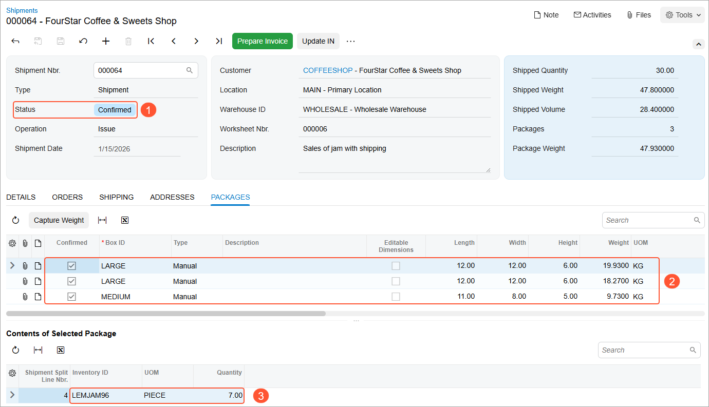

# Paperless Picking: To Process Wave Pick Lists {#_c011505f-22de-4200-9bc9-2a89fd146350 .task}

In the following activity, you will learn how to process a wave pick list. That is, you will prepare, pick, and pack a pick list of the *Wave* type in the paperless picking workflow.

**Attention:** This activity is based on the *U100* dataset. If you are using another dataset or if any system settings have been changed in *U100*, these changes can affect the workflow of the activity and the results of the processing. To avoid issues, restore the *U100* dataset to its initial state.

## Story { .section}

Suppose that the FourStar Coffee &amp; Sweets customer of SweetLife has ordered items in four sales orders. Those orders have been entered into the system, and they now need to be picked, packed, and shipped.

The warehouse manager wants to speed up the process of picking and packing items by creating wave pick lists and assigning this work to multiple pickers. After the warehouse workers pick the items in a wave, a warehouse worker acting as the packer needs to pack the items and confirm the shipments. You will perform these actions, acting as all of these employees.

## Configuration Overview {#section_tz4_djx_cnb .section}

In the *U100* dataset, the following tasks have been performed to support this activity:

-   On the [Enable/Disable Features](CS_10_00_00.md) \(CS100000\) form, the following features have been enabled in the *Inventory and Order Management* group of features:
    -   *Warehouse Management*
    -   *Fulfillment*
    -   *Advanced Picking*
    -   *Paperless Picking*
-   On the [Warehouses](IN_20_40_00.md) \(IN204000\) form, the *WHOLESALE* warehouse has been created. On the **Locations** tab, the following warehouse locations have been defined: *L1R1S1*, *L2R1S1*, *L2R2S1*, *L3R1S3*, *L3R3S2*. On the **Totes** tab, the following totes have been defined: *T16*, *T17*, *T18*, *T19*, and *T20*.
-   On the [Stock Items](IN_20_25_00.md) \(IN202500\) form, the following stock items have been created, and the corresponding barcodes have been defined:
    -   *APJAM96*, which has the *AJ96* barcode
    -   *PLUMJAM32*, which has the *PJ32* barcode
    -   *LEMJAM96*, which has the *LJ96* barcode
    -   *LEMJAM08*, which has the *LJ08* barcode
    -   *KIWIJAM32*, which has the *KJ32* barcode
    -   *LEMJAM32*, which has the *LJ32* barcode
-   On the [Sales Orders](SO_30_10_00.md) \(SO301000\) form, the following sales orders have been created for the *COFFEESHOP* customer: *000067*, *000068*, *000069*, and *000070*.
-   On the [Shipments](SO_30_20_00.md) \(SO302000\) form, the following shipment documents have been created for these sales orders: *000062*, *000063*, *000064*, and *000065*.

## Process Overview { .section}

In this activity, you will do the following:

1.  Acting as the warehouse manager, you will create wave pick lists and send them to the picking queue by using the [Create Pick Lists](SO_50_30_50.md) \(SO503050\) form. Then you will review the created pick lists on the [Picking Queue](SO_50_30_80.md) \(SO503080\) form.
2.  Acting as pickers, you will do the following by using the [Pick, Pack, and Ship](SO_30_20_20.md) \(SO302020\) form:
    1.  Pick items in a wave pick list
    2.  Pick items in another wave pick list
3.  Acting as a packer, you will pack one of the shipments of the wave by using the [Pick, Pack, and Ship](SO_30_20_20.md) form.

**Tip:** In any working mode, you enter a command or barcode by typing it in the **Scan** box and pressing Enter. In production systems, you will scan the appropriate barcodes rather than manually entering them.

## System Preparation { .section}

Before performing the steps of this activity, do the following:

1.  Launch the Acumatica ERP website, and sign in to a company with the *U100* dataset preloaded. You should sign in as the warehouse manager by using the *angelo* username and the *123* password.
2.  In the info area at the upper-right corner of the top pane of the Acumatica ERP screen, make sure that the business date is set to *1/30/2026*. If a different date is displayed, click the Business Date menu button and select *1/30/2026* from the calendar. For simplicity, you'll create and process all documents in this activity using this business date.
3.  As a prerequisite, perform [Paperless Picking: Implementation Activity](WMS_Paperless_Picking_Implem_Activity.md) to enable the *Paperless Picking* feature.
4.  On the **Warehouse Management** tab of the [Sales Orders Preferences](SO_10_10_00.md) \(SO101000\) form, make sure that the **Display the Pick Tab**, **Display the Pack Tab**, and **Add Totes to Shipments on the Fly** check boxes are selected.

## Step 1: Creating Wave Pick Lists { .section}

To create wave pick lists, acting as the warehouse manager, do the following:

1.  Open the [Create Pick Lists](SO_50_30_50.md) \(SO503050\) form.
2.  In the **Action** box, select *Create Wave Pick Lists*.
3.  In the **Warehouse** box, select *WHOLESALE*.
4.  In the **End Date** box, make sure that *1/30/2026* is specified.
5.  Enter `3` as the **Max. Number of Pickers**.
6.  Enter `2` as the **Max. Number of Totes per Picker**.
7.  Select the **Send to Picking Queue** check box.
8.  In the table, select the unlabeled check boxes in the rows of the shipments with reference numbers from *000062* through *000065*.
9.  On the form toolbar, click **Process**. Close the **Processing** dialog box after the processing is completed.

    The system has created the wave pick lists and sent them to the picking queue.

10. Open the [Picking Queue](SO_50_30_80.md) \(SO503080\) form.
11. In the **Warehouse** box, select *WHOLESALE*.
12. In the **Pick List Type** box, select *Wave*.

    The system shows the wave pick lists that you created in the table on the **Pick** tab. Notice that only two wave pick lists have been created. \(Although you have entered *3* as the maximum number of pickers, the system has found the optimal workflow and determined that two pickers are enough for picking the wave.\) Both rows with pick lists have the *Added to Queue* status, which means that pickers can start picking the items in these pick lists.

13. Sign out of the system.

## Step 2a: Picking Items in a Wave \(Picker 1\) { .section}

To pick the items in one of the wave pick lists, do the following:

1.  Sign in to the system as a picker by using the *perkins* username and the *123* password.
2.  Open the [Pick, Pack, and Ship](SO_30_20_20.md) \(SO302020\) form, and make sure that the **Pick** tab is opened.
3.  On the form toolbar, click **Next List**.

    In the Summary area, the system prompts you to enter the nearest location.

4.  Enter `L2R2S1` to select the requested location. The system loads the *000001/2* pick list, whose items are closest to the entered location.
5.  Assign totes to the shipments that you will be picking by doing the following:

    1.  Enter `T16`. The system assigns this tote to the *000064* shipment and inserts the tote ID in the **Tote ID** column of all lines of this shipment.
    2.  Enter `T17`. The system assigns this tote to the *000065* shipment.
    You have assigned the totes to shipments, and now you can start picking items.

6.  Pick the items from the first location by doing the following:
    1.  Enter `LJ32` to pick the item. \(*LJ32* is the barcode for *LEMJAM32*, the 32-ounce jar of lemon jam, which is included in the *000065* shipment.\)
    2.  Set the quantity of the item to `15` as follows:
        1.  On the form toolbar, click **Set Qty**. The system prompts you to enter the item quantity.
        2.  Enter `15`. You have indicated to the system that fifteen 32-ounce jars of lemon jam have been picked from the location and placed in the *T17* tote, which is assigned to the *000065* shipment.
7.  Start picking the items from the second location by doing the following:
    1.  Enter `L2R1S1` to select the location from which you are currently picking items.
    2.  Enter `KJ32` to pick the item. \(*KJ32* is the barcode for *KIWIJAM32*, the 32-ounce jar of kiwi jam, which is included in the *000064* shipment.\)

        Suppose that you have started picking items from the second location and realized that *T16* will not be spacious enough to fit the entire quantities of the *KIWIJAM32* and *LEMJAM96* items.

    3.  Set the quantity to `15`, which is the quantity that will fit in the *T16* tote.
8.  Click **Add Tote** on the form toolbar to add a tote for the *000064* shipment.
9.  Enter `T18`. The system assigns this tote to the *000064* shipment and inserts the tote ID in the **Tote ID** column of all lines of this shipment that have not been picked yet.
10. Continue picking the items from the second location by doing the following:
    1.  Enter `KJ32` to pick the item.
    2.  Enter `T18` to select the tote to which you want to pick the remaining items.
    3.  Set the quantity to `5`.
11. Pick the items from the third location by doing the following:
    1.  Enter `L1R1S1` to select the location from which you are currently picking items.
    2.  Enter `LJ96` to pick the item. \(*LJ96* is the barcode for *LEMJAM96,* the 96-ounce jar of lemon jam, which is included in the *000064* shipment.\)
    3.  Enter `T18` to select the tote to which you want to pick the ten 96-ounce jars of lemon jam.
    4.  Set the quantity to `10`.
12. On the form toolbar, click **Confirm Pick List** to confirm that picking is finished.

    You have finished picking the items for one of the pick lists.

13. Sign out of the system.

## Step 2b: Picking Items in a Wave \(Picker 2\) { .section}

To pick the items in another wave pick list, do the following:

1.  Sign in to the system as a picker by using the *rollins* username and the *123* password.
2.  Open the [Pick, Pack, and Ship](SO_30_20_20.md) \(SO302020\) form, and make sure that the **Pick** tab is opened.
3.  On the form toolbar, click **Next List**.

    In the Summary area, the system prompts you to enter the nearest location.

4.  Enter `L1R1S1` to select the requested location. The system loads the *000001/1* pick list, whose items are closest to the entered location.
5.  Assign totes to the shipments that you will be picking by doing the following:

    1.  Enter `T19`. The system assigns the tote to the *000062* shipment and inserts the tote ID in the **Tote ID** column of all lines of this shipment.
    2.  Enter `T20`. The system assigns the tote to the *000063* shipment.
    You have assigned the totes to shipments, and now you can start picking items.

6.  Pick the items from the first location by doing the following:
    1.  Enter `AJ96` to pick the item. \(*AJ96* is the barcode for *APJAM96* the 96-ounce jar of apple jam, which is included in the *000062* shipment.\)
    2.  Set the quantity of the item to `10` as follows:

        1.  On the form toolbar, click **Set Qty**. The system prompts you to enter the item quantity.
        2.  Enter `10`. You have indicated to the system that ten 96-ounce jars of apple jam have been picked from the location and placed in the *T19* tote, which is assigned to the *000062* shipment.
        You are continuing to pick items for different shipments from the same location, so you do not need to scan the location barcode again.

    3.  Do the following:
        1.  Enter `LJ96` \(*LJ96* is the barcode for *LEMJAM96*, the 96-ounce jar of apple jam, which is included in the *000063* shipment.\)
        2.  Set the quantity to `10`.
7.  To proceed to picking items from the second location, do the following:
    1.  Enter `L3R1S3` to select the location from which you are currently picking items.
    2.  Enter `LJ08` to pick the item. *LJ08* is the barcode for *LEMJAM08*, the 8-ounce jar of lemon jam, which is included in the *000063* shipment.
    3.  Set the quantity of the item to `5`.
8.  Pick the items from the third location by doing the following:
    1.  Enter `L3R3S2` to select the location from which you are currently picking items.
    2.  Enter `PJ32` to pick the item. \(*PJ32* is the barcode for *PLUMJAM32*, the 32-ounce jar of plum jam, which is included in the *000062* shipment.\)
    3.  Set the quantity of the item to `5`.
9.  On the form toolbar, click **Confirm Pick List** to confirm that picking is finished.

    You have finished picking the items in both pick lists.

10. Sign out of the system.

## Step 3: Packing a Shipment for the Wave {#section_p24_jvr_mwb .section}

At this point in the wave picking, all of the shipments from the wave can be packed. For the purposes of this activity, you will pack just one of the shipments \(*000064*\) from the wave, acting as a warehouse worker who handles packing. You will create several packages because the quantity of items in the shipment is too large to pack them into one box. To pack the shipment from the wave, do the following:

1.  Sign in to the system as a warehouse worker who will perform packing operations by using the *sauer* username and the *123* password.
2.  Open the [Pick, Pack, and Ship](SO_30_20_20.md) \(SO302020\) form.
3.  Enter `T16`, which is the reference number of the tote whose items are ready for packing.

    In the Summary area, the system notifies you that this is one of the two totes scanned for the *000064* shipment.

4.  Enter `T18`, which is the reference number of the second tote assigned to the shipment.
5.  Enter `LARGE` to select the box in which you are packing the items.
6.  Enter `LJ96` to select the item being packed. The system highlights the first line of the shipment in bold and inserts *1* as the **Packed Quantity**; it also adds a line with this item to the **Package Content** tab.

    While packing, you find out that the selected box can hold only seven 96-ounce jars of the jam.

7.  Set the quantity of the item to `7` as follows:
    1.  On the form toolbar, click **Set Qty**. The system prompts you to enter the item quantity.
    2.  Enter `7`. The system inserts *7* as the **Packed Quantity**.
8.  On the form toolbar, click **Confirm Package** to confirm the package.
9.  Enter `LARGE` to select the box in which you are now packing the items.
10. Enter `LJ96` to select the item being packed.
11. Set the quantity of this item to `3`. The system highlights the first line of the shipment in green to indicate that all 96-ounce jars of lemon jam have been packed.
12. Enter `KJ32` to select the next item being packed in the same box.

    While packing the second box, you find out that the selected box can hold only three 96-ounce jars of lemon jam and ten 32-ounce jars of kiwi jam.

13. Set the quantity of the `KJ32` item to `10`.
14. On the form toolbar, click **Confirm Package** to confirm the package.
15. Enter `MEDIUM` to select the box in which you are packing the rest of the items.
16. Enter `KJ32` to select the item being packed in the last box.
17. Set the quantity of this item to `10`.
18. On the form toolbar, click **Confirm Package** to confirm the last package for the *000064* shipment.
19. On the form toolbar, click **Confirm Shipment**.
20. Sign out of the system, and sign in again as a warehouse manager by using the *angelo* username and the *123* password.
21. On the [Shipments](SO_30_20_00.md) \(SO302000\) form, open the *000064* shipment, which you packed. Notice that it is now assigned the *Confirmed* status \(Item 1 below\). The **Packages** tab lists each box in which the items were packed \(Item 2\). For the box whose row is selected in this table, the items packed into this box \(Item 3\) are listed in the **Contents of Selected Package** table.

    

**Parent topic:**[Paperless Fulfillment of Orders](../UserGuide/WMS_Paperless_Picking_Mapref.md)

