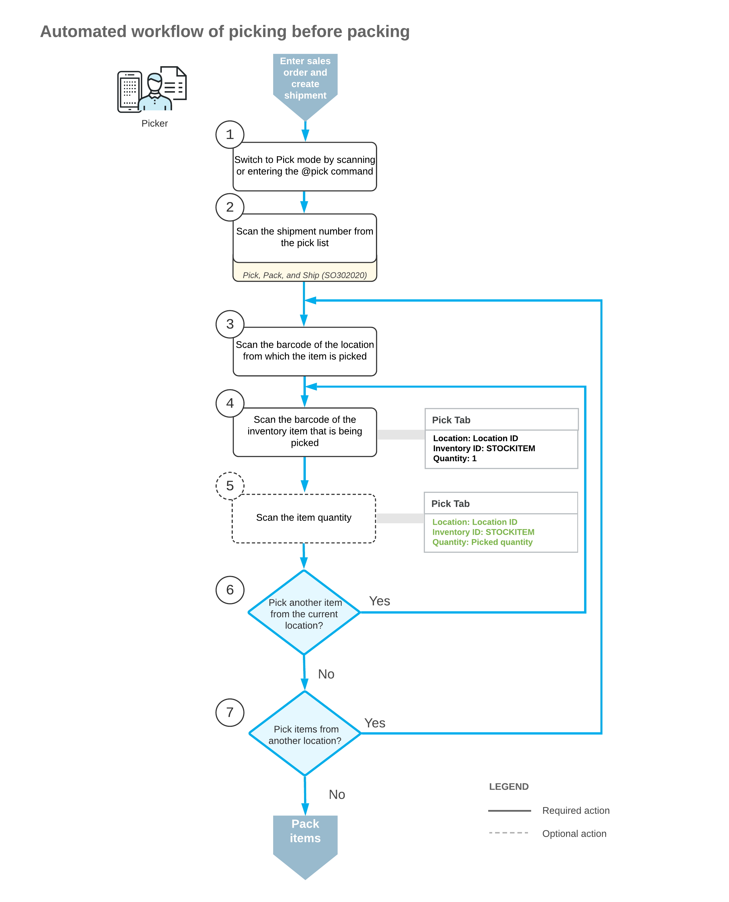
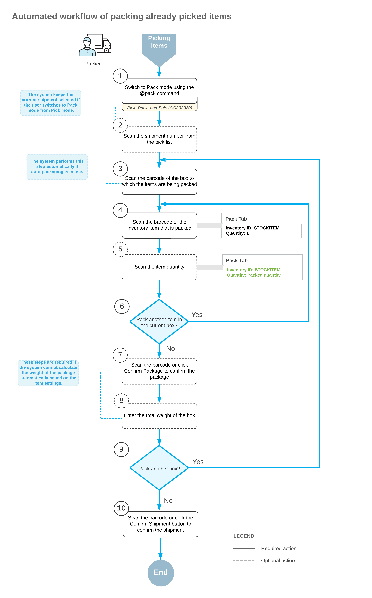

# Picking and Packing Operations: General Information {#_15701f8d-7884-486e-802d-b1f20207b134 .concept}

If the *Warehouse Management* and *Fulfillment* features are enabled on the [Enable/Disable Features](CS_10_00_00.md) \(CS100000\) form, you can perform the automated picking and packing of inventory items for shipping by using a barcode scanner or a mobile device with a scanning option.

You can perform automated picking of items for open shipments prepared on the [Shipments](SO_30_20_00.md) \(SO302000\) form for the sources included in the following table.

|Source|Source Form|Shipment Type|
|------|-----------|-------------|
|Sales order|[Sales Orders](SO_30_10_00.md) \(SO301000\)|*Shipment*|
|Transfer order|[Sales Orders](SO_30_10_00.md) \(SO301000\)|*Transfer*|
|Return order|[Sales Orders](SO_30_10_00.md) \(SO301000\)|*Shipment* with the *Receipt* operation|
|Project|[Project Materials](PM_30_65_00.md) \(PM306500\)|*Material Issue*|

You can perform automated packing for open shipments prepared for sales orders and transfer orders with at least one picked item.

In this topic, you will read about the workflow for the automated picking and packing of inventory items in Acumatica ERP. The workflow in this topic is based on the assumption that your system has the recommended configuration described in [Picking and Packing Operations: Implementation Checklist](WMS_Pick_Pack_Implem_Checklist.md).

## Learning Objectives { .section}

In this chapter, you will do the following:

-   Enable the needed system features
-   Specify the minimum required configuration for the automated picking and packing workflow
-   Learn the recommended settings that you can specify to make the system fit your business requirements
-   Pick the items for a shipment in an automated mode
-   Pack the items into a box in an automated mode
-   Confirm a shipment after picking and packing items

## Applicable Scenario { .section}

In your company's warehouses, picking processes and packing processes are completed by different warehouse workers. Each warehouse worker acting as a picker goes through the warehouse with a printed pick list, picks the items from the warehouse locations specified in the pick list, and transfers them to a packing line. A packer that works at the packing line selects the box for packing the shipment and packs the items; after the shipment is completely packed, the packer confirms the shipment. To track the operations as they are being performed, both pickers and packers scan the appropriate barcodes by using a barcode scanner or mobile device.

## Workflow for the Automated Picking of Items { .section}

The automated processing of picking items to be packed involves the actions shown in the following diagram.

To process the picking of items by using Pick mode, you perform the following steps:

1.  *Switch to Pick mode*.

    You open the [Pick, Pack, and Ship](SO_30_20_20.md) \(SO302020\) form \(or the corresponding screen in the Acumatica mobile app\) and switch to Pick mode by scanning or entering the *@pick* barcode.

2.  *Scan the shipment number*.

    To start the automated processing, you scan the reference number of the shipment to be processed. The system displays the lines of the scanned document in the table and inserts the reference number of the document that is currently selected for processing in the **Shipment Nbr.** box.

3.  *Scan the location barcode*.

    When you scan the barcode of the location from which the item is picked, the system searches for the location in the lines of the document that is currently selected.

4.  *Scan the item barcode*.

    When you scan the barcode of the picked item, the system searches for the item in the lines of the currently selected document. If the UOM defined by the barcode of the scanned item is specified for a non-base unit of measure \(UOM\), the system converts the item quantity defined by this barcode to the picked quantity in the base unit of measure for this item. The system displays the picked quantity in the **Picked Quantity** column and highlights the line \(in bold if the line has been picked partially, or in green if the line has been picked in full\).

5.  Optional: *Change the picking location*.

    If the full item quantity isn’t available for picking in the current location, you can change the location of the unpicked quantity. For more information about this process, see [Picking and Packing Operations: Changing Picking Locations During Picking](WMS_Changing_Picking_Location.md).

6.  Optional: *Scan the item quantity*.

    To change the picked quantity in the line that is currently being processed, you switch to Quantity Editing mode by scanning or entering the `*qty` barcode, and manually enter the quantity in the UOM of defined by the barcode of the scanned item.

    If the shipment contains lines of multiple sales orders with the same item and location, you can enter the consolidated quantity of these lines. The system will automatically distribute the entered quantity among the lines with this item.

7.  *Pick another line*.

    If another item needs to be picked for the currently selected location, you scan the item barcode \(return to Step 4\) and repeat the process for the item.

8.  *Pick items from another location*.

    If you need to pick items from another location, you scan the location barcode \(return to Step 3\), and repeat the process for the location.

    If you have finished the picking operation, to proceed with packaging, you scan the `@pack` barcode to switch to Pack mode.

## Workflow for the Automated Packing of Items { .section}

The automated processing of packing items that have been picked involves the actions shown in the following diagram.

To process the packing of items \(and use Pack mode\) after picking them, you perform the following steps:

1.  *Switch to Pack mode*.

    You open the [Pick, Pack, and Ship](SO_30_20_20.md) \(SO302020\) form \(or the corresponding screen in the Acumatica mobile app\) and switch to Pack mode by scanning or entering *@pack* barcode.

2.  Optional: *Scan the document number*.

    To start automated processing, you scan the reference number of the shipment to be processed. \(If you have switched to Pack mode from Pick mode with the document selected, the document is selected automatically.\) The system shows the lines of the document in the table and inserts the reference number of the document that is currently selected for processing in the **Shipment Nbr.** box.

3.  *Scan the barcode of the box*.

    You scan the barcode of the box into which the items will be packed.

    **Tip:** If the *Automatic Packaging* feature is enabled on the [Enable/Disable Features](CS_10_00_00.md) \(CS101000\) form, this step is performed automatically.

4.  *Scan the item barcode*.

    When you scan the barcode of the packed item, the system searches for the item in the lines of the document that is currently selected. If the UOM defined by the barcode of the scanned item corresponds to a non-base unit of measure, the system converts the item quantity defined by this barcode to the packed quantity in the base unit of measure for this item. The system also shows the packed quantity in the **Packed Quantity** column, and highlights the line \(in bold if the line has been processed partially, or in green if the line has been processed in full\).

5.  Optional: *Scan the item quantity*.

    To change the quantity of packed items in the line that is currently being processed, you switch to Quantity Editing mode by scanning or entering the `*qty` barcode, and manually enter the quantity in the UOM defined by the barcode of the scanned item.

6.  *Pack another line*.

    If another item needs to be packed in the current box, you return to scanning the item barcode \(return to Step 4\) and repeat the process for the item.

7.  Optional: *Confirm the box*.

    If all items are packed in a single box, you confirm the box by scanning the `*package*confirm` barcode or by clicking the **Confirm Package** button. If the items are packed in multiple boxes, the system automatically confirms the current box when you scan the barcode of the next box to be packed for the current shipment.

    **Tip:** If the *Automatic Packaging* feature is enabled on the [Enable/Disable Features](CS_10_00_00.md) form, this step is performed automatically for the shipments that are being packed to a single box that the system has suggested automatically.

8.  Optional: *Enter the box weight*.

    If the **Confirm Weight for Each Package** check box is selected on the **Warehouse Management** tab of the [Sales Orders Preferences](SO_10_10_00.md) \(SO101000\) form, the system requires you to confirm the weight of each box after you confirm the package.

    If you want to accept the automatically calculated weight of the box, you can do that by clicking **OK** on the form toolbar or by scanning the `*ok` command. If you want to change the calculated weight of the box, you must enter the new value to continue to the next step.

9.  Optional: *Enter the new package dimensions*.

    If the **Confirm Dimensions for Packages with Editable Dimensions** check box is selected on the **Warehouse Management** tab of the [Sales Orders Preferences](SO_10_10_00.md) form and you confirm a package that includes a box with the **Editable Dimensions** check box selected on the [Boxes](CS_20_76_00.md) \(CS207600\) form, the system requires you to confirm the existing dimensions or enter different dimensions for the box.

    If you want to accept the default dimensions of the box, you can do that by clicking **OK** on the form toolbar or by scanning the `*ok` command. If you want to change the dimensions of the box, you must enter the length, width, and height \(in this order\) in one string with a space as a separator to continue to the next step.

    The following example shows the entry of dimensions: `20 15 40`.

10. *Pack another box*.

    If more items need to be packed to another box for the current shipment, you return to scanning the barcode of the box barcode \(return to Step 3\) and repeat the process for another box.

11. *Complete the packing process*.

    If you have finished the packing operation and you do not need to specify shipping options, you scan the `*confirm*shipment` barcode or click the **Confirm Shipment** button on the form toolbar. The system confirms the shipment on the [Shipments](SO_30_20_00.md) \(SO302000\) form.

**Parent topic:**[Automated Picking and Packing Operations](../UserGuide/WMS_Pick_Pack_Mapref.md)

