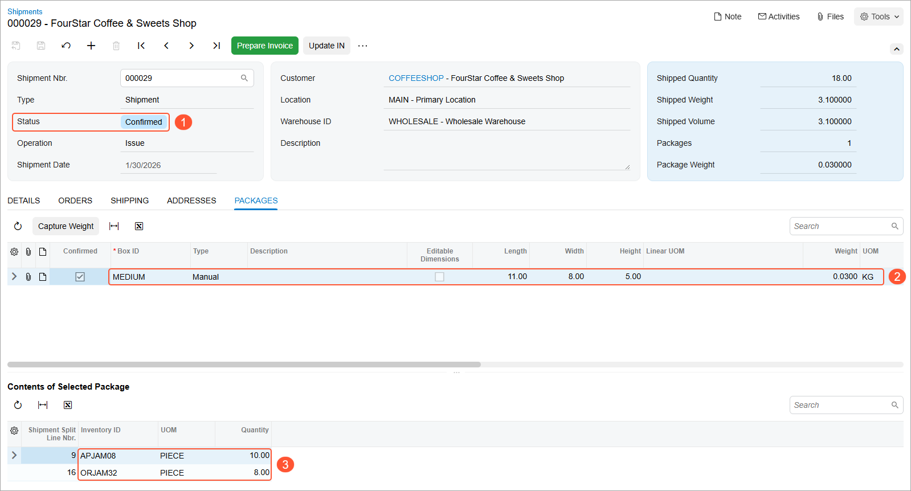

# Picking and Packing Operations: Process Activity {#_003da556-cfb7-4d1c-ab75-47d9e371e5f6 .task}

In the following activity, you will learn how to perform the picking and packing of items for a shipment by using the [Pick, Pack, and Ship](SO_30_20_20.md) \(SO302020\) form.

**Attention:** This activity is based on the *U100* dataset. If you are using another dataset or if any system settings have been changed in *U100*, these changes can affect the workflow of the activity and the results of the processing. To avoid issues, restore the *U100* dataset to its initial state.

## Story { .section}

Suppose that you are a warehouse worker of the wholesale warehouse of the SweetLife Fruits &amp; Jams company. Your warehouse manager gives you a task to prepare a shipment. In your organization, the pick and pack workflow is used, which means that you go through the warehouse locations and pick the items listed in the shipment pick list. Then you go to the packing line and pack the picked items into boxes.

## Configuration Overview { .section}

In the *U100* dataset, the following tasks have been performed to support this activity:

-   On the [Enable/Disable Features](CS_10_00_00.md) \(CS100000\) form, the following features have been enabled in the *Inventory and Order Management* group of features:
    -   *Multiple Warehouse Locations*
    -   *Warehouse Management*
    -   *Fulfillment*
-   On the **Warehouse Management** tab of the [Sales Orders Preferences](SO_10_10_00.md) \(SO101000\) form, the **Display the Pick Tab** and the **Display the Pack Tab** check boxes are selected.
-   On the [Warehouses](IN_20_40_00.md) \(IN204000\) form, the *WHOLESALE* warehouse has been created. On the **Locations** tab, the following warehouse locations have been defined: *L3R2S1* and *L2R1S3*.
-   On the [Stock Items](IN_20_25_00.md) \(IN202500\) form, the following stock items have been created, and the corresponding alternate IDs with the *Barcode* type have been defined on the **Cross-Reference** tab:

    **Tip:** For simplicity, in this activity, the alternate IDs will be further referred to as *barcodes*.

    -   *APJAM08*, which has the *AJ08* barcode
    -   *ORJAM32*, which has the *OJ32* barcode
-   On the [Boxes](CS_20_76_00.md) \(CS207600\) form, the *MEDIUM* box has been defined.
-   On the [Sales Orders](SO_30_10_00.md) \(SO301000\) form, the *000030* sales order for the *COFFEESHOP* customer has been created.
-   On the [Shipments](SO_30_20_00.md) \(SO302000\) form, the *000029* shipment has been created for this sales order.

## Process Overview { .section}

In this activity, you will do the following:

1.  Acting as a picker, you will open the [Pick, Pack, and Ship](SO_30_20_20.md) \(SO302020\) form, and scan the number of the shipment. Then you will pick the items from the warehouse locations and scan their barcodes and quantities.
2.  Acting as a packer, you will switch to Pack mode on the same form and scan the barcode of the box to which you pack the items. Then you will scan the item barcodes and the quantities of the items being packed into the box, and confirm the shipment.
3.  Acting as the warehouse manager, you will open the [Shipments](SO_30_20_00.md) \(SO302000\) form and review the shipment.

**Tip:** In any working mode, you enter a command or barcode by typing it in the **Scan** box and pressing Enter. In production systems, you will scan the appropriate barcodes rather than manually entering them.

## System Preparation { .section}

Before you start performing the automated picking and packing operations, you need to perform the following instructions:

1.  Sign in to a company with the *U100* dataset preloaded. You should sign in as a warehouse worker with the *perkins* username and the *123* password.
2.  On the **Warehouse Management** tab of the [Sales Orders Preferences](SO_10_10_00.md) \(SO101000\) form, make sure the **Display the Pick Tab** and **Display the Pack Tab** check boxes are selected.

## Step 1: Picking Items for Shipping { .section}

To record that the items to be added to a shipment have been picked from the warehouse locations, do the following:

1.  Open the [Pick, Pack, and Ship](SO_30_20_20.md) \(SO302020\) form, and make sure the **Pick** tab is opened.
2.  In the **Scan** box, type `000029`, which is the reference number of the shipment for which you are performing picking and packing operations, and press Enter. The system loads the shipment lines to the table on the **Pick** tab, and shows the reference number of the shipment that is currently being processed in the **Shipment Nbr.** box of the Summary area.
3.  Enter `L3R2S1` to select the location from which the item is picked.
4.  Enter `AJ08` to pick the item. \(*AJ08* is the barcode for *APJAM08*, the 8-ounce jar of apple jam, which is included in the *000029* shipment.\)

    The system highlights the first line of the shipment in bold and specifies *1* as the **Picked Quantity**.

5.  Set the quantity of the item to `10` as follows:
    1.  On the form toolbar, click **Set Qty**. The system prompts you to enter the item quantity.
    2.  In the **Scan** box, enter `10`. The system highlights the corresponding line of the shipment in green and specifies *10* as the **Picked Quantity**.
6.  Enter `L2R1S3` to select another location from which the item is picked.
7.  Enter `OJ32` to select the item being picked. \(*OJ32* is the barcode for *ORJAM32*, the 32-ounce jar of orange jam, which is included in the *000029* shipment.\)

    The system highlights the second line of the shipment in bold and specifies *1* as the **Picked Quantity**.

8.  Set the quantity of the line to `8`. The system highlights in green the second line of the shipment and specifies *8* as the **Picked Quantity**.

You have picked the items for the shipment, and now you can proceed with packing the shipment.

## Step 2: Packing Items for Shipping { .section}

To record that the items have been packed into a box, do the following:

1.  While you are still viewing the *000029* shipment on the [Pick, Pack, and Ship](SO_30_20_20.md) \(SO302020\) form, enter `@pack` in the **Scan** box to switch to Pack mode. Notice that the shipment is still selected and its reference number is shown in the **Shipment Nbr.** box of the Summary area.
2.  Enter `MEDIUM` to select the box for packaging the shipment.
3.  Enter `AJ08` to select the item being packed. The system highlights the first line of the shipment in bold and specifies *1* as the **Packed Quantity**.
4.  Set the quantity of the item to `10` as follows:
    1.  On the form toolbar, click **Set Qty**. The system prompts you to enter the item quantity.
    2.  In the **Scan** box, enter `10`. The system highlights the first line of the shipment in green and specifies *10* as the **Packed Quantity**.
5.  Enter `OJ32` to select the item being packed.
6.  Set the quantity of the item to `8`. The shipment is packed in full now.
7.  On the form toolbar, click **Confirm Package** to confirm the package.
8.  On the form toolbar, click **Confirm Shipment**.

## Step 3: Reviewing the Shipment { .section}

To review the result and make sure that the shipment has been confirmed, do the following:

1.  While you are still viewing the *000029* shipment on the [Pick, Pack, and Ship](SO_30_20_20.md) \(SO302020\) form, click the link in the **Shipment Nbr.** box. On the [Shipments](SO_30_20_00.md) \(SO302000\) form, which opens, review the shipment that you have processed earlier. It is now assigned the *Confirmed* status \(Item 1 below\).
2.  Review the **Packages** tab. Notice that one *MEDIUM* box \(Item 2\) is shown in the upper table, and the **Contents of Selected Package** table shows the items \(Item 3\) that you have packed into this box.

    

The shipment processing is completed.

**Parent topic:**[Automated Picking and Packing Operations](../UserGuide/WMS_Pick_Pack_Mapref.md)

