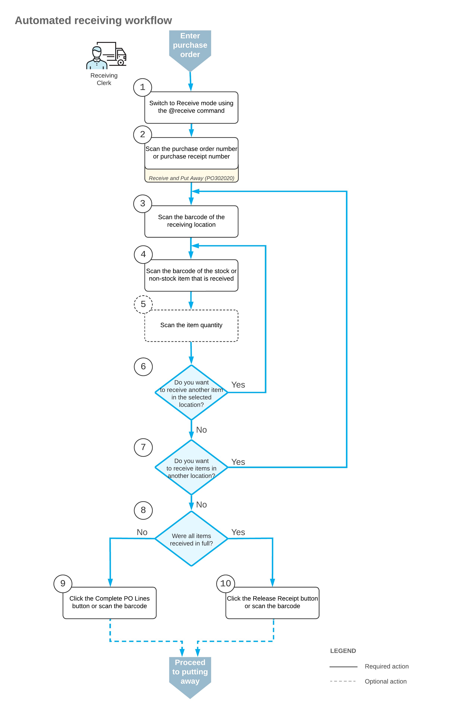
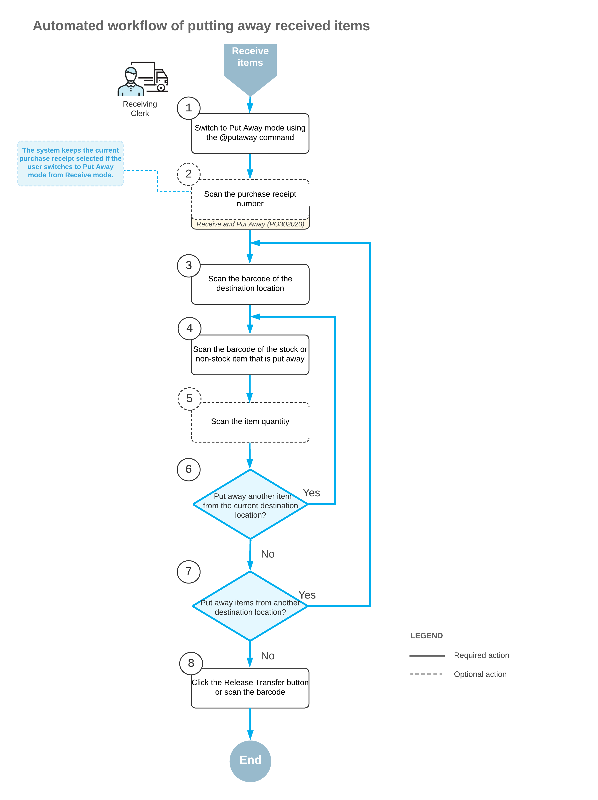

# Receiving and Putting Away Operations: General Information {#_2b4ef89d-2cb7-4e67-a03b-26655897d01d .concept}

If the *Receiving* feature is enabled on the [Enable/Disable Features](CS_10_00_00.md) \(CS100000\) form, you can perform the automated receiving and putting away of stock and non-stock items by using a barcode scanner or a mobile device with a scanning option.

In this topic, you will read about the workflow for the automated receiving and putting away of these items in Acumatica ERP. The workflow in this topic is based on the assumption that your system has the recommended configuration described in [Receiving and Putting Away Operations: Implementation Checklist](WMS_Receive_Put_Away_Implem_Checklist.md).

## Learning Objectives { .section}

In this chapter, you will do the following:

-   Enable the needed system features
-   Specify the minimum required configuration for the automated receiving and putting away workflow
-   Learn the recommended settings that you can specify to make the system fit your business requirements
-   Learn about the automated receiving and putting away, purchase return, and receipt verification workflows
-   Receive items to a receiving location of a warehouse in an automated mode and verify the received items and item quantities
-   Put away items in their storage locations in an automated mode

## Applicable Scenario { .section}

You can perform the automated receiving and putting away of stock and non-stock items if in your company's warehouses, all purchased items are received to a dedicated location. A warehouse worker receives items from a purchase receipt to this location. Then the warehouse worker puts away the received items in the locations where the items will be stored. To track the operations as they are being performed, the worker scans the appropriate barcodes by using a barcode scanner or mobile device.

You can perform automated receiving of items for purchase orders with the *Open* status, and purchase receipts with the *Balanced* status. You can perform the automated putting away of items for purchase receipts with the *Released* status.

## Receipt of Extra Quantity { .section}

If the actual quantity of received items is more than the quantity specified in the processed purchase document, you can process the receipt of these items as an automated operation as well. If you scan a quantity that exceeds the quantity in the line that is currently being processed, the system requests confirmation for adding this quantity. If you confirm this addition with the `*ok` barcode or the **OK** button, the system adds a new line with the extra quantity to the processed purchase receipt, and shows this line in the table on the **Receive** tab of the [Receive and Put Away](PO_30_20_20.md) \(PO302020\) form. The line with the extra quantity is not linked to the purchase order for which the purchase receipt was prepared.

## Workflow for the Automated Receipt of Items { .section}

The automated processing of receiving items involves the actions shown in the following diagram.

To process the receipt of items \(and to use Receive mode\), you perform the following steps:

1.  *Switch to Receive mode*.

    You can switch to Receive mode by scanning the `@receive` barcode.

2.  *Scan the document number*.

    To start the automated processing, you scan the reference number of the purchase order or purchase receipt to be processed. The system displays the lines of the scanned document in the table of the [Receive and Put Away](PO_30_20_20.md) \(PO302020\) form. If you have scanned the purchase order number, the system creates and saves the related purchase receipt automatically. In the **Receipt Nbr.** box, the system inserts the reference number of the receipt that is currently selected for processing.

    **Tip:** If the purchase order has 15 or fewer lines, the system creates a related purchase receipt and adds the lines of the order to the receipt automatically. If the purchase order has more than 15 lines, the created purchase receipt does not have any lines. The receipt lines are added when you scan the barcodes of the items of the purchase order.

3.  *Scan the barcode of the receiving location*.

    You scan the barcode of the warehouse location where the items are being received.

4.  *Scan the item barcode*.

    When you scan the barcode of the received item, the system searches for the item in the lines of the document that is currently selected. If the item is found, the system highlights the line in bold.

5.  Optional: *Scan the item quantity*.

    To change the received quantity in the line that is currently being processed, you switch on Quantity Editing mode by scanning or entering the `*qty` barcode, and manually enter the quantity in the UOM defined by the barcode of the scanned item.

    **Tip:** The system updates the quantity of the item in the purchase receipt on the [Purchase Receipts](PO_30_20_00.md) \(PO302000\) form only after you release this purchase receipt on the [Receive and Put Away](PO_30_20_20.md) form. If the received quantity of the item on the [Receive and Put Away](PO_30_20_20.md) form differs from the quantity of the item on the [Purchase Receipts](PO_30_20_00.md) form, you need to verify if the purchase receipt is released on the [Receive and Put Away](PO_30_20_20.md) form.

6.  *Receive another item*.

    If you need to receive at least one other item for the document currently being processed, you return to scanning the item barcode \(that is, return to Step 4\) and repeat the process for the item.

7.  *Receive items in another location*.

    If items must be received in another warehouse location, you scan the barcode of this location \(return to Step 3\) and repeat the process for the next location.

8.  *Complete the receiving process*.

    If you have finished the receiving operation but not all items have been received for the purchase receipt \(and they will not be received in the future\), you scan the `*complete*polines` barcode, or click the **Complete PO Lines** button. The system marks all purchase receipt lines as completed and releases the purchase receipt.

    If you have finished the receiving operation and all items have been received for the purchase receipt \(or the items were received partially and more items will be received in the future\), you scan the `*release` barcode or click the **Release Receipt** button. The system does not mark partially received lines as completed and releases the purchase receipt on the [Purchase Receipts](PO_30_20_00.md) form.

## Workflow for the Automated Putting Away of Items { .section}

The automated processing of putting away items involves the actions shown in the following diagram.

To process the putting away of items by using Put Away mode, you perform the following steps:

1.  *Switch to Put Away mode*.

    You can switch to Put Away mode by scanning the `@putaway` barcode.

2.  *Scan the document number*.

    To start the automated processing, you scan the reference number of the released purchase receipt to be processed. \(If you switch to Put Away mode from Receive mode with a document selected, the system selects the document automatically.\) The system displays the lines of the scanned document in the table of the [Receive and Put Away](PO_30_20_20.md) \(PO302020\) form. In the **Receipt Nbr.** box, the system inserts the reference number of the document that is currently selected for processing.

3.  *Scan the barcode of the destination location*.

    You scan the barcode of the destination location in which you are putting away items. If the items of a particular line are put away in multiple locations, the system creates line splits for the line. You can review the IDs of the locations to which the items are put away by clicking **Transfer Allocations** on the table toolbar of the **Put Away** tab.

    Once you have specified the destination location, the system automatically creates a single-step inventory transfer document that reflects the movement of the items from the receiving location to the storage location.

4.  *Scan the barcode of the item*.

    When you scan the barcode of the received item, the system searches for the item in the lines of the document that is currently selected. To indicate the line or lines with the scanned barcode, the system selects the **Matched** check box in these lines. The system highlights the lines in bold if they are processed partially, and in green if they are processed in full.

5.  Optional: *Scan the item quantity*.

    To change the quantity being put away in the line that is currently being processed, you switch to Quantity Editing mode by scanning or entering the `*qty` barcode, and manually enter the quantity in the UOM defined by the barcode of the scanned item.

6.  *Scan another item*.

    If at least one other item needs to be put away, you return to scanning the barcode of the item \(that is, return to Step 4\) and repeat the process for the item.

7.  *Scan another destination location*.

    If items must be transferred to another destination location, you scan the barcode of this location \(return to Step 3\) and repeat the process.

8.  *Complete the process of putting items away*.

    When you have finished the operation of putting away items, you scan the `*release` barcode or click the **Release Transfer** button. The system releases the inventory transfer document that was prepared during the automated operation; the items are moved to the destination locations.

**Attention:** Putaway of non-stock items is currently supported only in automated warehouse operations. You should note the following details:

-   You can’t create a transfer of a non-stock item directly on the [Transfers](IN_30_40_00.md) \(IN304000\) form.
-   Putaway of a non-stock item doesn’t generate inventory or GL transactions because the item has already been expensed at receipt release, and inventory isn’t tracked for it.

**Parent topic:**[Automated Receiving and Putting Away Operations](../UserGuide/WMS_Receive_Put_Away_Mapref.md)

