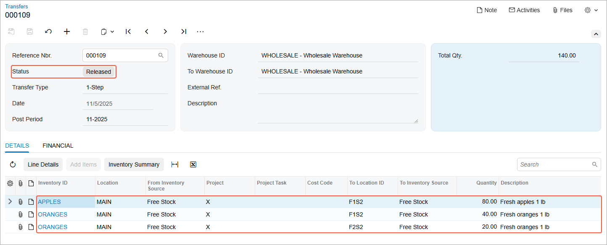

# Receiving and Putting Away Operations: To Receive and Put Away Items {#_7ae966bd-712b-4183-8a79-16ee075dcc2b .task}

In the following activity, you will learn how to perform the receiving and putting away of items by using the [Receive and Put Away](PO_30_20_20.md) \(PO302020\) form.

**Attention:** This activity is based on the *U100* dataset. If you are using another dataset or if any system settings have been changed in *U100*, these changes can affect the workflow of the activity and the results of the processing. To avoid issues, restore the *U100* dataset to its initial state.

## Story { .section}

Suppose that you are a warehouse worker in the wholesale warehouse of the SweetLife Fruits &amp; Jams company. Your warehouse manager gives you a task to receive the purchased fruits \(80 pounds of apples and 60 pounds of oranges\) in the warehouse. In your organization, the receive and put away workflow is used, which means that you receive the purchased items at a receiving location of the warehouse, and then go through the warehouse locations and put away the items in the locations where the fruits are stored. Also suppose that you are putting away the apples and part of the oranges in one fruit location, and the rest of the oranges in another fruit location.

## Configuration Overview { .section}

In the *U100* dataset, the following tasks have been performed to support this activity:

-   On the [Enable/Disable Features](CS_10_00_00.md) \(CS100000\) form, the following features have been enabled in the *Inventory and Order Management* group of features:
    -   *Multiple Warehouse Locations*
    -   *Warehouse Management*
    -   *Receiving*
-   On the **Warehouse Management** tab of the [Purchase Orders Preferences](PO_10_10_00.md) \(PO101000\) form, the **Display the Receive Tab** and **Display the Put Away Tab** check boxes have been selected.
-   On the [Warehouses](IN_20_40_00.md) \(IN204000\) form, the *WHOLESALE* warehouse has been created. On the **Locations** tab, the following warehouse locations have been defined: *MAIN*, *F1S2*, and *F2S2*.
-   On the [Stock Items](IN_20_25_00.md) \(IN202500\) form, the following stock items have been created, and the corresponding alternate IDs with the *Barcode* type have been defined on the **Cross-Reference** tab:

    **Tip:** For simplicity, in this activity, the alternate IDs will be further referred to as *barcodes*.

    -   *APPLES*, which has the *AP1LB* barcode
    -   *ORANGES*, which has the *OR1LB* barcode
-   On the [Purchase Orders](PO_30_10_00.md) \(PO301000\) form, the *000022* purchase order to the *ALLFRUITS* vendor has been created.
-   On the [Purchase Receipts](PO_30_20_00.md) \(PO302000\) form, the *000018* purchase receipt has been prepared for this purchase order.

## Process Overview { .section}

In this activity, acting as a warehouse worker, you will do the following:

1.  Open the [Receive and Put Away](PO_30_20_20.md) \(PO302020\) form, switch to Receive mode, and scan the number of the purchase receipt. Then you will receive the items and scan their barcodes and quantities. After you finish receiving items, you will release the purchase receipt.
2.  On the same form, switch to Put Away mode and scan the barcodes of the warehouse locations to which the items are being put away, and scan the item barcodes and quantities. After you finish putting away items, you will release the transfer receipt.
3.  Open the [Transfers](IN_30_40_00.md) \(IN304000\) form and review the generated transfer document.

**Tip:** In any working mode, you enter a command or barcode by typing it in the **Scan** box and pressing Enter. In production systems, you will scan the appropriate barcodes rather than manually entering them.

## System Preparation { .section}

Before you start the automated receiving and putting away operations, you need to perform the following instructions:

1.  Sign in to a company with the *U100* dataset preloaded as a warehouse worker with the *perkins* username and the *123* password.
2.  On the **Warehouse Management** tab of the [Purchase Orders Preferences](PO_10_10_00.md) \(PO101000\) form, make sure that the **Verify Receipts Before Release** check box is cleared.

## Step 1: Receiving Items in the Receiving Location { .section}

To record that items have been received in the receiving location of the warehouse, do the following:

1.  Open the [Receive and Put Away](PO_30_20_20.md) \(PO302020\) form and make sure the **Receive** tab is opened.
2.  In the **Scan** box, enter `000018`, which is the reference number of the purchase receipt for which you are receiving and putting away items. Press Enter. The system loads the purchase receipt lines to the table and shows the reference number of the purchase receipt that is currently being processed in the **Receipt Nbr.** box of the Summary area.
3.  Enter `MAIN` to select the location in which you are receiving the items.
4.  Enter `AP1LB` to select the item being received. \(*AP1LB* is the barcode for *APPLES*, one pound of apples, which is included in the *000018* receipt.\)

    The system highlights the first line of the purchase receipt in bold and sets the **Received Qty.** to *1*.

5.  Set the quantity of the item to `80` as follows:
    1.  On the form toolbar, click **Set Qty**. The system prompts you to enter the item quantity.
    2.  In the **Scan** box, enter `80`. The system highlights the first line of the purchase receipt in green and sets the **Received Qty.** to *80*.
6.  Enter `OR1LB` to select the item being received. \(*OR1LB* is the barcode for *ORANGES*, one pound of oranges, which is included in the *000018* receipt.\)

    The system highlights the second line of the purchase receipt in bold and sets the **Received Qty.** to *1*.

7.  Set the quantity of the current line to `60`.
8.  On the form toolbar, click **Release Receipt** to release the purchase receipt. The system releases the purchase receipt and generates the inventory receipt transaction to record the receipt of items in the *MAIN* location of the warehouse.

You have received the items for the purchase receipt, and now you can proceed with putting away the received items in the storage locations.

## Step 2: Putting Away the Received Items in the Storage Locations { .section}

To record that items are being put away from the receiving location of the warehouse in the locations where these items will be stored, do the following:

1.  While you are still on the [Receive and Put Away](PO_30_20_20.md) \(PO302020\) form with the *000018* purchase receipt selected, in the **Scan** box, enter `@putaway` to switch to Put Away mode.
2.  Enter `F1S2` to select the location to which the items are being put away.
3.  Enter `AP1LB` to select the item to be put away in this location. The system highlights the first line of the purchase receipt in bold and specifies *1* as the **Putaway Qty.** In the Summary area, the **Transfer Ref. Nbr.** box shows the reference number of the inventory transfer transaction that the system automatically creates to record the movement of items from the receiving location to the storage locations.
4.  Set the quantity of the item to `80` as follows:

    1.  On the form toolbar, click **Set Qty**. The system prompts you to enter the item quantity.
    2.  In the **Scan** box, enter `80`.
    The system highlights the first line of the purchase receipt in green and specifies *80* as the **Putaway Qty.**, indicating that 80 pounds of apples have been put away on the second shelf of the first refrigerator location.

5.  Enter `OR1LB` to select the item being put away.
6.  Set the quantity of the line to `40`, indicating that 40 pounds of oranges have been put away on the second shelf of the first refrigerator location.
7.  Enter `F2S2` to select another location to which the rest of the oranges is being put away.
8.  Enter `OR1LB` to select the item being put away.

    The system shows *&lt;SPLIT&gt;* in the **To Location ID** column, indicating that the received quantity of the item has been distributed over multiple locations during the putaway process.

9.  Set the quantity to `20`, indicating that 20 pounds of oranges have been put away on the second shelf of the second refrigerator location. Now all items from the purchase receipt have been put away in the appropriate storage locations, and these actions have been reflected in the system.
10. On the form toolbar, click **Release Transfer**.

## Step 3: Reviewing the Inventory Transfer { .section}

To review the results of the receiving and putting away operations and make sure that the transfer of the items has been recorded in the system, do the following:

1.  On the **Transfers** tab of the [Receive and Put Away](PO_30_20_20.md) \(PO302020\) form, click the number of the transfer that has been generated as the result of the previous step in the **Reference Nbr.** column.
2.  On the [Transfers](IN_30_40_00.md) \(IN304000\) form, which opens, review the details of the inventory transfer. Make sure that the document has been released.

    

**Parent topic:**[Automated Receiving and Putting Away Operations](../UserGuide/WMS_Receive_Put_Away_Mapref.md)

