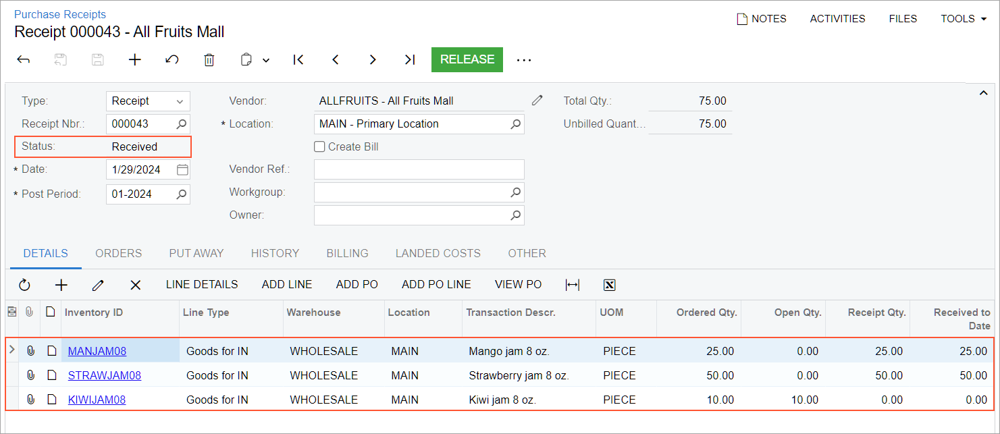

# Receiving and Putting Away Operations: To Receive Items and Verify the Receipt {#_c1254f01-21e0-43e5-8d1c-ed7a1294e63b .task}

In the following activity, you will learn how to perform the receiving of items by using the [Receive and Put Away](PO_30_20_20.md) \(PO302020\) form and verify the receipt by using the [Purchase Receipts](PO_30_20_00.md) \(PO302000\) form.

**Attention:** This activity is based on the *U100* dataset. If you are using another dataset or if any system settings have been changed in *U100*, these changes can affect the workflow of the activity and the results of the processing. To avoid issues, restore the *U100* dataset to its initial state.

## Story { .section}

Suppose that in the wholesale warehouse of the SweetLife Fruits &amp; Jams company, a warehouse manager sets up the receiving workflow with receipt verification. The warehouse manager gives a warehouse worker a task to receive the purchased jams \(25 jars of mango jam, 50 jars of strawberry jam, and 10 jars of kiwi jam\) in the warehouse.

Further suppose that the warehouse worker has received the purchased mango and strawberry jams at the receiving location of the warehouse, but no kiwi jam has been delivered. The worker leaves its quantity as *0* and confirms the receipt of the items. The warehouse manager verifies the correctness of item quantities, corrects some mistakes, and releases the receipt.

You will perform all the steps of this scenario, acting as the warehouse manager and worker.

## Configuration Overview {#section_tz4_djx_cnb .section}

In the *U100* dataset, the following tasks have been performed to support this activity:

-   On the [Enable/Disable Features](CS_10_00_00.md) \(CS100000\) form, the following features have been enabled in the *Inventory and Order Management* group of features:
    -   *Multiple Warehouse Locations*
    -   *Warehouse Management*
    -   *Receiving*
-   On the **Warehouse Management** tab of the [Purchase Orders Preferences](PO_10_10_00.md) \(PO101000\) form, the following check boxes have been selected:
    -   **Display the Receive Tab**
    -   **Display the Put Away Tab**
-   On the [Warehouses](IN_20_40_00.md) \(IN204000\) form, the *WHOLESALE* warehouse has been created. On the **Locations** tab, the *MAIN* warehouse location has been defined.
-   On the [Stock Items](IN_20_25_00.md) \(IN202500\) form, the following stock items have been created, and the corresponding alternate IDs with the *Barcode* type have been defined on the **Cross-Reference** tab:

    **Tip:** For simplicity, the alternate IDs will be further referred to as *barcodes*.

    -   *MANJAM08*, which has the *MJ08* barcode
    -   *STRAWJAM08*, which has the *STJ08* barcode
    -   *KIWIJAM08*, which has the *KWJ08* barcode
-   On the [Purchase Orders](PO_30_10_00.md) \(PO301000\) form, the *000051* purchase order to the *ALLFRUITS* vendor has been created. \(The order is dated 1/29/2026 and has 25 units of the *MANJAM08* stock item, 50 units of the *STRAWJAM08* stock item, and 10 units of the *KIWIJAM08* stock item.\)
-   On the [Purchase Receipts](PO_30_20_00.md) \(PO302000\) form, the *000043* purchase receipt has been prepared for this purchase order. The purchase receipt has 25 units of the *MANJAM08* stock item, 50 units of the *STRAWJAM08* stock item, and 10 units of the *KIWIJAM08* stock item.

## Process Overview { .section}

In this activity, you will do the following:

1.  You will configure the receipt verification workflow on the [Purchase Orders Preferences](PO_10_10_00.md) \(PO101000\) form.
2.  You will open the [Receive and Put Away](PO_30_20_20.md) \(PO302020\) form, switch to Receive mode, and scan the number of the purchase receipt. Then you will receive the items and scan their barcodes and quantities. After you finish receiving items, you will confirm the purchase receipt.
3.  You will open the [Purchase Receipts](PO_30_20_00.md) \(PO302000\) form, review and correct the quantities of the received items, and release the purchase receipt.

## System Preparation { .section}

Before you start performing the automated receiving operation and verification of a purchase receipt, you should launch the Acumatica ERP website and sign in to a company with the *U100* dataset preloaded. You should sign in as a warehouse worker with the *angelo* username and the *123* password.

## Step 1: Setting Up Receipt Verification { .section}

To set up receipt verification while acting in the role of a warehouse manager, do the following:

1.  Open the [Purchase Orders Preferences](PO_10_10_00.md) \(PO101000\) form.
2.  On the **Warehouse Management** tab, select the following check boxes:
    -   **Verify Receipts Before Release**
    -   **Keep Zero Lines on Receipt Confirmation**
3.  On the form toolbar, click **Save**.
4.  Sign out of the system.

## Step 2: Receiving Items in the Receiving Location and Confirming the Receipt { .section}

Acting as a warehouse worker, you will record that items have been received in the receiving location of the warehouse and confirm the receipt. Do the following:

1.  Sign in to the system as the warehouse worker by using the *perkins* username and the *123* password.
2.  Open the [Receive and Put Away](PO_30_20_20.md) \(PO302020\) form, and make sure the **Receive** tab is opened.
3.  In the **Scan** box, enter `000051`. This is the reference number of the purchase order for which you are receiving and putting away items. Press Enter. The system loads the purchase receipt lines to the table. It shows the reference number of the purchase receipt that is being processed \(*000043*\) in the **Receipt Nbr.** box of the Summary area.
4.  Enter `MAIN` to select the location in which you are receiving the items.
5.  Enter `MJ08` to select the item being received. \(*MJ08* is the barcode for *MANJAM08*, one small jar of mango jam, which is included in the *000043* receipt.\)

    The system highlights the first line of the purchase receipt in bold and specifies *1* as the **Received Quantity**.

6.  Set the quantity of the item to *25* as follows:
    1.  On the form toolbar, click **Set Qty**. The system prompts you to enter the item quantity.
    2.  In the **Scan** box, enter `25`. The system highlights the first line of the purchase receipt in green and sets the **Received Qty.** to *25*.
7.  Enter `STJ08` to select the item being received. \(*STJ08* is the barcode for *STRAWJAM08*, one small jar of strawberry jam, which is included in the *000043* receipt.\)

    The system highlights the second line of the purchase receipt in bold and sets the **Received Qty.** to *1*.

8.  Set the quantity of the current line to `50`.
9.  Suppose that no jars of kiwi jam have been delivered. On the form toolbar, click **Confirm Receipt**. The system confirms the purchase receipt.

    As the warehouse worker, you have finished receiving the items.

10. Sign out of the system.

## Step 3: Verifying and Releasing the Receipt { .section}

Acting as the warehouse manager, you will verify and release the receipt whose items have been received in the warehouse. Do the following:

1.  Sign in to the system as the warehouse manager by using the *angelo* username and the *123* password.
2.  Open the **Dashboards** workspace.

    **Tip:** If the **Dashboards** menu item is not on the main menu, click the **More Items** menu item and then click the **Dashboards** tile.

3.  In the **Dashboard: Inventory** category, click *Receiving Clerk*. The *Receiving Clerk* dashboard opens.
4.  Click the **Receipts to Verify** widget, which shows the number of purchase receipts with the *Received* status. The Purchase Receipts for Last 12 Months \(PO3020BI\) inquiry form opens.
5.  In the **Receipt Nbr.** column, click *000043* to open the purchase receipt on the [Purchase Receipts](PO_30_20_00.md) \(PO302000\) form. Notice that the receipt has the *Received* status. Review the items and item quantities \(see the following screenshot\).

    

6.  Notice that for the *STRAWJAM08* item, the **Receipt Qty.** is *50*. Suppose that you have verified that its actual quantity is 48 and that two jars have not been delivered to the warehouse. Change the **Receipt Qty.** in the line to `48`.
7.  Review the quantity of the *KIWIJAM08* item. Suppose that you have verified that no kiwi jam has been delivered. Remove the row with the *KIWIJAM08* item so that you will be able to release the purchase receipt.
8.  On the form toolbar, click **Save**.
9.  On the form toolbar, click **Release**. The system releases the purchase receipt and generates the inventory receipt transaction to record the receipt of items in the *MAIN* location of the warehouse.

    As the warehouse manager, you have checked which items have actually been received, corrected the mistakes, and released the receipt. Now the warehouse worker can proceed with putting the items away.

**Parent topic:**[Automated Receiving and Putting Away Operations](../UserGuide/WMS_Receive_Put_Away_Mapref.md)

