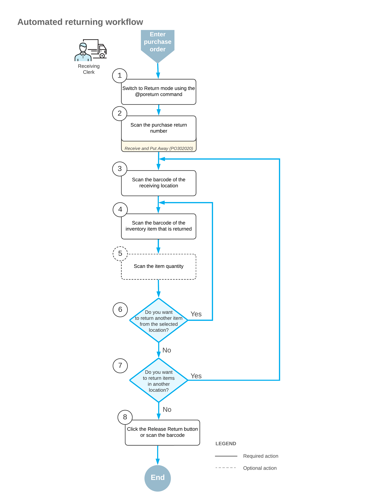

# Receiving and Putting Away Operations: Purchase Return Processing {#_a244f74e-90d0-4ba2-acc0-ecf07e5f645e .concept}

If the *Receiving* feature is enabled on the [Enable/Disable Features](CS_10_00_00.md) \(CS100000\) form, you can process the automated purchase return of stock and non-stock items to the vendor by using a barcode scanner or a mobile device with a scanning option. A purchase return is a purchase receipt of the *Return* type created on the [Purchase Receipts](PO_30_20_00.md) \(PO302000\) form.

In this topic, you will read about the workflow for the automated purchase returns of inventory items in Acumatica ERP. The workflow in this topic is based on the assumption that your system has the recommended configuration described in [Receiving and Putting Away Operations: Implementation Checklist](WMS_Receive_Put_Away_Implem_Checklist.md).

## Applicable Scenario { .section}

You can perform the automated processing of purchase returns of inventory items to the vendor if in your company's warehouses, all purchased items are received to a dedicated location. You issue items from this location while processing a purchase return. To track the operations as they are being performed, you scan the appropriate barcodes by using a barcode scanner or mobile device.

You can perform automated returning of items for purchase returns with the *Balanced* status.

## Workflow for the Automated Purchase Return of Items { .section}

The automated processing of a purchase return of items involves the actions shown in the following diagram.

To process the return of items in Return mode, you perform the following steps:

1.  *Switch to Return mode*.

    You can switch to Return mode by scanning the `@poreturn` barcode.

2.  *Scan the document number*.

    To start the automated processing, you scan the reference number of the purchase return to be processed. The system displays the lines of the scanned document in the table of the [Receive and Put Away](PO_30_20_20.md) \(PO302020\) form. In the **Receipt Nbr.** box, the system inserts the reference number of the purchase return that is currently selected for processing.

3.  *Scan the barcode of the location*.

    You scan the barcode of the warehouse location from which the items are being issued.

4.  *Scan the item barcode*.

    When you scan the barcode of the item, the system searches for the item in the lines of the purchase return that is currently selected. If the item is found, the system highlights the line in bold.

5.  Optional: *Scan the item quantity*.

    To change the received quantity in the line that is currently being processed, you switch on Quantity Editing mode by scanning or entering the `*qty` barcode, and manually enter the quantity in the UOM defined by the barcode of the scanned item.

    **Tip:** The system updates the quantity of the item in the purchase return on the [Purchase Receipts](PO_30_20_00.md) \(PO302000\) form only after you release this purchase return on the [Receive and Put Away](PO_30_20_20.md) form. If the issued quantity of the item on the [Receive and Put Away](PO_30_20_20.md) form differs from the quantity of the item on the [Purchase Receipts](PO_30_20_00.md) form, you need to verify if the purchase receipt is released on the [Receive and Put Away](PO_30_20_20.md) form.

6.  *Return another item*.

    If you need to return at least one other item for the purchase return currently being processed, you scan the item barcode \(that is, return to Step 4\) and repeat the process for the item.

7.  *Complete the returning process*.

    If you have finished the returning operation and all items have been issued for the purchase return \(or the items were issued partially and more items will be issued in the future\), you scan the `*release` barcode or click the **Release Return** button. The system clears the **Completed** and **Closed** check boxes for the purchase order lines with the returned items on the [Purchase Orders](PO_30_10_00.md) \(PO301000\) form and releases the purchase return on the [Purchase Receipts](PO_30_20_00.md) form.

**Parent topic:**[Automated Receiving and Putting Away Operations](../UserGuide/WMS_Receive_Put_Away_Mapref.md)

