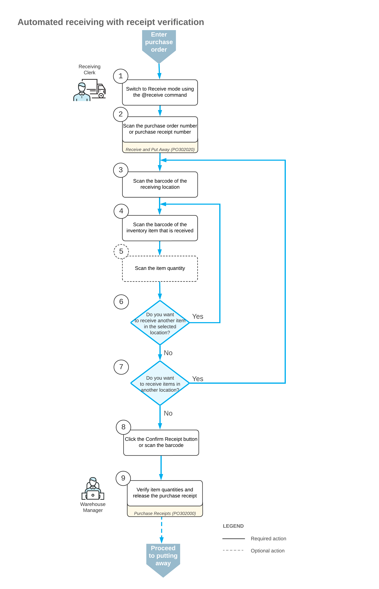

# Receiving and Putting Away Operations: Receipt Verification {#_9bf72e01-2066-402f-bd75-96001d4560a5 .concept}

If the *Receiving* feature is enabled on the [Enable/Disable Features](CS_10_00_00.md) \(CS100000\) form, during the automated receiving of stock and non-stock items, you can perform additional verification of a purchase receipt to ensure the correctness of its items and item quantities. When the **Verify Receipts Before Release** check box is selected on the [Purchase Orders Preferences](PO_10_10_00.md) \(PO101000\) form, a warehouse worker can no longer release a purchase receipt on the [Receive and Put Away](PO_30_20_20.md) \(PO302020\) form. Instead, the warehouse worker confirms the received quantities, which causes the receipt to be assigned the *Received* status. Then the warehouse manager \(or another user responsible for the verification\) verifies and releases the purchase receipt on the [Purchase Receipts](PO_30_20_00.md) \(PO302000\) form.

**Tip:** If the **Keep Zero Lines on Receipt Confirmation** check box is selected on the [Purchase Orders Preferences](PO_10_10_00.md) form and the received quantity of an item is 0, the receipt on the [Purchase Receipts](PO_30_20_00.md) form will contain this line. When the warehouse manager verifies the purchase receipt, they will need to manually delete the lines with a quantity of 0 upon verification or adjust the quantity; the purchase receipt cannot be released if it contains any lines with a quantity of 0.

In this topic, you will read about the workflow for the automated receiving of inventory items with the additional step of purchase receipt verification in Acumatica ERP. The workflow in this topic is based on the assumption that your system has the recommended configuration described in [Receiving and Putting Away Operations: Implementation Checklist](WMS_Receive_Put_Away_Implem_Checklist.md).

## Workflow for the Automated Receipt of Items with Receipt Verification { .section}

The automated processing of receiving items with receipt verification involves the actions shown in the following diagram.

To process the receipt of items \(and to use Receive mode\), the warehouse employees perform the following steps:

1.  Warehouse worker: *Switches to Receive mode*.

    They can switch to Receive mode by scanning the `@receive` barcode.

2.  Warehouse worker: *Scans the document number*.

    To start the automated processing, they scan the reference number of the purchase order, purchase receipt, or purchase return document to be processed. \(They use Return mode to process a purchase return.\) The system displays the lines of the scanned document in the table of the [Receive and Put Away](PO_30_20_20.md) \(PO302020\) form. If they have scanned the purchase order number, the system creates and saves the related purchase receipt automatically. In the **Receipt Nbr.** box, the system inserts the reference number of the receipt or return that is currently selected for processing.

    **Tip:** If the purchase order has 15 or fewer lines, the system creates the related purchase receipt and adds the lines of the order to the receipt automatically. If the purchase order has more than 15 lines, the created purchase receipt does not have any lines. The receipt lines are added when they scan the barcodes of the items of the purchase order.

3.  Warehouse worker: *Scans the barcode of the receiving location*.

    They scan the barcode of the warehouse location where the items are being received.

4.  Warehouse worker: *Scans the item barcode*.

    When they scan the barcode of the received item, the system searches for the item in the lines of the document that is currently selected. If the item is found, the system highlights the line in bold.

5.  Warehouse worker: *Scans the item quantity* \(optional\).

    To change the received quantity in the line that is currently being processed, they switch on Quantity Editing mode by scanning or entering the `*qty` barcode, and manually enter the quantity in the UOM defined by the barcode of the scanned item.

    **Tip:** The system updates the quantity of the item in the purchase receipt on the [Purchase Receipts](PO_30_20_00.md) \(PO302000\) form only after they release this purchase receipt on the [Receive and Put Away](PO_30_20_20.md) form. If the received quantity of the item on the [Receive and Put Away](PO_30_20_20.md) form differs from the quantity of the item on the [Purchase Receipts](PO_30_20_00.md) form, they need to verify if the purchase receipt is released on the [Receive and Put Away](PO_30_20_20.md) form.

6.  Warehouse worker: *Receives another item*.

    If they need to receive at least one other item for the document currently being processed, they return to scanning the item barcode \(that is, return to Step 4\) and repeat the process for the item.

7.  Warehouse worker: *Receives items in another location*.

    If items must be received in another warehouse location, they scan the barcode of this location \(return to Step 3\) and repeat the process for the next location.

8.  Warehouse worker: *Completes the receiving process*.

    If they have finished the receiving operation and all items have been received for the purchase receipt, they scan the `*confirm*receipt` barcode or click the **Confirm Receipt** button. The system does not mark partially received lines as completed and assigns the *Received* status to the purchase receipt on the [Purchase Receipts](PO_30_20_00.md) form.

9.  Warehouse manager: *Verifies the receipt*.

    They open the receipt on the [Purchase Receipts](PO_30_20_00.md) form, check items and item quantities, correct any mistakes, and release the receipt.

**Parent topic:**[Automated Receiving and Putting Away Operations](../UserGuide/WMS_Receive_Put_Away_Mapref.md)

