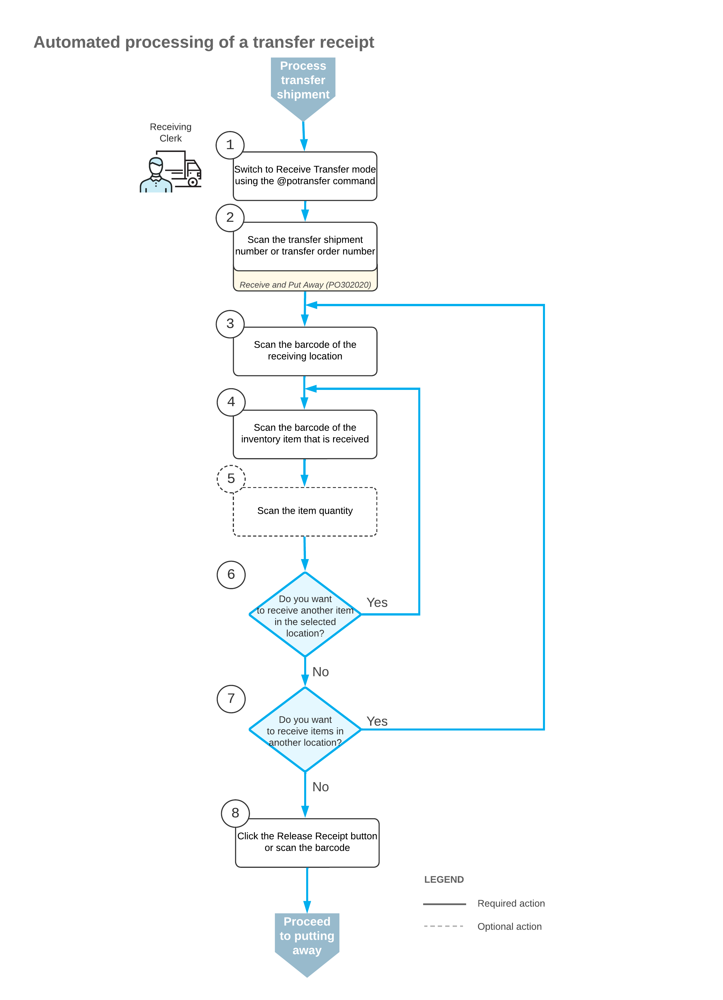

# Receiving and Putting Away Operations: Transfer Receipt Processing {#_a2dd0147-0932-4fcb-be03-a0f8ad7f0755 .concept}

During the automated receiving of inventory items, you can create a transfer receipt based on a transfer shipment or transfer order by using the mobile app or the [Receive and Put Away](PO_30_20_20.md) \(PO302020\) form if both of the following are true:

-   The *Receiving* feature is enabled on the [Enable/Disable Features](CS_10_00_00.md) \(CS100000\) form.
-   The **Display the Receive Transfer Tab** check box is selected on the **Warehouse Management** tab of the [Purchase Orders Preferences](PO_10_10_00.md) \(PO101000\) form.

You can receive a transfer receipt for a transfer shipment and put away the items. Other warehouse workers can also receive separate transfer receipts for the same shipment and put away their items.

## Applicable Scenario { .section}

A variety of scenarios can involve multiple warehouse workers simultaneously receiving transfer receipts for a transfer shipment and putting away items from these transfer receipts, including the following.

Suppose that goods should be transferred from a source warehouse to a destination warehouse. A user creates a transfer order on the [Sales Orders](SO_30_10_00.md) \(SO301000\) form, adds two items \(10 units of each\), and processes the related transfer shipment on the [Shipments](SO_30_20_00.md) \(SO302000\) form. The system generates and releases the inventory transfer that issues the items from the source warehouse. The transfer shipment has the *Completed* status on the [Shipments](SO_30_20_00.md) form.

Further suppose that two warehouse workers have copies of the same shipment confirmation report; one of these workers is responsible for receiving one item, and another worker is responsible for receiving another item. Each worker needs to receive the transferred items in the destination warehouse.

## Workflow for the Automated Processing of a Transfer Receipt { .section}

The automated processing of a transfer receipt involves the actions shown in the following diagram.

To receive transferred items in Receive Transfer mode, you perform the following steps:

1.  *Switch to Receive Transfer mode*.

    You can switch to Receive Transfer mode by scanning the `@potransfer` barcode.

2.  *Scan the document number*.

    To start the automated processing, you scan the reference number of the transfer shipment. \(You can scan the number of the transfer order instead.\) The system creates and saves a transfer receipt—that is, a purchase receipt of the *Transfer Receipt* type on the [Purchase Receipts](PO_30_20_00.md) \(PO302000\) form. The newly created transfer receipt has no lines. In the **Receipt Nbr.** box, the system inserts the reference number of the transfer receipt.

3.  *Scan the barcode of the receiving location*.

    You scan the barcode of the warehouse location where the items are being received.

4.  *Scan the item’s barcode*.

    When you scan the barcode of the received item, the system searches for the item in the lines of the document that is currently selected. If the item is found, the system highlights the line in bold.

5.  Optional: *Scan the item quantity*.
6.  *Complete the receiving process*.

    If you have finished the receiving operation and all items have been received for the transfer receipt, you scan the `*release` barcode or click the **Release Receipt** button. The system releases the transfer receipt on the [Purchase Receipts](PO_30_20_00.md) form.

When the transfer receipt has been released, you can put away the items.

## Duplicate Identifiers in Transfer Receipt Processing { .section}

In Receive Transfer mode on the [Receive and Put Away](PO_30_20_20.md) \(PO302020\) form, you can scan the identifiers \(that is, reference numbers\) of such documents as transfer shipments, transfer receipts, or transfer orders. Although documents of a particular type \(such as transfer receipts\) have unique identifiers, documents of different types \(such as a transfer receipt and a transfer order\) can share the same identifier. When an identifier is scanned, the system searches in the following order until it finds a document with the identifier:

1.  Transfer receipts on the [Purchase Receipts](PO_30_20_00.md) \(PO302000\) form
2.  Transfer shipments on the [Shipments](SO_30_20_00.md) \(SO302000\) form
3.  Transfer orders on the [Sales Orders](SO_30_10_00.md) \(SO301000\) form

Suppose that the system has two documents with identical identifiers: a transfer receipt and a transfer shipment. If you enter an identifier matching a released transfer receipt on the [Receive and Put Away](PO_30_20_20.md) form, the system displays an error message indicating that the transfer receipt has already been released. This prevents further processing of the shipment with the same identifier.

**Attention:** To ensure that identifiers are unique and avoid issues with duplicates, we strongly recommend creating a separate numbering sequence with a unique prefix on the [Numbering Sequences](CS_20_10_10.md) \(CS201010\) form for each type of document. This will cause identifiers to be unique across documents of different types.

**Parent topic:**[Automated Receiving and Putting Away Operations](../UserGuide/WMS_Receive_Put_Away_Mapref.md)

