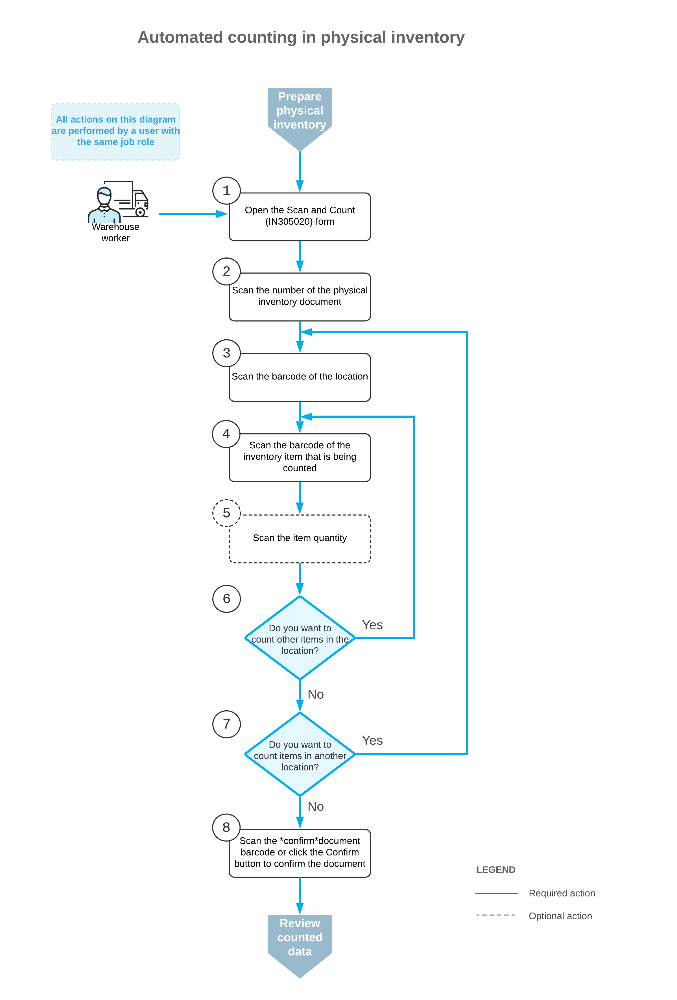

# Counting in Physical Inventory: General Information {#_c4829ece-a676-4d85-ba2a-3b41958c21cd .concept}

If the *Inventory Operations* feature is enabled on the [Enable/Disable Features](CS_10_00_00.md) \(CS100000\) form, you can perform automated counting of items during physical inventory by using a barcode scanner or a mobile device with a scanning option.

In this topic, you will read about the workflow for the automated physical inventory in Acumatica ERP. The workflow in this topic is based on the assumption that your system has the recommended configuration described in [Counting in Physical Inventory: Implementation Checklist](WMS_Scan_and_Count_Implem_Checklist.md).

## Learning Objectives { .section}

In this chapter, you will do the following:

-   Enable the needed system features
-   Learn the recommended settings that you can specify to make the system fit your business requirements
-   Process counting of stock items during physical inventory in automated mode

## Applicable Scenario { .section}

You can use automated counting during physical inventory if your organization uses barcode scanners or mobile devices with a scanning option and all stock items and locations in warehouses are barcoded.

## Workflow for the Automated Scanning and Counting of Items { .section}

The automated counting inventory items involves the steps shown in the following diagram.

To count inventory items \(and use Scan and Count mode\), you perform the following steps:

1.  *Open the [Scan and Count](IN_30_50_20.md) \(IN305020\) form*.

    You open the [Scan and Count](IN_30_50_20.md) form \(or the corresponding screen in the Acumatica mobile app\) to start the counting process.

2.  *Scan the document number*.

    To start the automated counting, you scan the reference number of the physical inventory document. The lines of the scanned document are shown in the table. The reference number of the document selected for processing is displayed in the **Reference Nbr.** box.

3.  *Scan the location barcode*.

    You scan the barcode of the location where the items to be counted are stored. All items that you scan after scanning the location barcode will be assigned to this location.

4.  *Scan the item barcode*.

    When you scan the barcode of the item, the system changes the status of the line for this item to *Entered*.

5.  Optional: *Scan the item quantity*.

    To change the counted quantity in the line that is currently being processed, you switch to Quantity Editing mode by scanning or entering the `*qty` barcode or by clicking **Set Qty** on the form toolbar; you then manually enter the quantity in the UOM coded in the scanned item barcode.

6.  Optional: *Scan the barcode of the next item in the same location*.

    If you have more items to count in the same location, you scan the barcode of the next item \(return to Step 4\) and repeat the process for the item.

7.  Optional: *Scan the barcode of the next location*.

    If items in another location must be counted, you return to scanning the warehouse location \(return to Step 3\) and repeat the process for the items in this location.

8.  *Confirm the counted quantities*.

    When you have finished counting items, you scan the `*confirm` command or click **Confirm** on the form toolbar. The system saves your changes to the physical inventory document on the [Physical Inventory Count](IN_30_50_10.md) \(IN305010\) form.

**Parent topic:**[Automated Processing of Physical Inventory](../UserGuide/WMS_Scan_and_Count_Mapref.md)

