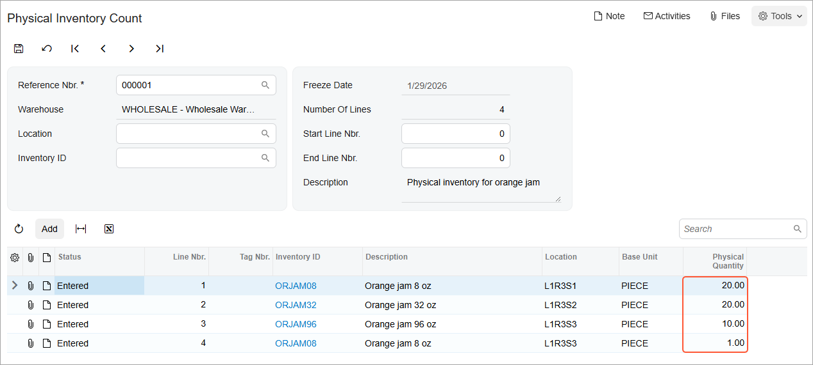

# Counting in Physical Inventory: Process Activity {#_75c786eb-ed32-4b38-94ab-50487341a7e4 .task}

In this activity, you will learn how to perform automated counting during physical inventory on the [Scan and Count](IN_30_50_20.md) \(IN305020\) form.

**Attention:** This activity is based on the *U100* dataset. If you are using another dataset or if any system settings have been changed in *U100*, these changes can affect the workflow of the activity and the results of the processing. To avoid issues, restore the *U100* dataset to its initial state.

## Story { .section}

Suppose that you, as a warehouse worker of the SweetLife Fruits &amp; Jams company, are assigned to perform a physical inventory count by entering barcodes of the stock items and locations. You will count the quantities of orange jam in particular warehouse locations added to the physical inventory document, which your manager has provided to you.

## Configuration Overview { .section}

In the *U100* dataset, the following tasks have been performed to support this activity:

-   On the [Enable/Disable Features](CS_10_00_00.md) \(CS100000\) form, the following features have been enabled in the *Inventory and Order Management* group of features:
    -   *Multiple Warehouse Locations*
    -   *Advanced Physical Count*
    -   *Warehouse Management*
    -   *Inventory Operations*
-   On the [Warehouses](IN_20_40_00.md) \(IN204000\) form, the *WHOLESALE* warehouse has been created. On the **Locations** tab, the following warehouse locations have been defined: *L1R3S1*, *L1R3S2*, and *L1R3S3*.
-   On the [Stock Items](IN_20_25_00.md) \(IN202500\) form, the following stock items have been created, and the corresponding barcodes have been defined:
    -   *ORJAM08*, which has the *OJ08* and *OJ08B* barcodes
    -   *ORJAM32*, which has the *OJ32B* barcode
    -   *ORJAM96*, which has the *OJ96B* barcode
-   On the [Physical Inventory Types](IN_20_89_00.md) \(IN208900\) form, the *ORJCNT* physical inventory type has been created.
-   On the [Prepare Physical Count](IN_50_40_00.md) \(IN504000\) form, the *000001* physical inventory document has been created, and it has the *Counting in Progress* status.

## Process Overview { .section}

In this activity, as you count stock items during a physical inventory count, you will do the following using the [Scan and Count](IN_30_50_20.md) \(IN305020\) form:

1.  Scan the barcode of the physical inventory document and then scan a location barcode and the barcodes of each item you find in this location.
2.  Correct the quantities of items that you find in the location.
3.  Add extra lines for items that you find in the location.
4.  When you have counted all items in all locations added to the physical inventory document, confirm the document.

**Tip:** In any working mode, you enter a command or barcode by typing it in the **Scan** box and pressing Enter. In production systems, you will scan the appropriate barcodes rather than manually entering them.

## System Preparation { .section}

Before you start counting stock items, do the following:

1.  Launch the Acumatica ERP website, and sign in to a company with the *U100* dataset preloaded. You should sign in as a warehouse worker with the *perkins* username and the *123* password.
2.  In the info area at the upper-right corner of the top pane of the Acumatica ERP screen, make sure that the business date is set to *1/30/2026*. If a different date is displayed, click the Business Date menu button and select *1/30/2026* from the calendar. For simplicity, you'll create and process all documents in this activity using this business date.

## Step 1: Entering the Counted Quantities of Items { .section}

Suppose that you are starting to count orange jam in the locations listed in the physical inventory document. To enter the counted quantities in the system, do the following:

1.  Open the [Scan and Count](IN_30_50_20.md) \(IN305020\) form.
2.  In the **Scan** box, type `000001` \(which is the reference number of the physical inventory count\) and press Enter. Notice that the list of items that you will count is displayed on the **Count** tab.
3.  Enter `L1R3S1` as the first location in which you are performing counting.

    Suppose that in this location, you find two boxes of orange jam in 8-ounce jars.

4.  Enter `OJ08B`, which is the barcode for a box of 10 jars of orange jam in 8-ounce jars. The system adds 10 units of the *ORJAM08* item to the row that corresponds to this item.
5.  Enter `OJ08B` again to add the second box. The system adds another 10 units to the first line, so the quantity is *20*.

    You have finished counting items in the *L1R3S1* location and can start counting items in the next location.

6.  Enter `L1R3S2`.

    Suppose that in this location, you find three boxes of orange jam in 32-ounce jars.

7.  Enter `OJ32B`, which is the barcode for a box of 10 jars of orange jam in 32-ounce jars. The system adds 10 units of the *ORJAM32* item to the row that corresponds to this item.
8.  To enter two more boxes, do the following:

    1.  On the form toolbar, click **Set Qty**.
    2.  In the **Scan** box, enter `3`.

        On the **Count** tab, the system changes the quantity of the *ORJAM32* item in the second line to *30*.

    You have finished counting items in the *L1R3S2* location and can start counting items in the next location.

9.  Enter `L1R3S3`.

    Suppose that in this location, you find one box of orange jam in 96-ounce jars.

10. Enter `OJ96B`, which is the barcode for a box of 10 jars of orange jam in 96-ounce jars. The system adds 10 units of the *ORJAM96* item to the row that corresponds to this item.

    You have finished counting items in the *L1R3S3* location, which was the last location in your physical inventory document.

## Step 2: Correcting Quantities in the Physical Inventory Document { .section}

Suppose that you have entered an extra box of *ORJAM32* item in the *L1R3S2* location by mistake \(suppose, for instance, that you had intended to set the quantity of the boxes to 2 instead of 3\), and now you need to correct the quantity in the document. Do the following:

1.  While you are still viewing the [Scan and Count](IN_30_50_20.md) \(IN305020\) form with the *000001* physical inventory document opened, on the form toolbar, click **Remove** to switch to Remove mode.
2.  In the **Scan** box, enter `L1R3S2`.
3.  Enter `OJ32B`. The system removes 10 units of the *ORJAM32* item from the row that corresponds to the item. In the **Physical Quantity** box, you can see 20 units.

You have corrected the quantity of the *ORJAM32* item in the *L1R3S2* location.

## Step 3: Adding Extra Lines to the Physical Inventory Document { .section}

Suppose that in the *L1R3S3* location, you have found one jar of the *ORJAM08* item, which is not in the physical inventory document. To add this item to the document, do the following:

1.  While you are still viewing the [Scan and Count](IN_30_50_20.md) \(IN305020\) form with the *000001* physical inventory document opened, enter `L1R3S3`.
2.  Enter `OJ08`, which is the barcode of one 8-ounce jar of orange jam. The system shows the warning, asking you to confirm the addition of the new row to the document.
3.  Enter `*ok` to confirm the addition of a new row. The system adds the new row to the table with the *L1R3S3* location and one unit of the *ORJAM08* item.

You have added the extra item to the physical inventory document. Now you will review the counted quantities and confirm the entered data.

## Step 4: Reviewing the Quantities and Confirming the Entered Data { .section}

To review the quantities and confirm the entered data, do the following:

1.  While you are still viewing the *000001* physical inventory document on the [Scan and Count](IN_30_50_20.md) \(IN305020\) form, review the lines in the table on the **Count** tab. They should have the settings indicated in the following table.

    |Line Nbr.|Location|Inventory ID|Physical Quantity|
    |---------|--------|------------|-----------------|
    |*1*|*L1R3S1*|*ORJAM08*|*20*|
    |*2*|*L1R3S2*|*ORJAM32*|*20*|
    |*3*|*L1R3S3*|*ORJAM96*|*10*|
    |*4*|*L1R3S3*|*ORJAM08*|*1*|

2.  On the form toolbar, click **Confirm** to confirm the entered data. The system confirms the data and clears the physical inventory document number. The form is ready for a new count.
3.  On the [Physical Inventory Count](IN_30_50_10.md) \(IN305010\) form, select *000001* in the **Reference Nbr.** box to open the physical inventory document for which you have performed count. In the **Physical Quantity** column, make sure all counted quantities are shown \(see the following screenshot\).

    

You have successfully counted orange jam in the warehouse locations and entered data in the system.

**Parent topic:**[Automated Processing of Physical Inventory](../UserGuide/WMS_Scan_and_Count_Mapref.md)

