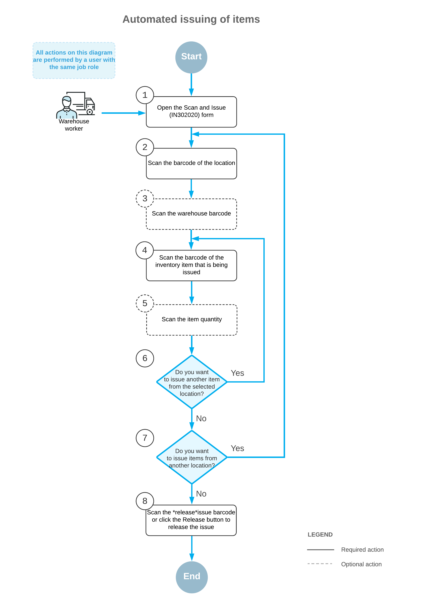

# Processing of Inventory Issues: General Information {#_c91e3387-a144-4464-affd-6daaa4a622bd .concept}

If the *Inventory Operations* feature is enabled on the [Enable/Disable Features](CS_10_00_00.md) \(CS100000\) form, you can perform the automated issue of inventory items from a particular warehouse location by using a barcode scanner or a mobile device with a scanning option.

In this topic, you will read about the workflow for the automated issue of inventory items in Acumatica ERP. The workflow in this topic is based on the assumption that your system has the recommended configuration described in [Processing of Inventory Issues: Implementation Checklist](WMS_Scan_and_Issue_Implem_Checklist.md).

## Learning Objectives { .section}

In this chapter, you will do the following:

-   Enable the needed system features
-   Learn the recommended settings that you can specify to make the system fit your business requirements
-   Process an issue of stock items from a warehouse location in automated mode

## Applicable Scenario { .section}

You can use automated processing of inventory issues when you need to remove items from a warehouse location, for example, expired items that must be removed from warehouse locations and, in your organization, all items and locations have barcodes and warehouse workers are equipped with barcode scanners or mobile devices with a scanning option.

## Workflow for the Automated Issuing of Items { .section}

The automated processing of issuing inventory items involves the actions shown in the following diagram.

To issue items by using a barcode scanner or a mobile device with a scanning option, you perform the following steps:

1.  *Open the [Scan and Issue](IN_30_20_20.md) \(IN302020\) form*.

    You open the [Scan and Issue](IN_30_20_20.md) form \(or the corresponding screen in the Acumatica mobile app\).

2.  *Scan the location barcode*.

    You scan the barcode of the warehouse location where the items to be issued are stored.

3.  Optional: *Scan the warehouse barcode*.

    If the location whose identifier you scanned in the previous step is assigned to multiple warehouses, you scan the warehouse barcode. The system inserts the warehouse ID in the **Warehouse** box.

4.  *Scan the item barcode*.

    You scan the barcode of the item that must be issued from the selected location.

5.  Optional: *Scan the item quantity*.

    To change the issued quantity in the line that is currently being processed, you switch to Quantity Editing mode by scanning or entering the `*qty` barcode or by clicking **Set Qty** on the form toolbar; you then manually enter the quantity in the UOM coded in the scanned item barcode.

6.  Optional: *Scan the barcode of the next item to be issued from the selected location*.

    If another item must be issued from the currently selected location, you scan the barcode of the next item \(that is, return to Step 4\) and repeat the process for this item.

7.  Optional: *Scan the barcode of the next location*.

    If items must be issued from another warehouse location, you scan the barcode of this location \(that is, return to Step 2\) and repeat the process for this location.

8.  *Release the inventory issue*.

    When you have added all items to be issued, you scan the `*release` command or click **Release** on the form toolbar. The system releases the inventory issue on the [Issues](IN_30_20_00.md) \(IN302000\) form.

**Parent topic:**[Automated Processing of Inventory Issues](../UserGuide/WMS_Scan_and_Issue_Mapref.md)

