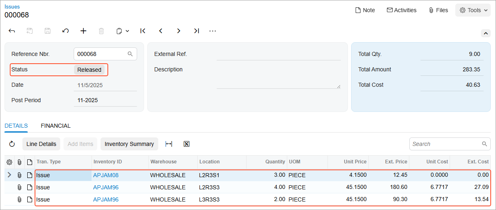

# Processing of Inventory Issues: Process Activity {#_df12eeb4-51c7-4bef-95e0-a3a5de8c101f .task}

In the following activity, you will learn how to issue stock items by using the [Scan and Issue](IN_30_20_20.md) \(IN302020\) form.

**Attention:** This activity is based on the *U100* dataset. If you are using another dataset or if any system settings have been changed in *U100*, these changes can affect the workflow of the activity and the results of the processing. To avoid issues, restore the *U100* dataset to its initial state.

## Story { .section}

Suppose that you, as a warehouse worker of the SweetLife Fruits &amp; Jams company, have a task to inspect the jars of apple jam to find out if they are of appropriate quantity and to write off jars with any defects. If you find any jars with defects, you need to remove them from the location and process an inventory issue to record this removal in the system.

## Configuration Overview { .section}

In the *U100* dataset, the following tasks have been performed to support this activity:

-   On the [Enable/Disable Features](CS_10_00_00.md) \(CS100000\) form, the following features have been enabled in the *Inventory and Order Management* group of features:
    -   *Multiple Warehouse Locations*
    -   *Warehouse Management*
    -   *Inventory Operations*
-   On the [Warehouses](IN_20_40_00.md) \(IN204000\) form, the *WHOLESALE* warehouse has been created. On the **Locations** tab, the following warehouse locations have been defined: *L2R3S1*, *L2R3S3*, and *L3R3S3*.
-   On the [Stock Items](IN_20_25_00.md) \(IN202500\) form, the following stock items have been created, and the corresponding alternate IDs with the *Barcode* type have been defined on the **Cross-Reference** tab:

    **Tip:** For simplicity, in this activity, the alternate IDs will be further referred to as *barcodes*.

    -   *APJAM08*, which has the *AJ08* barcode
    -   *APJAM96*, which has the *AJ96* barcode

## Process Overview { .section}

In this activity, acting as a warehouse worker, you will do the following:

1.  Open the [Scan and Issue](IN_30_20_20.md) \(IN302020\) form and scan the barcode of the location where the items are stored and then scan the barcode of each item to be issued.
2.  On the same form, review and release the issue.

**Tip:** In any working mode, you enter a command or barcode by typing it in the **Scan** box and pressing Enter. In production systems, you will scan the appropriate barcodes rather than manually entering them.

## System Preparation { .section}

Before you start issuing stock items, you need to sign in to a company with the *U100* dataset preloaded. You should sign in as a warehouse worker with the *perkins* username and the *123* password.

## Step 1: Creating an Inventory Issue { .section}

Suppose that you have found the following damaged jars of apple jam while inspecting them: three units of apple jam in 8-ounce jars in the *L2R3S1* location, four units of apple jam in 96-ounce jars in the *L2R3S3* location, and two units of apple jam in 96-ounce jars in the *L3R3S3* location. To create an issue with these items, do the following:

1.  Open the [Scan and Issue](IN_30_20_20.md) \(IN302020\) form.
2.  In the **Scan** box, type `L2R3S1`, which is the barcode of the location where you have found the damaged apple jam in 8-ounce jars. Press Enter.
3.  Enter `AJ08`, which is the barcode that corresponds to one unit of apple jam in an 8-ounce jar. The system adds 1 unit of the *APJAM08* item to the table on the **Issue** tab.
4.  Set the quantity of the item to `3`, the number of damaged 8-ounce jars you found, as follows:
    1.  On the form toolbar, click **Set Qty**. The system prompts you to enter the item quantity.
    2.  In the **Scan** box, enter `3`.
5.  Enter `L2R3S3`, which is the barcode of the location where the damaged apple jam in 96-ounce jars is stored.
6.  Enter `AJ96`, which is the barcode that corresponds to one unit of apple jam in a 96-ounce jar. The system adds 1 unit of the *APJAM96* item to the table on the **Issue** tab.
7.  Set the quantity of the item to `4`, the number of damaged 96-ounce jars you found.
8.  Enter `L3R3S3`, which is the barcode of the location where the damaged apple jam in 96-ounce jars is stored.
9.  Enter `AJ96`, which is the barcode that corresponds to one unit of apple jam in a 96-ounce jar. The system adds 1 unit of the *APJAM96* item to the table on the **Issue** tab.
10. Set the quantity of the item to `2`, the number of damaged 96-ounce jars you found.
11. On the form toolbar, click **Save**. The system saves your changes and creates the inventory issue, whose reference number you can view in the **Reference Nbr.** box of the Summary area.

You have added the required items to the issue. Now you will review the issue and release it.

## Step 2: Reviewing and Releasing the Issue { .section}

To review and release the issue, do the following:

1.  While you are still viewing the inventory issue on the [Scan and Issue](IN_30_20_20.md) \(IN302020\) form, review the lines that have been added to the table on the **Issue** tab. They should have the settings indicated in the following table.

    |Inventory ID|Location|Quantity|UOM|
    |------------|--------|--------|---|
    |*APJAM08*|*L2R3S1*|*3*|*PIECE*|
    |*APJAM96*|*L2R3S3*|*4*|*PIECE*|
    |*APJAM96*|*L3R3S3*|*2*|*PIECE*|

2.  On the form toolbar, click **Release** to release the inventory issue.
3.  Click the link in the **Reference Nbr.** box, and on the [Issues](IN_30_20_00.md) \(IN302000\) form, which opens, review the inventory issue. Make sure that it includes the needed lines and is assigned the *Released* status, as shown in the following screenshot.

    

You have successfully created and released the inventory issue to record the removal of the damaged jars of apple jam from the warehouse locations.

**Parent topic:**[Automated Processing of Inventory Issues](../UserGuide/WMS_Scan_and_Issue_Mapref.md)

