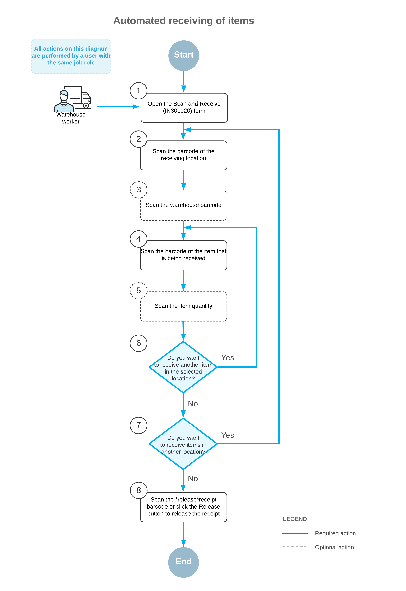

# Processing of Inventory Receipts: General Information {#_3454fa73-07da-44be-bee8-414fb274bbc5 .concept}

If the *Inventory Operations* feature is enabled on the [Enable/Disable Features](CS_10_00_00.md) \(CS100000\) form, you can perform the automated receipt of inventory items to a particular warehouse location by using a barcode scanner or a mobile device with a scanning option.

In this topic, you will read about the workflow for the automated receipt of inventory items in Acumatica ERP. The workflow in this topic is based on the assumption that your system has the recommended configuration described in [Processing of Inventory Receipts: Implementation Checklist](WMS_Scan_and_Receive_Implem_Checklist.md).

## Learning Objectives { .section}

In this chapter, you will do the following:

-   Enable the needed system features
-   Learn the recommended settings that you can specify to make the system fit your business requirements
-   Process a receipt of items to a warehouse in automated mode

## Applicable Scenario { .section}

You can use automated processing of inventory receipts when you need to move items to a warehouse location and, in your organization, all items and locations have barcodes and warehouse workers are equipped with barcode scanners or mobile devices with a scanning option.

## Workflow for the Automated Receiving of Items { .section}

The automated processing of receiving inventory items involves the actions shown in the following diagram.

To receive items by using a barcode scanner or a mobile device with a scanning option, you perform the following steps:

1.  *Open the [Scan and Receive](IN_30_10_20.md) \(IN301020\) form*.

    You open the [Scan and Receive](IN_30_10_20.md) form \(or the corresponding screen in the Acumatica mobile app\).

2.  *Scan the location barcode*.

    You scan the barcode of the warehouse location, where the items are to be received.

3.  Optional: *Scan the warehouse barcode*.

    If the location whose identifier you scanned in the previous step is assigned to multiple warehouses, you scan the warehouse barcode. The system inserts the warehouse ID in the **Warehouse** box.

4.  *Scan the item barcode*.

    You scan the barcode of the item being received.

5.  Optional: *Scan the item quantity*.

    To change the received quantity in the line that is currently being processed, you switch to Quantity Editing mode by scanning or entering the `*qty` barcode or by clicking **Set Qty** on the form toolbar; you then manually enter the quantity in the UOM coded in the scanned item barcode.

6.  Optional: *Scan the barcode of the next item to be received*.

    If more items need to be received in the currently selected location, you scan the barcode of the next item barcode \(that is, return to Step 4\), and repeat the process for the item.

7.  Optional: *Scan the barcode of the next location*.

    If items must be received in another warehouse location, you scan the barcode of this location \(that is, return to Step 2\) and repeat the process for this location.

8.  *Release the inventory receipt*.

    When you have finished receiving items, you scan the `*release` command or click **Release** on the form toolbar. The system releases the inventory receipt on the [Receipts](IN_30_10_00.md) \(IN301000\) form.

**Parent topic:**[Automated Processing of Inventory Receipts](../UserGuide/WMS_Scan_and_Receive_Mapref.md)

