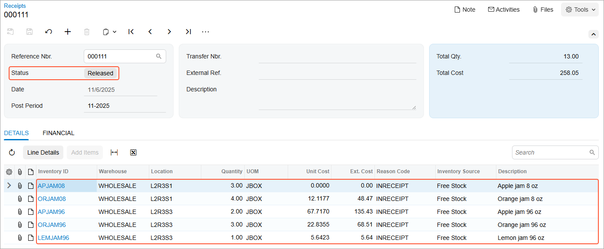

# Processing of Inventory Receipts: Process Activity {#_8facc395-35ba-4126-90ed-39fdd3afe734 .task}

In the following activity, you will learn how to receive stock items by using the [Scan and Receive](IN_30_10_20.md) \(IN301020\) form.

**Attention:** This activity is based on the *U100* dataset. If you are using another dataset or if any system settings have been changed in *U100*, these changes can affect the workflow of the activity and the results of the processing. To avoid issues, restore the *U100* dataset to its initial state.

## Story { .section}

Suppose that you, as a warehouse worker of the SweetLife Fruits &amp; Jams company, have a task to put apple, orange, and lemon jam, which you recently have received from production, to appropriate warehouse locations and process an inventory receipt to register this operation in the system.

Suppose that you have received the following jam, which you will move to appropriate locations: three boxes of apple jam in 8-ounce jars and four boxes of orange jam in 8-ounce jars \(you will put these boxes to the *L2R3S1* location\); two boxes of apple jam in 96-ounce jars, three boxes of orange jam in 96-ounce jars, and one box of lemon jam in 96-ounce jars \(you will put these boxes to the *L2R3S3* location\).

## Configuration Overview { .section}

In the *U100* dataset, the following tasks have been performed to support this activity:

-   On the [Enable/Disable Features](CS_10_00_00.md) \(CS100000\) form, the following features have been enabled in the *Inventory and Order Management* group of features:
    -   *Multiple Warehouse Locations*
    -   *Warehouse Management*
    -   *Inventory Operations*
-   On the [Warehouses](IN_20_40_00.md) \(IN204000\) form, the *WHOLESALE* warehouse has been created. On the **Locations** tab, the following warehouse locations have been defined: *L2R3S1* and *L2R3S3*.
-   On the [Stock Items](IN_20_25_00.md) \(IN202500\) form, the following stock items have been created, and the corresponding alternate IDs with the *Barcode* type have been defined on the **Cross-Reference** tab:

    **Tip:** For simplicity, in this activity, the alternate IDs will be further referred to as *barcodes*.

    -   *APJAM08*, which has the *AJ08B* barcode
    -   *ORJAM08*, which has the *OJ08B* barcode
    -   *APJAM96*, which has the *AJ96B* barcode
    -   *ORJAM96*, which has the *OJ96B* barcode
    -   *LEMJAM96*, which has the *LJ96B* barcode

## Process Overview { .section}

In this activity, acting as a warehouse worker, you will do the following:

1.  Open the [Scan and Receive](IN_30_10_20.md) \(IN301020\) form and scan the barcode of the location where the items must be stored and then scan the barcode of each item to be received.
2.  Release the inventory receipt and review the created document.

**Tip:** In any working mode, you enter a command or barcode by typing it in the **Scan** box and pressing Enter. In production systems, you will scan the appropriate barcodes rather than manually entering them.

## System Preparation { .section}

Before you start receiving stock items, you need to sign in to a company with the U100 dataset preloaded as a warehouse worker with the *perkins* username and the *123* password.

## Step 1: Creating an Inventory Receipt { .section}

To create an inventory receipt with the received jam, do the following:

1.  Open the [Scan and Receive](IN_30_10_20.md) \(IN301020\) form.
2.  In the **Scan** box, type `L2R3S1`, which is the barcode of the location where you put apple and orange jam in 8-ounce jars. Press Enter.
3.  Enter `AJ08B`, which is the barcode that corresponds to one box of ten 8-ounce jars of apple jam. The system adds 1 box of the *APJAM08* item to the table on the **Receive** tab.
4.  Set the quantity of the item to `3`, the number of received boxes of apple jam in 8-ounce jars, as follows:
    1.  On the form toolbar, click **Set Qty**. The system prompts you to enter the item quantity.
    2.  In the **Scan** box, enter `3`.
5.  Enter `OJ08B`, which is the barcode that corresponds to one box of ten 8-ounce jars of orange jam. The system adds 1 box of the *ORJAM08* item to the table on the **Receive** tab.
6.  Set the quantity of the item to `4`.
7.  Enter `L2R3S3`, which is the barcode of the location where you put apple, orange, and lemon jam in 96-ounce jars.
8.  Enter `AJ96B`, which is the barcode that corresponds to one box of ten 96-ounce jars of apple jam. The system adds 1 box of the *APJAM96* item to the table on the **Receive** tab.
9.  Enter `AJ96B` one more time to add second unit to the current line.
10. Enter `OJ96B`, which is the barcode that corresponds to one box of ten 96-ounce jars of orange jam. The system adds 1 box of the *ORJAM96* item to the table on the **Receive** tab.
11. Set the quantity of the item to `3`.
12. Enter `LJ96B`, which is the barcode that corresponds to one box of ten 96-ounce jars of lemon jam. The system adds 1 box of the *LEMJAM96* item to the table on the **Receive** tab.
13. On the form toolbar, click **Save**. The system saves your changes and creates the inventory receipt, whose reference number you can view in the **Reference Nbr.** box of the Summary area.

You have added the required items to the receipt. Now you will review the receipt and release it.

## Step 2: Releasing and Reviewing the Receipt { .section}

To release and review the receipt, do the following:

1.  While you are still viewing the inventory receipt on the [Scan and Receive](IN_30_10_20.md) \(IN301020\) form, review the lines that have been added to the table on the **Receive** tab. They should have the settings indicated in the following table.

    |Inventory ID|Location|Quantity|UOM|
    |------------|--------|--------|---|
    |*APJAM08*|*L2R3S1*|*3*|*JBOX*|
    |*ORJAM08*|*L2R3S1*|*4*|*JBOX*|
    |*APJAM96*|*L2R3S3*|*2*|*JBOX*|
    |*ORJAM96*|*L2R3S3*|*3*|*JBOX*|
    |*LEMJAM96*|*L2R3S3*|*1*|*JBOX*|

2.  On the form toolbar, click **Release** to release the inventory receipt.
3.  Click the link in the **Reference Nbr.** box, and on the [Receipts](IN_30_10_00.md) \(IN301000\) form, which opens, review the inventory receipt document. Make sure it includes the needed lines and is assigned the *Released* status, as shown in the following screenshot.

    

You have successfully created and released the inventory receipt to record the addition or received jam to the warehouse locations.

**Parent topic:**[Automated Processing of Inventory Receipts](../UserGuide/WMS_Scan_and_Receive_Mapref.md)

