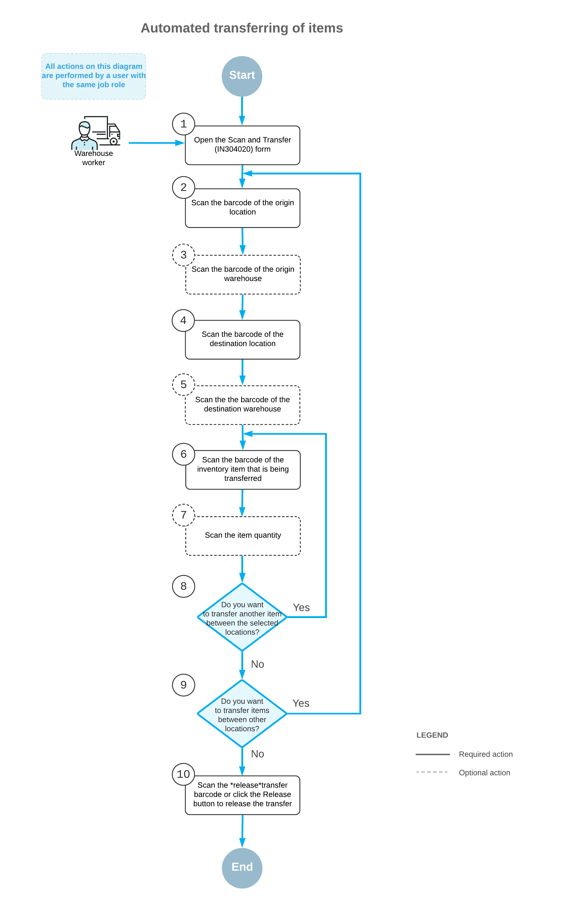

# Processing of Transfers: General Information {#_ea6a637d-9322-4a35-ab70-583c1d633a62 .concept}

If the *Inventory Operations* feature is enabled on the [Enable/Disable Features](CS_10_00_00.md) \(CS100000\) form, you can perform the automated transfer of inventory items between locations of the same warehouse or between locations of different warehouses that are assigned to the same building by using a barcode scanner or a mobile device with a scanning option.

In this topic, you will read about the workflow for the automated transfer of inventory items in Acumatica ERP. The workflow in this topic is based on the assumption that your system has the recommended configuration described in [Processing of Transfers: Implementation Checklist](WMS_Scan_and_Transfer_Implem_Checklist.md).

## Learning Objectives { .section}

In this chapter, you will do the following:

-   Enable the needed system features
-   Learn the recommended settings that you can specify to make the system fit your business requirements
-   Process a single-step transfer of items between locations of the same warehouse in automated mode

## Applicable Scenario { .section}

You process single-step transfers when you need to move items from one location to another location within the same warehouse or between locations of different warehouses that are assigned to the same building by using a barcode scanner or a mobile device with a scanning option and to track this movement in the system.

## Workflow for the Automated Scanning and Transferring of Items { .section}

The automated processing of transferring inventory items involves the steps shown in the following diagram.

To transfer items \(and use Scan and Transfer mode\), you perform the following steps:

1.  *Open the [Scan and Transfer](IN_30_40_20.md) \(IN304020\) form*.

    You open the [Scan and Transfer](IN_30_40_20.md) form \(or the corresponding screen in the Acumatica mobile app\) to start processing a transfer.

2.  *Scan the origin location barcode*.

    You scan the barcode of the origin location \(that is, the location where the item to be transferred is currently being stored\).

3.  Optional: *Scan the origin warehouse barcode*.

    If the location whose identifier you scanned in the previous step is assigned to multiple warehouses, you scan the origin warehouse barcode. The system inserts the warehouse ID in the **Warehouse** box.

4.  *Scan the destination location barcode*.

    You scan the barcode of the destination location \(that is, the location to which you are transferring items\).

5.  Optional: *Scan the destination warehouse barcode*.

    If the location whose identifier you scanned in the previous step is assigned to multiple warehouses, you scan the destination warehouse barcode. The system inserts the warehouse ID in the **To Warehouse** box.

    **Attention:** If the destination warehouse differs from the origin warehouse and the warehouses are assigned to different buildings \(or the building is not specified in the settings of either of the warehouses\), the system displays an error message, and the transfer cannot be performed.

6.  *Scan the item barcode*.

    You scan the barcode of the item to be transferred.

7.  Optional: *Scan the item quantity*.

    To change the transferred quantity in the line that is currently being processed, you switch to Quantity Editing mode by scanning or entering the `*qty` barcode or by clicking **Set Qty** on the form toolbar; you then manually enter the quantity in the base unit of measure.

8.  Optional: *Scan the barcode of the next item to be transferred between the selected locations*.

    If another item must be transferred between the currently selected locations, you scan the barcode of the next item \(return to Step 6\) and repeat the process for the next item.

9.  Optional: *Scan the barcode of the next origin location*.

    If items must be transferred between another locations, you scan the barcode of the next origin location \(return to Step 2\) and repeat the process.

10. *Release the inventory transfer*.

    When you have finished transferring items, you scan the barcode of the `*release` command or click **Release** on the form toolbar. The system releases the single-step inventory transfer on the [Transfers](IN_30_40_00.md) \(IN304000\) form.

**Parent topic:**[Automated Processing of Inventory Transfers](../UserGuide/WMS_Scan_and_Transfer_Mapref.md)

