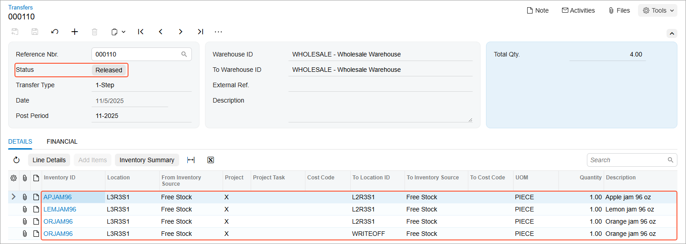

# Processing of Transfers: Process Activity {#_7f5e971c-70ee-4890-b138-339505bbaa56 .task}

In the following activity, you will learn how to transfer stock items between locations of the same warehouse in a single step by using the [Scan and Transfer](IN_30_40_20.md) \(IN304020\) form.

**Attention:** This activity is based on the *U100* dataset. If you are using another dataset or if any system settings have been changed in *U100*, these changes can affect the workflow of the activity and the results of the processing. To avoid issues, restore the *U100* dataset to its initial state.

## Story { .section}

Suppose that you, as a warehouse worker of the SweetLife Fruits &amp; Jams company, have a task to transfer all jam jars from one location of the wholesale warehouse to another, which will clear the origin location for a new batch of jam.

You will prepare the single-step transfer to reflect the movement of jam jars between the warehouse locations.

## Configuration Overview { .section}

In the *U100* dataset, the following tasks have been performed to support this activity:

-   On the [Enable/Disable Features](CS_10_00_00.md) \(CS100000\) form, the following features have been enabled in the *Inventory and Order Management* group of features:
    -   *Multiple Warehouse Locations*
    -   *Warehouse Management*
    -   *Inventory Operations*
-   On the [Warehouses](IN_20_40_00.md) \(IN204000\) form, the *WHOLESALE* warehouse has been created. On the **Locations** tab, the following warehouse locations have been defined: *L3R3S1*, *L2R3S1*, and *WRITEOFF*.
-   On the [Stock Items](IN_20_25_00.md) \(IN202500\) form, the following stock items have been created, and the corresponding alternate IDs with the *Barcode* type have been defined on the **Cross-Reference** tab:

    **Tip:** For simplicity, in this activity, the alternate IDs will be further referred to as *barcodes*.

    -   *APJAM96*, which has the *AJ96* barcode
    -   *ORJAM96*, which has the *OJ96* barcode
    -   *LEMJAM96*, which has the *LJ96* barcode

## Process Overview { .section}

In this activity, acting as a warehouse worker, you will do the following:

1.  Open the [Storage Summary](IN_40_90_10.md) \(IN409010\) form and review the quantities of the items to be transferred from the *L3R3S1* location. Then you will open the [Scan and Transfer](IN_30_40_20.md) \(IN304020\) form and enter the settings of a transfer document.
2.  On the [Scan and Transfer](IN_30_40_20.md) form, remove a partial quantity of an item from the document.
3.  On the same form, add a line with other origin and destination locations to the same document, and enter an item and its quantity to be moved between these locations.
4.  Review and release the transfer document. Then you will open the [Storage Summary](IN_40_90_10.md) form again and review the quantities of items in the *L3R3S1* location.

**Tip:** In any working mode, you enter a command or barcode by typing it in the **Scan** box and pressing Enter. In production systems, you will scan the appropriate barcodes rather than manually entering them.

## System Preparation { .section}

Before you start processing transfers between warehouse locations, you need to sign in to a company with the *U100* dataset preloaded. You should sign in as a warehouse worker with the *perkins* username and the *123* password.

## Step 1: Creating a Transfer { .section}

Suppose that the *L3R3S1* location contains one 96-ounce jar of apple jam, one 96-ounce jar of lemon jam, and two 96-ounce jars of orange jam. To create a single-step transfer that will register the movement of these items from the *L3R3S1* location to the *L2R3S1* location of the *WHOLESALE* warehouse, do the following:

1.  On the [Storage Summary](IN_40_90_10.md) \(IN409010\) form, specify *WHOLESALE* as the **Warehouse** and *L3R3S1* as the **Location**. In the table, notice that the location contains one jar of *APJAM96*, one jar of *LEMJAM96*, and two jars of *ORJAM96*.
2.  Open the [Scan and Transfer](IN_30_40_20.md) \(IN304020\) form.
3.  In the **Scan** box, type `L3R3S1` as the origin location and press Enter.
4.  Enter `L2R3S1` as the destination location.
5.  Enter `AJ96` as the first item to be transferred. The system adds a line with one unit of the item to the table on the **Transfer** tab.
6.  Enter `LJ96` as the next item to be transferred. The system adds a line with one unit of the item to the table on the **Transfer** tab.
7.  Enter `OJ96` as the last item to be transferred. The system adds a line with one unit of the item to the table on the **Transfer** tab.
8.  Set the quantity of the last entered item to `2` as follows:
    1.  On the form toolbar, click **Set Qty**. The system prompts you to enter the item quantity.
    2.  In the **Scan** box, enter `2`.
9.  On the form toolbar, click **Save**. The system creates the transfer with the data you have entered. Notice that it has inserted the transfer number in the **Reference Nbr.** box of the Summary area.

You have created the inventory transfer for moving *APJAM96*, *LEMJAM96*, and *ORJAM96* between the *L3R3S1* and *L2R3S1* locations.

## Step 2: Removing Items from the Transfer { .section}

Suppose that while you were moving jars of *ORJAM96* between the locations, you noticed that the lid of one of the jars had been dented. The warehouse manager asked you to move this jar to the warehouse location for items to be written off. The location is indicated as *WRITEOFF* in the system. To remove one jar of orange jam from the inventory transfer, do the following:

1.  While you are still viewing the transfer on the [Scan and Transfer](IN_30_40_20.md) \(IN304020\) form, on the form toolbar, click **Remove** to switch to Remove mode.
2.  In the **Scan** box, enter `L3R3S1` as the origin location.
3.  Enter `L2R3S1` as the destination location.
4.  Enter `OJ96` as the item to be removed from the transfer. On the **Transfer** tab, the system decreases the value of the **Quantity** column in the line with the *ORJAM96* item by 1.

You have removed one unit of the *ORJAM96* item from the transfer. Now you need to add another line to the transfer to reflect the movement of the jar to the *WRITEOFF* location.

## Step 3: Adding Items to Be Transferred Between Other Locations { .section}

To add to the same transfer the line that reflects the movement of one jar of *ORJAM96* from the *L3R3S1* location to the *WRITEOFF* location, do the following:

1.  While you are still viewing the transfer on the [Scan and Transfer](IN_30_40_20.md) \(IN304020\) form, in the **Scan** box, enter `L3R3S1` as the origin location.
2.  Enter `WRITEOFF` as the destination location.
3.  Enter `OJ96` to indicate the item to be transferred. The system adds the line with one unit of the item to the table on the **Transfer** tab.

You have added another line to the transfer.

## Step 4: Reviewing and Releasing the Transfer { .section}

Now that you have added all required items to the transfer, you can release the it. Do the following:

1.  While you are still viewing the transfer on the [Scan and Transfer](IN_30_40_20.md) \(IN304020\) form, review the lines that have been added to the table on the **Transfer** tab. They should have the settings indicated in the following table.

    |Inventory ID|Location|To Location|Quantity|
    |------------|--------|-----------|--------|
    |*APJAM96*|*L3R3S1*|*L2R3S1*|1|
    |*LEMJAM96*|*L3R3S1*|*L2R3S1*|1|
    |*ORJAM96*|*L3R3S1*|*L2R3S1*|1|
    |*ORJAM96*|*L3R3S1*|*WRITEOFF*|1|

2.  On the form toolbar, click **Release**. The system releases the transfer.
3.  Click the link in the **Reference Nbr.** box.
4.  On the [Transfers](IN_30_40_00.md) \(IN304000\) form, which opens, review the inventory transfer transaction. Make sure it includes the needed lines and is assigned the *Released* status, as shown in the following screenshot.

    

5.  On the [Storage Summary](IN_40_90_10.md) \(IN409010\) form, do the following:
    1.  **Warehouse**: *WHOLESALE*
    2.  **Location**: *L3R3S1*
    3.  Review the table. It must contain no lines, which indicates that you have successfully moved all items from the location.

You have successfully processed the transfer for moving jam jars between warehouse locations.

**Parent topic:**[Automated Processing of Inventory Transfers](../UserGuide/WMS_Scan_and_Transfer_Mapref.md)

