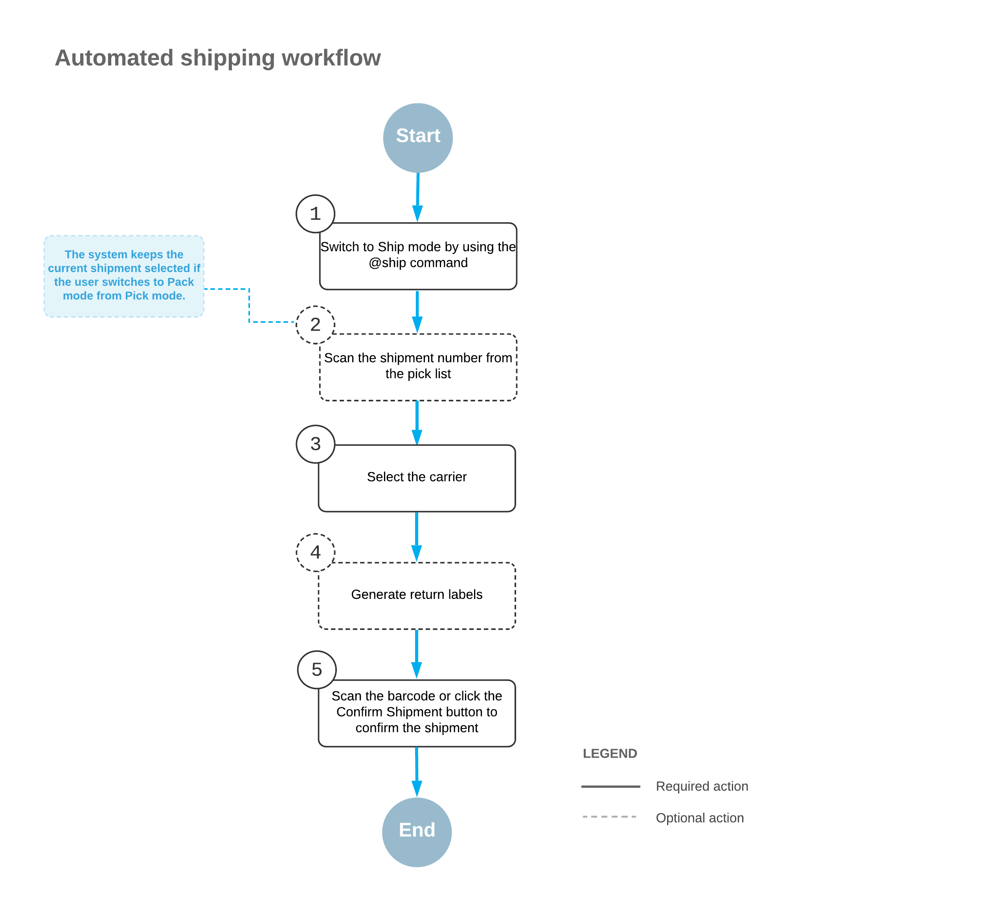

# Automated Shipping Operations: General Information {#_8e0fb900-22c9-40b6-854d-64ec3d905ea7 .concept}

After you have picked and packed items, or packed items without picking, you may need to specify shipping options before you confirm the applicable shipment. This workflow is illustrated in the following diagram.

To specify shipping options for the shipment that is currently being processed, you perform the following steps:

1.  *Switch to Ship mode*.

    You open the [Pick, Pack, and Ship](SO_30_20_20.md) \(SO302020\) form and switch to Ship mode by scanning or entering *@ship* barcode.

    **Important:** Ship mode is not available in the Acumatica mobile app.

2.  *Scan the shipment number*.

    To start automated processing, you scan the reference number of the shipment to be processed. In the **Shipment Nbr.** box, the system inserts the reference number of the document that is currently selected for processing. \(If you have switched to Ship mode from Pick mode or Pack mode with a document selected, the document is selected automatically.\)

    The boxes for the shipment are shown in the **Packages** table.

3.  *Select the carrier rate*.

    In the **Carrier Rates** table, you select the unlabeled check box in the row of the carrier rate to be used for shipping.

4.  Optional: *Generate return labels*.

    On the table toolbar of the **Carrier Rates** table, click **Get Return Labels** to generate return labels for the shipment.

5.  *Confirm the shipment*.

    To confirm the processed shipment, you scan the `*confirm*shipment` barcode, or click **Confirm Shipment** on the form toolbar.

**Parent topic:**[Automated Shipping Operations](../UserGuide/WMS_Ship_Mapref.md)

