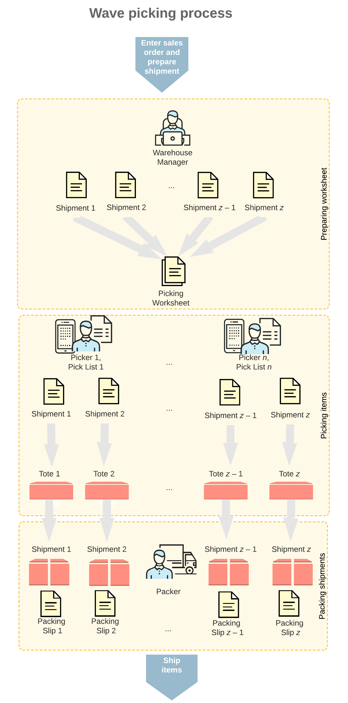
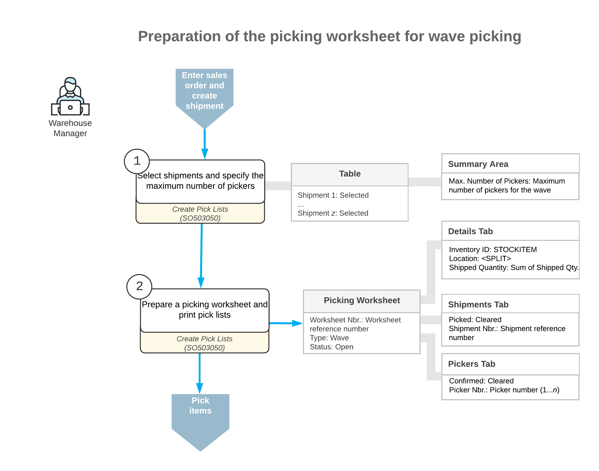
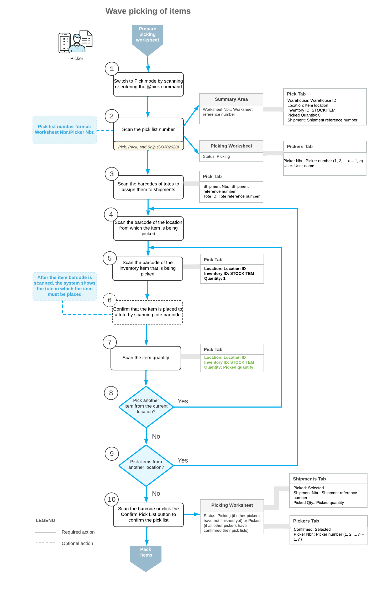
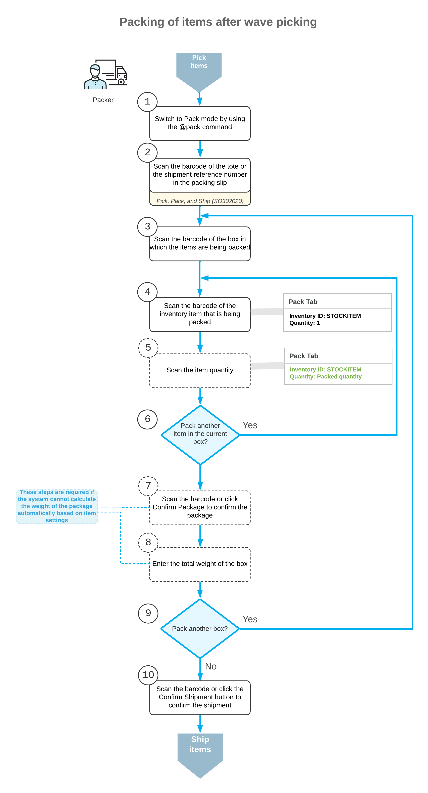

# Wave Picking: General Information {#_a789290c-0d15-46f7-ad84-02851e00939e .concept}

If the *Advanced Picking* feature is enabled on the [Enable/Disable Features](CS_10_00_00.md) \(CS100000\) form, you can optimize and speed up the warehouse operations needed for fulfilling the order by using the wave picking workflow.

In this topic, you will read about the wave picking workflow in Acumatica ERP. The workflow in this topic is based on the assumption that your system has the recommended configuration described in [Wave Picking: Implementation Checklist](WMS_Wave_Picking_Implem_Checklist.md).

## Learning Objectives { .section}

In this chapter, you will do the following:

-   Enable the needed system features
-   Specify the minimum required configuration for the wave picking workflow
-   Learn the recommended settings that you can specify to make the system fit your business requirements
-   Prepare a wave picking worksheet
-   Pick and pack items in a wave
-   Confirm a shipment after packing the items

## Applicable Scenario { .section}

You use wave picking if you need to optimize the processes of picking and packing items for a group of orders to be shipped. With a wave picking flow, the warehouse manager prepares a series of pick lists for a group of orders to be shipped \(also called a *wave*\). Each picker receives a consolidated pick list that includes multiple shipments for which the picker can pick all the listed items in one pass through the warehouse. The pickers collect the items and organize them in the individual totes assigned to each of the shipments. When the items are brought to the packing location, the packer takes the items from each of the totes, verifies that the shipment is collected correctly, and packs the items into boxes.

## General Process of Wave Picking { .section}

The workflow of fulfilling orders with the wave picking workflow is shown in the following diagram.

Processing a wave includes the following processes performed by the following persons:

1.  A warehouse manager opens the [Create Pick Lists](SO_50_30_50.md) \(SO503050\) form, selects the shipments to be processed in a wave, specifies the maximum number of pickers, creates a picking worksheet, and prints the wave pick lists.
2.  Each warehouse worker acting as a picker opens the [Pick, Pack, and Ship](SO_30_20_20.md) \(SO302020\) form \(or the corresponding screen in the Acumatica mobile app\), switches to Pick mode, and scans the reference number of the wave pick list. Then the picker scans the barcodes of the totes that will be used for picking items for particular shipments. The picker goes through the warehouse, picks the items from the locations, scans locations' barcodes, and items' barcodes and quantities, and puts the items in the totes.
3.  A warehouse worker acting as a packer opens the [Pick, Pack, and Ship](SO_30_20_20.md) form \(or the corresponding screen in the Acumatica mobile app\), switches to Pack mode and scans the reference number of the wave pick list. Then the packer scans the barcode of the box to which the items are being packed, takes the items from the totes, scans the barcodes and the quantity of items being packed, and puts items in boxes. After all the items are packed, the packer confirms the shipment.

The following sections illustrate and describe the workflow for a warehouse manager, a picker, and a packer. By understanding the workflow for each of these employees, you can better understand the wave picking workflow as a whole in a warehouse.

## Workflow for a Warehouse Manager { .section}

The workflow of a warehouse manager involves the actions shown in the following diagram.

To prepare a wave picking worksheet, the warehouse manager performs the following steps:

1.  *Selects the type of picking worksheet to be prepared.*

    The warehouse manager opens the [Create Pick Lists](SO_50_30_50.md) \(SO503050\) form and selects the *Create Wave Pick Lists* action.

2.  *Specifies the number of pickers.*

    To specify the maximum number of pickers who are currently available to be assigned to a wave, the manager enters the value in the **Max. Number of Pickers** box.

3.  Optional: *Defines the number of totes for each picker.*

    To define the number of totes used by each picker assigned to a wave, the manager enters the value in the **Max Nbr. of Totes per Picker** box.

4.  *Selects the shipments.*

    In the table, the manager selects the unlabeled check boxes in the lines with the shipments to be included in the picking worksheet.

5.  *Creates a picking worksheet and selects the pickers.*

    On the form toolbar, the manager clicks **Process** to create the picking worksheet for the selected shipments and to print wave pick lists \(in which the items are grouped by the wave\) and standard pick lists for each shipment to be picked. Then the manager gives these pick lists to the pickers \(that is, the warehouse workers who will perform the picking\).

    **Attention:** If the **Print Packing Slips with Pick Lists** check box is selected on the [Sales Orders Preferences](SO_10_10_00.md) \(SO101000\) form, the system also prints packing slips with the pick lists.

## Cancellation of a Picking Worksheet { .section}

If a wave picking worksheet has the *Picking* status on the [Picking Worksheets](SO_30_25_00.md) \(SO302500\) form, the warehouse manager can click **Cancel Worksheet** on the More menu to cancel this worksheet.

When a picking worksheet is canceled, the system assigns the *Canceled* status to it, cancels all the created pick lists, and removes all the related shipments from the picking worksheet. For all rows on the **Details** tab, the **Picked Qty.** becomes *0*.

After cancellation, the shipments from the canceled worksheet are no longer associated with this worksheet and can be added to another worksheet. These shipments can still be reviewed on the **Shipments** tab of the [Picking Worksheets](SO_30_25_00.md) form; the **Unlinked** check box is selected for each shipment on the tab.

The process of physically distributing already-picked goods back to their storage locations is not covered by the picking workflow; this should be done manually according to the pick lists of the canceled worksheet.

## Workflow for a Picker { .section}

The workflow of a picker involves the actions shown in the following diagram.

To pick the items for a wave pick list, the picker performs the following steps:

1.  *Switches to Pick mode*.

    The picker opens the [Pick, Pack, and Ship](SO_30_20_20.md) \(SO302020\) form \(or the corresponding screen in the Acumatica mobile app\) and switches to Pick mode by scanning or entering *@pick* barcode.

2.  *Scans the number of the wave pick list*.

    To start the automated processing, the picker scans the reference number of the wave pick list. This reference number has the *Worksheet Nbr./Picker Nbr.* format, where *Worksheet Nbr.* is the reference number of the related picking worksheet, and the *Picker Nbr.* is the reference number of the picker assigned to this worksheet \(for example, *000001/1*\). The system displays the pick list lines in the table and inserts the reference number of the picking worksheet that is currently selected for processing in the **Shipment Nbr.** box.

3.  *Scans the barcodes of the totes to be assigned to the shipments.*

    The picker scans the barcodes of all totes that will be used for picking the wave. Each tote is assigned to a particular shipment. The picker also places into each tote the pick list \(or the packing slip\) of the related shipment.

4.  *In each location from the wave pick list, picks the items as follows:*
    1.  *Scans the location barcode*.

        When the picker scans the barcode of the location from which the item is picked, the system searches for the location in the lines of the picking worksheet that is currently selected.

    2.  Optional: *Changes the picking location*.

        If the full item quantity isn’t available for picking in the current location, the picker can change the location of the unpicked quantity. For more information about this process, see [Picking and Packing Operations: Changing Picking Locations During Picking](WMS_Changing_Picking_Location.md).

    3.  *Scans the item barcode*.

        When the picker scans the item barcode of the picked item, the system searches for the item in the lines of the currently selected document. The system displays the picked quantity in the **Picked Quantity** column and highlights the line \(in bold if the line has been picked partially, or in green if the line has been picked in full\). If the UOM defined by the barcode of the scanned item corresponds to a non-base unit of measure, the system converts the item quantity defined by this barcode to the picked quantity in the base unit of measure for this item.

    4.  *Scans the tote barcode*.

        The system notifies the picker in which tote the items must be placed. The picker scans the tote to confirm that the picked item is placed in the right tote \(that is, in the one assigned to the shipment\).

    5.  Optional: *Scans the item quantity*.

        To change the picked quantity in the line that is currently being processed, the picker switches to Quantity Editing mode by clicking the **Set Qty** button on the form toolbar \(or by scanning or entering the `*qty` barcode\) and manually enters the quantity in the UOM defined by the barcode of the scanned item.

        If the pick list contains lines of multiple sales orders with the same item and location, the picker can enter the consolidated quantity of these lines. The system will automatically distribute the entered quantity among the lines with this item.

    6.  *Picks another item*.

        If another item needs to be picked from the currently selected location, the picker scans the item barcode \(returns to the second substep of this step\) and repeats the process for the item.

    7.  *Picks items from another location*.

        If the picker needs to pick items from another location, the picker scans the location barcode \(returns to the first substep of this step\), and repeats the process for the location.

5.  *Completes the picking process*.

    If the picker has finished picking items from his or her part of the wave, the picker scans the `*confirm*pick` barcode or clicks the **Confirm Picking** button on the form toolbar to confirm that the picking process is finished.

    **Attention:** Confirming the picking of a wave does not confirm the picked shipments.

    After finishing the wave picking, the picker brings the totes with items to the packing location.

## Workflow for a Packer { .section}

The workflow of a packer involves the actions shown in the following diagram.

To pack the items for a shipment, the packer performs the following steps:

1.  *Switches to Pack mode*.

    The packer opens the [Pick, Pack, and Ship](SO_30_20_20.md) \(SO302020\) form \(or the corresponding screen in the Acumatica mobile app\) and switches to Pack mode by scanning or entering the *@pack* barcode.

2.  *Scans the tote barcode or the shipment number*.

    The packer scans the barcode of the tote or the shipment number from the packing slip to start packing the items from this tote for shipping.

3.  For each box being packed for the selected shipment, the packer does the following:
    1.  *Scans the barcode of the box*.

        The packer scans the barcode of the box into which the items will be packed.

    2.  *Scans the item barcode*.

        When the packer scans the barcode of the packed item, the system searches for the item in the lines of the shipment that is currently selected. If the UOM defined by the barcode of the scanned item corresponds to a non-base unit of measure, the system converts the item quantity defined by this barcode to the packed quantity in the base unit of measure for this item. The system shows the packed quantity in the **Packed Quantity** column and highlights the line \(in bold if the line has been processed partially, or in green if the line has been processed in full\).

    3.  Optional: *Scans the item quantity*.

        To change the packed quantity in the line that is currently being processed, the packer switches to Quantity Editing mode by scanning or entering the `*qty` barcode, and manually enters the quantity in the UOM defined by the barcode of the scanned item.

    4.  *Packs another item*.

        If another item needs to be packed in the current box, the packer returns to scanning the item barcode \(that is, returns to the second substep of this step\) and repeats the process for the item, or proceeds to the next step if all items have been packed in the box.

    5.  *Confirms the box*.

        If all items have been packed in the box, the packer confirms the current box by scanning the `*ok` barcode or by clicking the **OK** button.

    6.  Optional: *Enters the box weight*.

        If the **Confirm Weight for Each Package** check box is selected on the **Warehouse Management** tab of the [Sales Orders Preferences](SO_10_10_00.md) \(SO101000\) form, the system requires the packer to confirm the weight of each box after the package is confirmed.

        If the packer wants to accept the automatically calculated weight of the box, they can do that by clicking **OK** on the form toolbar or by scanning the `*ok` command. If the packer wants to change the calculated weight of the box, they must enter the new value to continue to the next step.

    7.  Optional: *Enters the new package dimensions*.

        If the **Confirm Dimensions for Packages with Editable Dimensions** check box is selected on the **Warehouse Management** tab of the [Sales Orders Preferences](SO_10_10_00.md) \(SO101000\) form and the packer confirms a package that includes a box with the **Editable Dimensions** check box selected on the [Boxes](CS_20_76_00.md) \(CS207600\) form, the system requires the packer to confirm the existing dimensions or enter different dimensions for the box.

        If the packer wants to accept the default dimensions of the box, they can do that by clicking **OK** on the form toolbar or by scanning the `*ok` command. If the packer wants to change the dimensions of the box, they must enter the length, width, and height \(in this order\) in one string with a space as a separator to continue to the next step.

        The following example shows the entry of dimensions: `20 15 40`.

    8.  *Packs another box*.

        If more items need to be packed for the current shipment, the packer returns to scanning the barcode of the box \(returns to the first substep of this step\) and repeats the process for another box.

4.  *Completes the packing process*.

    If the packer has finished the packing operation and specifying shipping options is not needed, the packer scans the `*confirm*shipment` barcode or clicks the **Confirm Shipment** button on the form toolbar. The system confirms the shipment that is currently being processed, and prints labels for the packed boxes.

**Parent topic:**[Automated Fulfillment of Orders with Wave Picking](../UserGuide/WMS_Wave_Picking_Mapref.md)

