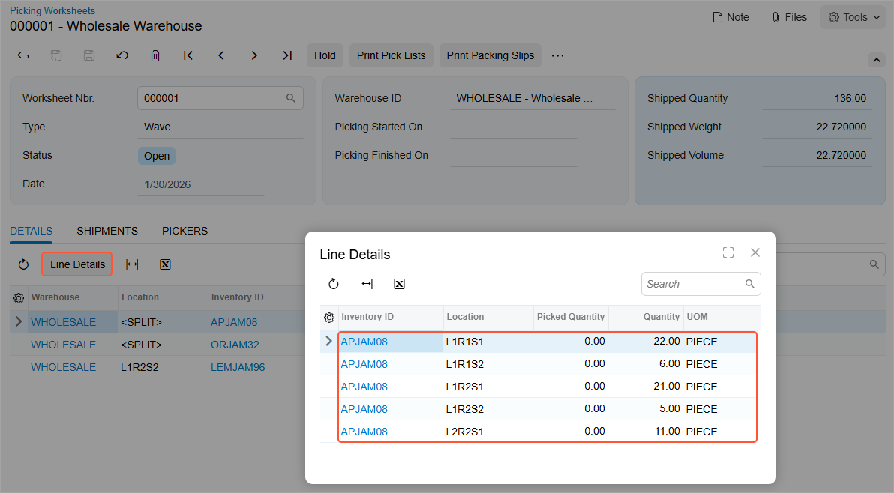
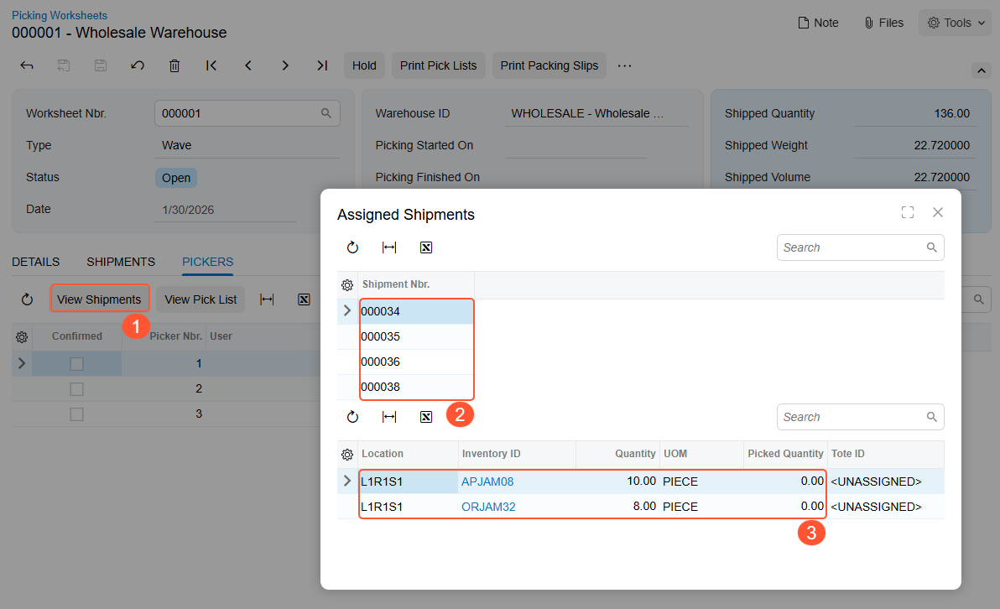
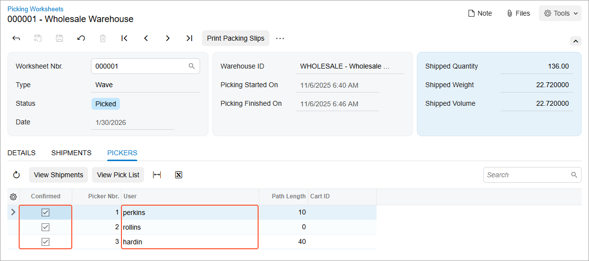
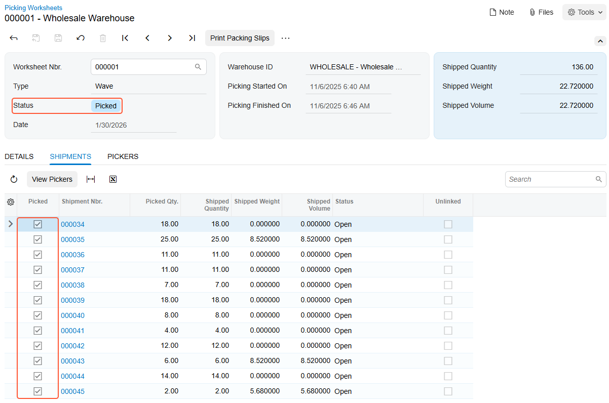
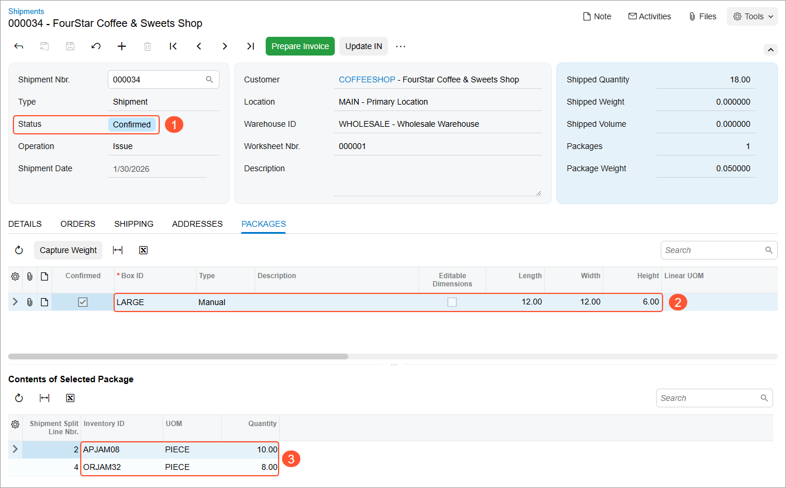

# Wave Picking: Process Activity {#_48e94afd-c415-4459-b870-39c147d864e5 .task}

In the following activity, you will learn how to process shipments in a wave by using the [Pick, Pack, and Ship](SO_30_20_20.md) \(SO302020\) form.

**Attention:** This activity is based on the *U100* dataset. If you are using another dataset or if any system settings have been changed in *U100*, these changes can affect the workflow of the activity and the results of the processing. To avoid issues, restore the *U100* dataset to its initial state.

## Story { .section}

Suppose that the wholesale warehouse of SweetLife was temporarily closed because of inventory counting. During this time, multiple orders have been entered into the system, and they now require shipping. The warehouse manager wants to speed up the process of picking and packing items by creating a wave picking worksheet and assigning this work to multiple pickers. After the warehouse workers pick the items in a wave, a warehouse worker acting as the packer needs to pack the items and confirm the shipments. You will perform these actions, acting as all of these employees.

## Configuration Overview { .section}

In the *U100* dataset, the following tasks have been performed to support this activity:

-   On the [Enable/Disable Features](CS_10_00_00.md) \(CS100000\) form, the following features have been enabled in the *Inventory and Order Management* group of features:
    -   *Warehouse Management*
    -   *Fulfillment*
    -   *Advanced Picking*
-   The **Print Packing Slips with Pick Lists** check box has been selected on the **Warehouse Management** tab of the [Sales Orders Preferences](SO_10_10_00.md) \(SO101000\) form; with this check box selected, when a user prints worksheet pick lists, the packing slips are also printed.
-   On the [Warehouses](IN_20_40_00.md) \(IN204000\) form, the *WHOLESALE* warehouse has been created. On the **Locations** tab, the following warehouse locations have been defined: *L1R1S1*, *L1R1S2*, *L1R2S1*, *L1R2S2*, and *L2R2S1*. On the **Totes** tab, the following totes have been defined: *T1*, *T2*, *T3*, *T4*, *T5*, *T6*, *T7*, *T8*, *T9*, *T10*, *T11*, and *T12*.
-   On the [Stock Items](IN_20_25_00.md) \(IN202500\) form, the following stock items have been created, and the corresponding alternate IDs with the *Barcode* type have been defined on the **Cross-Reference** tab:

    **Tip:** For simplicity, in this activity, the alternate IDs will be further referred to as *barcodes*.

    -   *APJAM08*, which has the *AJ08* barcode
    -   *ORJAM32*, which has the *OJ32* barcode
    -   *LEMJAM96*, which has the *LJ96* barcode
-   On the [Boxes](CS_20_76_00.md) \(CS207600\) form, the *LARGE* box has been defined.
-   On the [Sales Orders](SO_30_10_00.md) \(SO301000\) form, the following sales orders have been created for multiple customers: *000035*, *000036*, *000037*, *000038*, *000039*, *000040*, *000041*, *000042*, *000043*, *000044*, and *000046*.
-   On the [Shipments](SO_30_20_00.md) \(SO302000\) form, the following shipment documents have been created for these sales orders: *000034*, *000035*, *000036*, *000037*, *000038*, *000039*, *000040*, *000041*, *000042*, *000043*, *000044*, and *000045*.

## Process Overview { .section}

In this activity, you will do the following:

1.  Acting as a warehouse manager, you will open the [Create Pick Lists](SO_50_30_50.md) \(SO503050\) form, select the shipments to be processed in a wave, specify the maximum number of pickers, create a picking worksheet, and print the wave pick lists.
2.  You will do the following:
    1.  Acting as a warehouse worker, open the [Pick, Pack, and Ship](SO_30_20_20.md) \(SO302020\) form, switch to Pick mode, and scan the reference number of the wave pick list. Then you will scan the barcodes of the totes that will be used for picking items for particular shipments. After that you will scan locations' barcodes, and barcodes and quantities of items being picked from these locations.
    2.  Acting as the second warehouse worker, do the same on the [Pick, Pack, and Ship](SO_30_20_20.md) form.
    3.  Acting as the third warehouse worker, do the same on the [Pick, Pack, and Ship](SO_30_20_20.md) form.
3.  Acting as a pack line operator, you will review the progress of three pickers who picked the items
4.  Acting as a warehouse worker, you will open the [Pick, Pack, and Ship](SO_30_20_20.md) form, switch to Pack mode, and scan the reference number of the wave pick list. Then you will scan the barcode of the box to which the items will be packed, take the items from the totes, and scan the barcodes and the quantity of items being packed. After all the items will be packed, you will confirm the shipment.

**Tip:** In any working mode, you enter a command or barcode by typing it in the **Scan** box and pressing Enter. In production systems, you will scan the appropriate barcodes rather than manually entering them.

## System Preparation { .section}

Before you start performing the automated picking and packing operations, do the following:

1.  Launch the Acumatica ERP website, and sign in to a company with the *U100* dataset preloaded using the *angelo* username and the *123* password. You are initially signing in as the warehouse manager to prepare the wave picking worksheet.
2.  In the info area at the upper-right corner of the top pane of the Acumatica ERP screen, make sure that the business date is set to *1/30/2026*. If a different date is displayed, click the Business Date menu button and select *1/30/2026* from the calendar. For simplicity, you'll create and process all documents in this activity using this business date.
3.  On the **Warehouse Management** tab of the [Sales Orders Preferences](SO_10_10_00.md) \(SO101000\) form, make sure that the **Display the Pick Tab** and **Display the Pack Tab** check boxes are selected.

## Step 1: Preparing the Wave Picking Worksheet { .section}

To prepare the wave picking worksheet, acting as the warehouse manager, do the following:

1.  Open the [Create Pick Lists](SO_50_30_50.md) \(SO503050\) form, and in the **Action** box, select *Create Wave Pick Lists*.
2.  In the **Warehouse ID** box, select *WHOLESALE*.
3.  In the **End Date** box, make sure *1/30/2026* is specified.
4.  Specify `4` as the **Max. Number of Pickers**.
5.  Specify `4` as **Max. Number of Totes per Picker**.
6.  In the table, select the unlabeled check boxes next to the shipments with reference numbers from *000034* through *000045*.
7.  On the form toolbar, click **Process**. Close the **Processing** dialog box after processing completes.
8.  On the [Picking Worksheets](SO_30_25_00.md) \(SO302500\) form, open the created worksheet of the *Wave* type, and review its details. The **Details** tab lists all the items that have to be packed in a wave \(as shown in the following screenshot\). Notice that *&lt;SPLIT&gt;* is shown in the **Location** column for two of the lines, indicating that these items have to be picked from multiple locations.
9.  Click the first line in the table, and on the table toolbar, click **Line Details**. In the **Line Details** dialog box, which opens, review the locations in which the items are allocated for the wave \(see the following screenshot\) and close the dialog box.

    

10. Open the **Pickers** tab, and notice that the wave will be picked by three pickers. \(Although you have entered *4* as the maximum number of pickers, the system has found the optimal workflow and determined that three pickers are enough for picking the wave.\)
11. Click the first line in the table \(which corresponds to the first picker\), and on the table toolbar, click **View Shipments** \(Item 1 below\). In the **Assigned Shipments** dialog box, which opens, review the shipments assigned to the first picker \(Item 2\) and the items that the picker will pick for these shipments \(Item 3\).

    

12. Close the **Assigned Shipments** dialog box.
13. On the form toolbar, click **Print Pick Lists**. The system opens the [Worksheet Pick List](SO_64_40_06.md) \(SO644006\) report with generated printable pick lists and packing slips. For each pick list, notice the **Pick List Nbr.** number; you will load the pick lists for processing by using these numbers.

    In the production system, you would print the pick lists and packing slips and distribute them to the three pickers. Each picker would put pick lists and packing slips to totes assigned to shipments.

14. Sign out of the system.

## Step 2a: Picking Items in a Wave \(Picker 1\) { .section}

Acting as the first picker selected in the picking worksheet, you will assign totes to the shipments assigned to you and then pick the items, placing them in the appropriate totes. Do the following:

1.  Sign in to the system as the first picker by using the *perkins* username and the *123* password.
2.  Open the [Pick, Pack, and Ship](SO_30_20_20.md) \(SO302020\) form, and make sure the **Pick** tab is opened.
3.  In the **Scan** box, type `000001/1`, which is the reference number of the pick list for the first picker. Press Enter. The system loads the shipment lines to the table on the **Pick** tab, and shows the reference number of the picking worksheet that is currently being processed in the **Worksheet Nbr.** box of the Summary area.
4.  Assign totes to the shipments you will be picking by doing the following:

    1.  Enter `T1`. The system assigns the tote to the shipment *000034*, and shows the tote ID in the **Tote ID** column of all lines of this shipment.
    2.  Enter `T2`. The system assigns the tote to the shipment *000035*.
    3.  Enter `T3`. The system assigns the tote to the shipment *000036*.
    4.  Enter `T4`. The system assigns the tote to the shipment *000038*.
    Now you have assigned the totes to shipments, and you can start picking items.

5.  Pick the items from the first location by doing the following:
    1.  Enter `L1R1S1` to select the location from which you are currently picking items.
    2.  Enter `OJ32` to pick the item. \(*OJ32* is the barcode for *ORJAM32*, the 32-ounce jar of orange jam.\)

        The system highlights the line in bold and specifies *1* as the **Picked Quantity**.

    3.  Set the quantity of the item to `11` as follows:

        1.  On the form toolbar, click **Set Qty**. The system prompts you to enter the item quantity.
        2.  In the **Scan** box, enter `11`. This indicates that eleven 32-ounce jars of orange jam have been picked from the location and placed in the *T3* tote.
        You are continuing to pick items for different shipments from the same location, so you do not need to scan the location barcode again.

    4.  Enter `AJ08` to pick the item. \(*AJ08* is the barcode for *APJAM08*, the 8-ounce jar of apple jam.\)
    5.  Set the quantity to `12`.
    6.  Enter `AJ08` to pick the item.
    7.  Set the quantity to `10`.
    8.  Enter `OJ32` to pick the item.
    9.  Set the quantity to `8`.
    10. Enter `OJ32` to pick the item.
    11. Set the quantity to `3`.

        You have finished picking items from this location, so you will proceed to picking items from another location.

6.  Pick the items from the second location by doing the following:
    1.  Enter `L1R1S2` to select the location from which you are currently picking items.
    2.  Enter `AJ08` to pick the item.
    3.  Set the quantity to `6`.

        You have finished picking items from this location, so you proceed to picking items from another location.

7.  Pick the items from the third location by doing the following:
    1.  Enter `L1R2S1` to select the location from which you are currently picking items.
    2.  Enter `AJ08` to pick the item.
    3.  Set the quantity to `4`.

        You are continuing to pick items for different shipments from the same location, so you do not need to scan the location barcode again.

    4.  Enter `AJ08` to pick the item.
    5.  Set the quantity to `4`.
8.  Pick the items from the last location by doing the following:
    1.  Enter `L1R2S2` to select the location from which you are currently picking items.
    2.  Enter `LJ96` to pick the item. \(*LJ96* is the barcode for *LEMJAM96*, the 96-ounce jar of lemon jam.\)
    3.  Set the quantity to `3`.
9.  On the form toolbar, click **Confirm Pick List** to confirm that picking is finished.

    As the first picker, you have finished picking the items.

10. Sign out of the system.

## Step 2b: Picking Items in a Wave \(Picker 2\) { .section}

Acting as the second picker selected in the picking worksheet, you will assign totes to the shipments assigned to you and then pick the items, placing them in the appropriate totes. Do the following:

1.  Sign in to the system as the second picker by using the *rollins* username and the *123* password.
2.  Open the [Pick, Pack, and Ship](SO_30_20_20.md) \(SO302020\) form, and make sure the **Pick** tab is opened.
3.  In the **Scan** box, enter `000001/2`. The system loads the shipment lines to the table on the **Pick** tab, and shows the reference number of the picking worksheet that is currently being processed in the **Worksheet Nbr.** box of the Summary area.
4.  Assign totes to the shipments you will be picking by doing the following:

    1.  Enter `T5`. The system assigns the tote to the *000037* shipment, and shows the tote ID in the **Tote ID** column of all lines of this shipment.
    2.  Enter `T6`. The system assigns the tote to the *000041* shipment.
    3.  Enter `T7`. The system assigns the tote to the *000044* shipment.
    4.  Enter `T8`. The system assigns the tote to the *000045* shipment.
    Now you have assigned the totes to shipments, and you can start picking items.

5.  Pick the items from the first location by doing the following:
    1.  Enter `L1R2S1` to select the location from which you are currently picking items.
    2.  Enter `AJ08` to pick the item.

        The system highlights the line in bold and specifies *1* as the **Picked Quantity**.

    3.  Set the quantity of the item to `11` as follows:

        1.  On the form toolbar, click **Set Qty**. The system prompts you to enter the item quantity.
        2.  In the **Scan** box, enter `11`. This indicates that eleven 8-ounce jars of apple jam have been picked from the location and placed in the *T5* tote.
        You are continuing to pick items for different shipments from the same location, so you do not need to scan the location barcode again.

    4.  Enter `OJ32` to pick the item.
    5.  Set the quantity of the item to `14`.
    6.  Enter `OJ32` to pick the item.
    7.  Set the quantity of the item to `4`.

        You have finished picking items from this location, so you will proceed to picking items from another location.

6.  Pick the items from the second location by doing the following:
    1.  Enter `L1R2S2` to select the location from which you are currently picking items.
    2.  Enter `LJ96` to pick the item.
    3.  Enter `LJ96` one more time to add second unit of the item to the current line.
7.  On the form toolbar, click **Confirm Pick List** to confirm that picking is finished.

    As the second picker, you have finished picking the items.

8.  Sign out of the system.

## Step 2c: Picking Items in a Wave \(Picker 3\) { .section}

Acting as the third picker selected in the picking worksheet, you will assign totes to the shipments assigned to you and then pick the items, placing them in the appropriate totes. Do the following:

1.  Sign in to the system as the third picker by using the *hardin* username and the *123* password.
2.  Open the [Pick, Pack, and Ship](SO_30_20_20.md) \(SO302020\) form, and make sure the **Pick** tab is opened.
3.  In the **Scan** box, enter `000001/3`. The system loads the shipment lines to the table on the **Pick** tab, and shows the reference number of the picking worksheet that is currently being processed in the **Worksheet Nbr.** box of the Summary area.
4.  Assign totes to the shipments you will be picking by doing the following:

    1.  Enter `T9`. The system assign the tote to the shipment *000039*, and shows the tote ID in the **Tote ID** column of all lines of this shipment.
    2.  Enter `T10`. The system assigns the tote to the shipment *000040*.
    3.  Enter `T11`. The system assigns the tote to the shipment *000042*.
    4.  Enter `T12`. The system assigns the tote to the shipment *000043*.
    You have assigned the totes to the shipments, and you can start picking items.

5.  Pick the items from the first location by doing the following:
    1.  Enter `L1R1S1` to select the location from which you are currently picking items.
    2.  Enter `OJ32` to pick the item.

        The system highlights the line in bold and specifies *1* as the **Picked Quantity**.

    3.  Set the quantity of the item to `5` as follows:

        1.  On the form toolbar, click **Set Qty**. The system prompts you to enter the item quantity.
        2.  In the **Scan** box, enter `5`. This indicates that five 32-ounce jars of orange jam have been picked from the location and placed in the *T9* tote.
        You are continuing to pick items for different shipments from the same location, so you do not need to scan the location barcode again.

    4.  Enter `OJ32` to pick the item from the same location for one more line.

        You have finished picking of items in the location, so you proceed to picking of items from another location.

6.  Pick the items from the second location by doing the following:
    1.  Enter `L1R1S2` to select the location from which you are currently picking items.
    2.  Enter `OJ32` to pick the item.
    3.  Set the quantity of the item to `5`.
7.  Pick the items from the third location by doing the following:
    1.  Enter `L1R2S1` to select the location from which you are currently picking items.
    2.  Enter `OJ32` to pick this item.
    3.  Set the quantity of the item to `10`.
    4.  Enter `AJ08` to pick the item.
    5.  Enter `AJ08` one more time to add second unit to the current line.
    6.  Enter `OJ32` to pick the item.
    7.  Enter `OJ32` one more time to add second unit to the current line.
8.  Pick the items from the fourth location by doing the following:
    1.  Enter `L1R2S2` to select the location from which you are currently picking items.
    2.  Enter `LJ96` to pick this item.
    3.  Set the quantity of the item to `3`.
    4.  Enter `AJ08` to pick the item.
    5.  Set the quantity of the item to `5`.
9.  Pick the items from the last location by doing the following:
    1.  Enter `L2R2S1` to select the location from which you are currently picking items.
    2.  Enter `AJ08` to pick this item.
    3.  Set the quantity of this item to `6`.
    4.  Enter `AJ08` to pick this item.
    5.  Set the quantity of the item to `3`.
    6.  Enter `AJ08` to pick the item.
    7.  Enter `AJ08` one more time to add second unit to the current line.
10. On the form toolbar, click **Confirm Pick List** to confirm that picking is finished.

    As the third picker, you have finished picking the items.

11. Sign out of the system.

## Step 3: Reviewing the Worksheet Status { .section}

As the pack line operator, you will review the progress of three pickers who picked the items. Do the following:

1.  Sign in to the system as the pack line operator by using the *rueb* username and the *123* password.
2.  On the [Picking Worksheets](SO_30_25_00.md) \(SO302500\) form, open the wave picking worksheet, and review the **Pickers** tab \(see the following screenshot\). The usernames of the workers who performed the picking operations are shown in the **User** column; the selected check boxes in each line of the **Confirmed** column indicate that each picker has confirmed the completion of the picking.

    

3.  Review the **Shipments** tab, as shown in the following screenshot. All shipments have been picked, as the selected check boxes in the **Picked** column indicate; the picking worksheet now is assigned the *Picked* status.

    

4.  Sign out of the system.

## Step 4: Packing a Shipment for the Wave { .section}

At this point in the wave picking, all of the shipments from the wave can be packed. For the purposes of this activity, you will pack just one of the shipments, acting as a warehouse worker who handles packing. To pack one of the shipments from a wave, do the following:

1.  Sign in to the system as a warehouse worker who will perform packing operations by using the *sauer* username and the *123* password.
2.  Open the [Pick, Pack, and Ship](SO_30_20_20.md) \(SO302020\) form and make sure the Pack mode is active.
3.  Enter `000034`, which is the reference number of one of the shipments ready for packing.
4.  Enter `T1`, which is the reference number of the tote ready for packing.
5.  Enter `LARGE` to select the box in which you are packing the items.
6.  Enter `AJ08` to select the item being packed. The system highlights the first line of the shipment in bold and specifies *1* as the **Packed Quantity**, and shows this item in the **Package Content** tab.
7.  Set the quantity of the item to `10` as follows:
    1.  On the form toolbar, click **Set Qty**. The system prompts you to enter the item quantity.
    2.  In the **Scan** box, enter `10`. The system highlights the first line of the shipment in green and specifies *10* as the **Packed Quantity**.
8.  Enter `OJ32` to select the next item being packed in the same box.
9.  Set the quantity of this item to `8`.
10. On the form toolbar, click **Confirm Package** to confirm the package.
11. On the form toolbar, click **Confirm Shipment**.
12. Sign out of the system, and sign in again as a warehouse manager by using the *angelo* username and the *123* password.
13. On the [Shipments](SO_30_20_00.md) \(SO302000\) form, open the shipment with the *000034* reference number that you have packed, which is now assigned the *Confirmed* status \(Item 1 below\). On the **Packages** tab, the box in which the items were packed is listed \(Item 2\), and the items packed into this box are listed in the **Contents of Selected Package** table \(Item 3\).

    

**Parent topic:**[Automated Fulfillment of Orders with Wave Picking](../UserGuide/WMS_Wave_Picking_Mapref.md)

