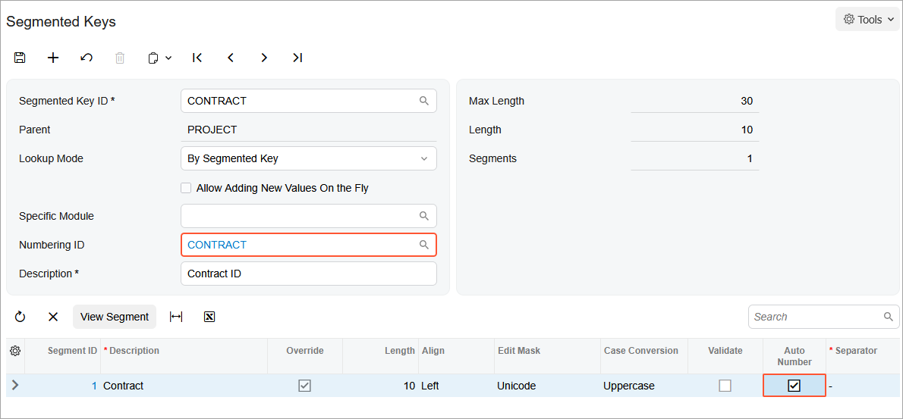

# Contract Functionality Implementation: Implementation Activity {#_1e56fa61-32cf-407f-88b7-f3e159754de7 .task}

In this implementation activity, you will learn how to enable the *Contract Management* feature and review the basic contract management settings.

**Attention:** This activity is based on the *U100* dataset. If you are using another dataset or if any system settings have been changed in *U100*, these changes can affect the workflow of the activity and the results of the processing. To avoid issues, restore the *U100* dataset to its initial state.

## Story { .section}

Suppose that you are an administrative user of the SweetLife company. You are configuring the minimum required functionality to prepare the system for creating and processing of contracts.

## Process Overview { .section}

To set up the basic contract management settings, you will do the following:

1.  On the [Enable/Disable Features](CS_10_00_00.md) \(CS100000\) form, you will enable the *Contract Management* feature to support the contract management functionality.
2.  On the [Accounts Receivable Preferences](AR_10_10_00.md) \(AR101000\) form, you will clear the **Hold Documents on Entry** check box to use the needed accounts receivable functionality in activities of the guide.
3.  On the [Numbering Sequences](CS_20_10_10.md) \(CS201010\) form, you will enable auto-numbering for contracts. The numbering sequence will be used to assign automatically numbered identifiers to contracts.

## System Preparation { .section}

Before you start performing the initial configuration of the contract management functionality, launch the Acumatica ERP website, and sign in to a company with the *U100* dataset preloaded.

You should sign in as a system administrator by using the *gibbs* username and the *123* password.

## Step 1: Enabling the Contract Management Feature {#section_uhz_lf1_dt .section}

To activate the needed feature to use the contract functionality, do the following:

1.  Open the [Enable/Disable Features](CS_10_00_00.md) \(CS100000\) form.
2.  On the form toolbar, click **Modify**.
3.  Under the *Advanced Financials* group of features, select the **Contract Management** check box.

    **Attention:** The *Contract Management* feature provides support for contracts, including contract billing, in Acumatica ERP. It makes available forms related to contract processing and provides integration with accounts receivable and the tracking of time and expenses.

4.  On the form toolbar, click **Enable**.

## Step 2: Configuring the Settings of the Accounts Receivable Functionality {#section_mss_4f1_dt .section}

To be able to use the needed accounts receivable functionality, on the [Accounts Receivable Preferences](AR_10_10_00.md) \(AR101000\) form, do the following:

1.  On the **General** tab, clear the **Hold Documents on Entry** check box.

    With this check box cleared, any invoice issued when a contract is billed will have the *Balanced* status.

2.  On the form toolbar, click **Save**.

**Tip:** The step is optional. You may perform it during your activities in the case you want the system issues invoices in the *Balanced* status. You can then release invoices in bulk from the [Release AR Documents](AR_50_10_00.md) \(AR501000\) form.

## Step 3: Enabling Auto-Numbering for Contracts {#section_it1_qf1_dt .section}

In Acumatica ERP, contract identifiers are created based on the *CONTRACT* segmented key. To configure the system to assign automatically numbered identifiers to contracts, do the following:

1.  In the **Segmented Key ID** box of the [Segmented Keys](CS_20_20_00.md) \(CS202000\) form \(the Summary area\), select *CONTRACT*.
2.  In the **Numbering ID** box, click *CONTRACT*.
3.  In the [Numbering Sequences](CS_20_10_10.md) \(CS201010\) form, which opens, view the configuration of the numbering sequence. This predefined numbering sequence is used in the *CONTRACT* segmented key by default.
4.  Close the [Numbering Sequences](CS_20_10_10.md) form.
5.  In the table of the [Segmented Keys](CS_20_20_00.md) form, select the **Auto Number** check box for the only row, which contains the settings of the single segment included in the segmented key \(see the following screenshot\).

    

    Contract identifiers can be defined to include multiple segments. However, automatic numbering can be enabled for only one segment. Note that the length of the auto-numbered segment must match the length of the numbering sequence specified in the **Numbering ID** box.

6.  On the form toolbar, click **Save**.

**Parent topic:**[Implementing the Contract Functionality](../UserGuide/Contracts_Implementing_Contracts_Functionality_Mapref.md)

