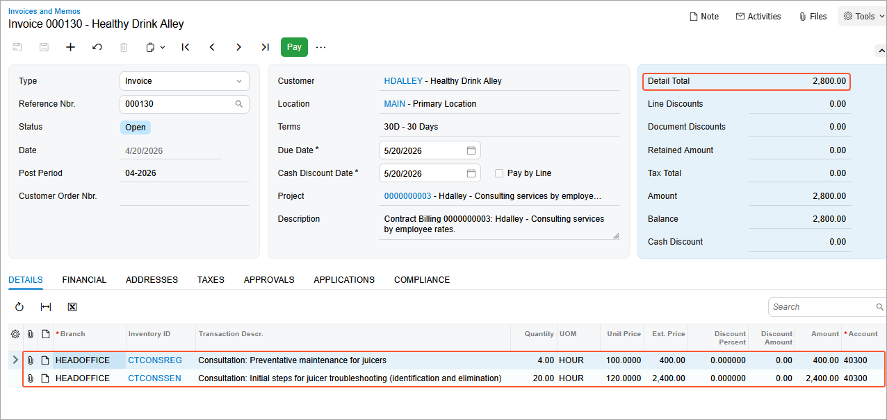

# Contract Billing: To Bill a Consulting Contract by Employee Activity Usage {#_a26af0a6-15df-4b04-86f5-496d423f1d9d .task}

In this activity, you will learn how to bill the contract by employee activity usage.

**Attention:** This activity is based on the *U100* dataset. If you are using another dataset or if any system settings have been changed in *U100*, these changes can affect the workflow of the activity and the results of the processing. To avoid issues, restore the *U100* dataset to its initial state.

## Story { .section}

Suppose that after purchasing the juicers, the Healthy Drink Alley customer needs a consulting contract to teach employees about the proper use of juicers and related equipment. This service is provided by the SweetLife Fruits &amp; Jams company's consultants of different qualifications: senior consultants, whose services cost $120 per hour, and regular consultants, whose services cost $100 per hour.

According to the terms of the contract, on *4/10/2026*, the customer obtains consulting in the amount of 20 hours from the senior consultant William Perkins, and in the amount of 4 hours from the consultant David Chubb for the total amount of $2,800. The billing of the contract will be performed on demand and on per-activity basis.

Earlier you have created an empty contract whose terms determine prices depending on the skills and position of the consulting specialist, who can be a regular specialist or a senior consultant, and have created contract usage to reflect rendering services in the system.

Acting as an accountant, you will bill the contract by employee activities usage on *4/20/2026*.

## Process Overview { .section}

In this activity, on the [Customer Contracts](CT_30_10_00.md) \(CT301000\) form, you will bill a contract by employee activities usage.

## Configuration Overview { .section}

In the *U100* dataset, the following tasks have been performed to support this activity:

-   On the [Enable/Disable Features](CS_10_00_00.md) \(CS100000\) form, the *Contract Management* feature has been enabled.
-   On the [Customers](AR_30_30_00.md) \(AR303000\) form, the *HDALLEY \(Healthy Drink Alley\)* customer has been created.

## System Preparation { .section}

To prepare to perform the instructions of this activity, do the following:

1.  As a prerequisite to this activity, complete [Contract Usage: To Create Employee Activity Usage \(Consulting Contract\)](config_Contract_Management_Implem_Activity_To_Create_Activities_Usage_for_Consulting_Contract.md) activity to create a case and employee case activities to bill a contract by employee activities usage.
2.  Launch the Acumatica ERP website with the *U100* dataset preloaded, and sign in as the accountant Anna Johnson by using the *johnson* username and the *123* password.
3.  In the info area, in the upper-right corner of the top pane of the Acumatica ERP screen, make sure that the business date in your system is set to *4/20/2026*. For simplicity, in this activity, you will create and process all documents in the system on this business date.

## Step 1: Billing the Contract {#section_znr_3fz_js .section}

To initiate the contract billing, do the following:

1.  On the [Customer Contracts](CT_30_10_00.md) \(CT301000\) form, open the the contract with description *Hdalley - Consulting services by employee rates* contract.
2.  On the form toolbar, select **Run Contract Billing**.
3.  In the **Billing On Demand** dialog box \(which opens\), leave *4/20/2026* in the **Billing Date** box, and click **OK**.
4.  Review the **AR History** tab. After the billing operation completed successfully, the system issued an invoice for the billed contract usage and automatically released the invoice.

    Note that now the invoice has the *Open* status because you have selected the **Automatically Release AR Documents** check box on the **Summary** tab of the [Contract Templates](CT_20_20_00.md) \(CT202000\) form, so that the invoices and credit memos are automatically released when the contract is billed.

5.  In the only row in the table, click the **Reference Nbr.** link to open and review the invoice on the [Invoices and Memos](AR_30_10_00.md) \(AR301000\) form. On the **Details** tab, each activity is shown in a separate line. The date of the invoice matches the billing date. The default prices of the non-stock items that are specified as labor items in the corresponding case class are used as unit prices in the invoice. In the Summary area note that the **Detail total** is $2,800, that is the sum of services performed by employees.

    

## Step 2: Viewing Contract Usage Details {#section_ets_fzr_js .section}

To view the result of contract billing by usage, do the following:

1.  On the [Contract Usage](CT_30_30_00.md) \(CT303000\) form, in the **Contract ID** box, select the contract with description *Hdalley - Consulting services by employee rates* contract.
2.  On the **Billed** tab, review the details about both of the billed activities. This tab displays information about accumulated billed usage for the selected contract.

In this activity, you have performed the contract billing by employee activities usage.

**Parent topic:**[Billing Contracts](../UserGuide/Contracts_Billing_Contracts_Mapref.md)

