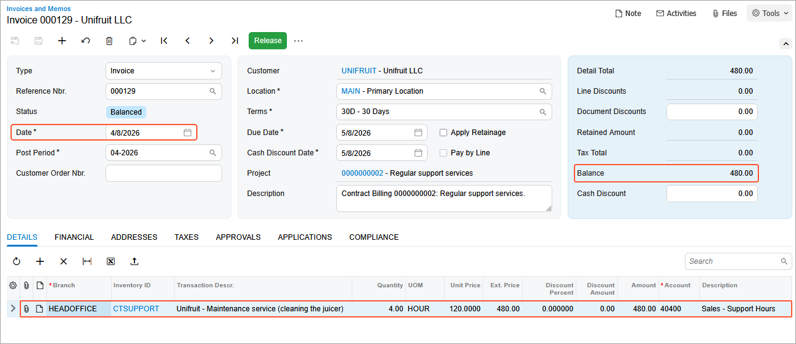

# Contract Billing: To Bill a Support Contract by Case Usage {#_8158722b-b0a8-4757-84bf-d5049c54a63b .task}

In this activity, you will learn how to bill support contract by case usage.

**Attention:** This activity is based on the *U100* dataset. If you are using another dataset or if any system settings have been changed in *U100*, these changes can affect the workflow of the activity and the results of the processing. To avoid issues, restore the *U100* dataset to its initial state.

## Story { .section}

Suppose that the SweetLife Fruits &amp; Jams company, in addition to deploying juicers, also specializes in providing maintenance. The Unifruit LLC customer previously purchased juicers and now needs to enter into a maintenance support contract. On *3/8/2026*, the support contract was signed by both parties.

According to the terms of the contract, it has the *Expiring* type, and the contract span is three months. On *3/10/2026*, the service under the contract was provided by one regular specialist for four hours for a total sum of $480. This service was reflected in the system in a separate case.

The service of maintenance specialists costs $120 per hour, and the price is not dependent on the skills and position of the employee performing the service. Now you have the released case for the support contract in the system. The billing of the contract will be performed monthly and on a per-case basis.

Acting as an accountant, on *4/8/2026*, you will bill support contract by case usage.

## Configuration Overview { .section}

In the *U100* dataset, the following tasks have been performed to support this activity:

-   On the [Enable/Disable Features](CS_10_00_00.md) \(CS100000\) form, the *Contract Management* feature has been enabled.
-   On the [Accounts Receivable Preferences](AR_10_10_00.md) \(AR101000\) form, on the **General** tab \(**Data Entry Settings** section\), the **Hold Documents on Entry** check box has been cleared.
-   On the [Customers](AR_30_30_00.md) \(AR303000\) form, the *UNIFRUIT \(Unifruit LLC\)* customer has been created.

## Process Overview { .section}

In this activity, on the [Customer Contracts](CT_30_10_00.md) \(CT301000\) form, you will bill a contract by case usage. Then on the [Invoices and Memos](AR_30_10_00.md) \(AR301000\) form, you will release the resulting invoice.

## System Preparation { .section}

To prepare to perform the instructions of this activity, do the following:

1.  As a prerequisite to this activity, complete [Contract Usage: To Create Case Usage \(Support Contract\)](config_Contract_Management_Implem_Activity_To_Create_Case_Usage_for_Support_Contract.md) activity to create a case that you will use to bill a contract by case usage.
2.  Launch the Acumatica ERP website with the *U100* dataset preloaded, and sign in as the accountant Anna Johnson by using the *johnson* username and the *123* password.
3.  In the info area, in the upper-right corner of the top pane of the Acumatica ERP screen, make sure that the business date in your system is set to *4/8/2026*. For simplicity, in this activity, you will create and process all documents in the system on this business date.

## Step 1: Billing the Contract Usage {#section_msc_h3z_js .section}

To initiate contract billing, do the following:

1.  On the [Customer Contracts](CT_30_10_00.md) \(CT301000\) form, open the contract with description *Unifruit - Regular support services*. Notice that on the **Summary** tab, the **Next Billing Date** is set to *4/8/2026*.
2.  On the form toolbar, click **Run Contract Billing**.

    When the billing operation has completed successfully, the **Next Billing Date** is set to *5/8/2026*, and the system has generated the invoice in the amount of $480 for the billed contract usage. You can see the invoice on the **AR History** tab. The invoice has the *Balanced* status.

## Step 2: Releasing the Invoice {#section_hlp_33z_js .section}

Do the following to release the invoice for the support contract:

1.  While you are still viewing the contract on the [Customer Contracts](CT_30_10_00.md) \(CT301000\) form, on the **AR History** tab, click the **Reference Nbr.** link in the only row to open the invoice on the [Invoices and Memos](AR_30_10_00.md) \(AR301000\) form. Review the settings of the invoice \(see the following screenshot\). The balance of the invoice is $480, which is the cost of services rendered to the customer by case usage.

    

    **Tip:** An invoice issued at contract billing includes all the contract's unbilled usage whose dates precede the billing date.

2.  On the form toolbar, click **Release**. The system generates and releases a batch in the general ledger. You can see the batch on the **Financial** tab of the [Invoices and Memos](AR_30_10_00.md) form \(**Link to GL** section\).
3.  On the [Customer Contracts](CT_30_10_00.md) \(CT301000\) form, open the contract with description *Unifruit - Regular support services*. Press F5 to refresh the form, and review the contract balance \($480\), which is calculated as the sum of the balances of open invoices associated with the contract.
4.  Open the **AR History** tab on the [Customer Contracts](CT_30_10_00.md) \(CT301000\) form, and note that the invoice in the amount of $480 now has the *Open* status.

You have billed the support contract by case usage and released the invoice.

**Parent topic:**[Billing Contracts](../UserGuide/Contracts_Billing_Contracts_Mapref.md)

