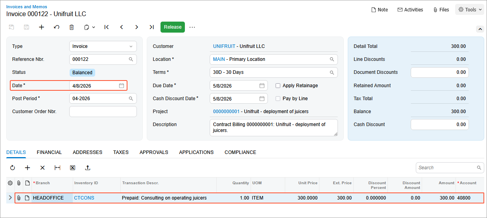
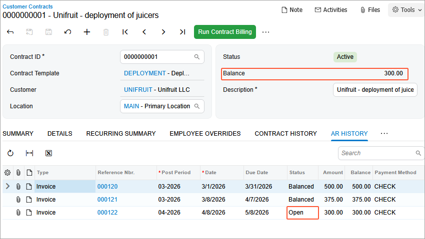

# Contract Billing: To Bill a Regular Contract on a Schedule {#_fa46d5c5-35a7-450e-8c0e-5b62ea8f3bca .task}

In this activity, you will learn how to bill a regular contract by using a schedule.

**Attention:** This activity is based on the *U100* dataset. If you are using another dataset or if any system settings have been changed in *U100*, these changes can affect the workflow of the activity and the results of the processing. To avoid issues, restore the *U100* dataset to its initial state.

## Story { .section}

Suppose that the SweetLife Fruits &amp; Jams company supplies its customer Unifruit LLC with equipment for juice production and provides deployment services for the purchased equipment.

A typical regular deployment contract includes the deployment of equipment, a maintenance support service, and consulting. The start date of the contract is *3/1/2026*, and the contract should span two months, with the possibility of renewal.

According to the terms of the contract, the customer will be billed in the amount of $500 for the juicer deployment service and the initial actions when contract setup takes place. In addition, the customer will be billed a fixed amount of $75, which is 15% of the deployment fee for a juicer maintenance at the moment of contract activation or on contract renewal. The customer will also be billed monthly in the amount of $300 at the beginning of each scheduled billing period for the consulting service that is to be provided during the duration of the contract.

Acting as an accountant, *4/1/2026* you need to bill the contract by using a schedule.

## Process Overview { .section}

In this activity, on the [Customer Contracts](CT_30_10_00.md) \(CT301000\) form, you will bill the contract. On the [Invoices and Memos](AR_30_10_00.md) \(AR301000\) form, you will review the last generated invoice and then release it.

## Configuration Overview { .section}

In the *U100* dataset, the following tasks have been performed to support this activity:

-   On the [Enable/Disable Features](CS_10_00_00.md) \(CS100000\) form, the *Contract Management* feature has been enabled.
-   On the [Accounts Receivable Preferences](AR_10_10_00.md) \(AR101000\) form on the **General** tab \(**Data Entry Settings** section\), the **Hold Documents on Entry** check box has been cleared.
-   On the [Customers](AR_30_30_00.md) \(AR303000\) form, the *UNIFRUIT \(Unifruit LLC\)* customer has been created.

## System Preparation { .section}

To prepare to perform the instructions of this activity, do the following:

1.  As a prerequisite to this activity, the contract has been set up and activated, as described in the [Contract Setup and Activation: To Set Up and Activate a Regular Contract](config_Contract_Management_Implem_Activity_To_Set_Up_Contract.md).
2.  Launch the Acumatica ERP website with the *U100* dataset preloaded, and sign in as the accountant Anna Johnson by using the *johnson* username and the *123* password.
3.  In the info area, in the upper-right corner of the top pane of the Acumatica ERP screen, make sure that the business date in your system is set to *4/1/2026*.

## Step 1: Running Contract Billing for a Particular Contract {#section_upx_4hz_js .section}

To initiate contract billing, on the [Customer Contracts](CT_30_10_00.md) \(CT301000\) form, do the following:

1.  In the **Contract ID** box, select *0000000001 \(Unifruit - deployment of juicers\)*.

    Notice the next billing date \(*4/8/2026*\) in the **Next Billing Date** box on the **Summary** tab.

2.  On the form toolbar, click **Run Contract Billing**.
3.  On the **AR History** tab, click the **Reference Nbr.** link of the last generated invoice to open it for review on the [Invoices and Memos](AR_30_10_00.md) \(AR301000\) form.

    

    The invoice date \(*4/8/2026*\) matches the date of the contract billing. The invoice includes the recurring part of the contract item, which in the current example consists of only the *CTCONS* non-stock item. This item's default price has been used as the unit price for billing in the amount of $300. The default price is set for the *CTCONS* non-stock item on the **Price Cost** tab of the [Non-Stock Items](IN_20_20_00.md) \(IN202000\) form, in the **Default Price** box.

You have billed the regular contract once by using a schedule for the consulting service. Now you can proceed with releasing the invoice.

## Step 2: Releasing the Invoice {#section_hlp_33z_js .section}

Do the following to release the invoice that has been generated during billing by using a schedule:

1.  While you are still viewing the contract on the [Customer Contracts](CT_30_10_00.md) \(CT301000\) form, on the **AR History** tab, click the **Reference Nbr.** link to open the invoice that you have created in Step 1.

    Notice that the invoice has the **Balanced** status.

2.  On the form toolbar, click **Release**. The system generates and releases a batch in the general ledger. You can see the batch number on the **Financial** tab \(**Link to GL** section\) of the [Invoices and Memos](AR_30_10_00.md) \(AR301000\) form.
3.  On the [Customer Contracts](CT_30_10_00.md) \(CT301000\) form, open the *0000000001 \(Unifruit - deployment of juicers\)* contract. Press F5 to refresh the form.

    Notice that on the **AR History** tab, the invoice now has the *Open* status. Review the contract balance \($300\), which is calculated as the sum of the balances of open invoices associated with the contract.

    

You have performed the contract billing by using a schedule and released the invoice that the system has generated. Now you can proceed with other actions.

**Parent topic:**[Billing Contracts](../UserGuide/Contracts_Billing_Contracts_Mapref.md)

