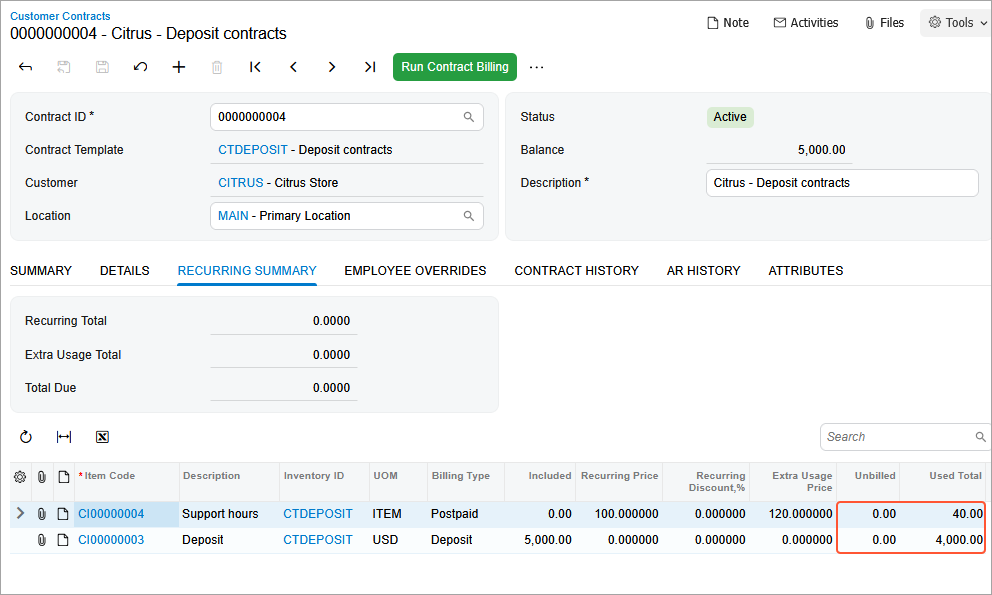
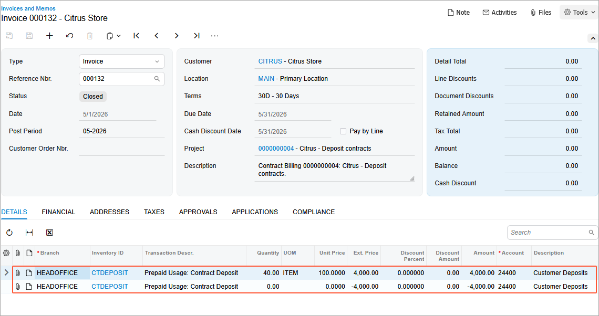
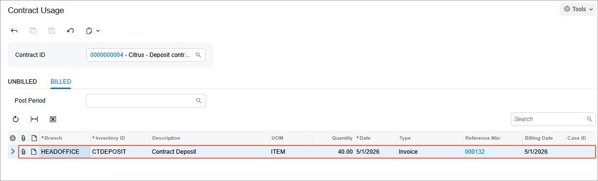
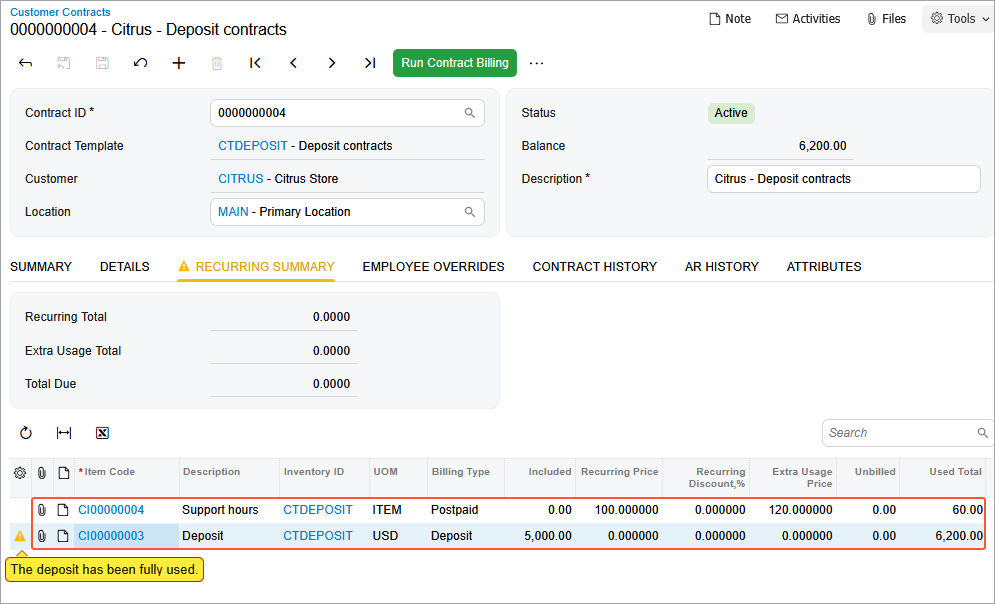
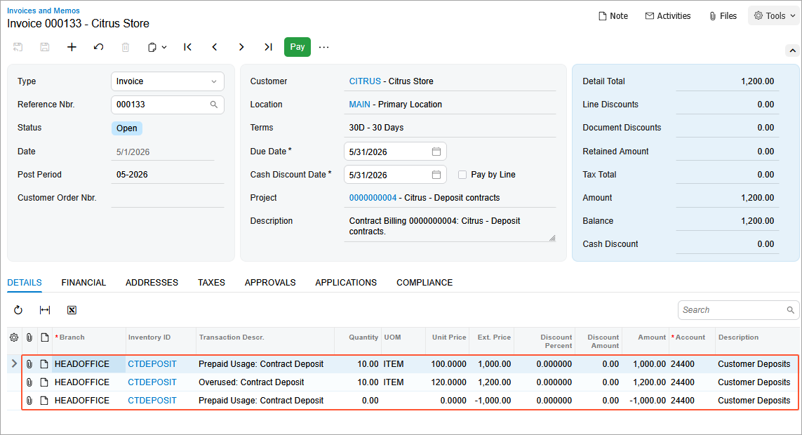

# Contract Billing: To Bill a Deposit Contract by Usage Entered Manually {#_744a1660-e8e0-4c9d-8731-be8c8f02be6f .task}

In the following implementation activity, you will learn how to bill a deposit contract by usage entered manually for regular and extra hours. You will also learn how the system warns you that the deposit has been fully used.

**Attention:** This activity is based on the *U100* dataset. If you are using another dataset or if any system settings have been changed in *U100*, these changes can affect the workflow of the activity and the results of the processing. To avoid issues, restore the *U100* dataset to its initial state.

## Story { .section}

Suppose that the Citrus Store customer wants to purchase a fixed number of support hours in advance, for which the SweetLife Fruits &amp; Jams company offers a discount. According to the terms of the deposit contract, the customer pays a deposit in advance for work that will be performed later, and the total price of the provided service will be deducted from the deposit in parts upon completion of each service.

According to the terms of the contract, the SweetLife Fruits &amp; Jams company will receive an advance payment from the Citrus Store customer in the amount of $5,000. In May 2026, SweetLife's employees will provide consulting services for a total of 50 support hours at a discounted price of $100 per hour. All support hours beyond the included hours will be billed at a higher price of $120 per hour.

Acting as an accountant, you will bill a deposit contract by usage entered manually for regular and extra hours.

## Configuration Overview { .section}

In the *U100* dataset, the following tasks have been performed to support this activity:

-   On the [Enable/Disable Features](CS_10_00_00.md) \(CS100000\) form, the *Contract Management* feature has been enabled.
-   On the [Accounts Receivable Preferences](AR_10_10_00.md) \(AR101000\) form on the **General** tab \(**Data Entry Settings** section\), the **Hold Documents on Entry** check box has been cleared.
-   On the [Customers](AR_30_30_00.md) \(AR303000\) form, the *CITRUS \(Citrus Store\)* customer has been created.

## Process Overview { .section}

On the [Customer Contracts](CT_30_10_00.md) \(CT301000\) form, you will bill deposit contract by usage entered manually for regular hours. Then you will create an additional manual contract usage and will bill contract for extra hours.

## System Preparation { .section}

To prepare to perform the instructions of this activity, do the following:

1.  As a prerequisite to this activity, complete the [Contract Usage: To Create Usage \(Deposit Contract\)](config_Contract_Management_Implem_Activity_To_Create_Usage_for_Deposit_Contract.md) to create the contract usage for a deposit contract manually.
2.  Launch the Acumatica ERP website with the *U100* dataset preloaded, and sign in as the accountant Anna Johnson by using the *johnson* username and the *123* password.
3.  In the info area, in the upper-right corner of the top pane of the Acumatica ERP screen, make sure that the business date in your system is set to *5/1/2026*. For simplicity, in this activity, you will create and process all documents in the system on this business date.

## Step 1: Billing the Deposit Contract {#section_dny_w5g_2tb .section}

To bill the deposit contract, proceed as follows:

1.  On the [Customer Contracts](CT_30_10_00.md) \(CT301000\) form, open the the contract with description *Citrus - Deposit contracts* contract.
2.  On the form toolbar, click **Run Contract Billing**.
3.  In the **Billing On Demand** dialog box, which opens, leave *5/1/2026* the **Billing Date** box, and then click **OK**.
4.  On the **Recurring Summary** tab, view the total quantity of the included items \(see the screenshot below\).

    The **Unbilled** column shows the total quantity of each included item that has been used but has not yet been billed. The **Used Total** column shows the total quantity of the recurring item, both billed and unbilled, that has been used since contract activation. For the deposit, the system displays the total amount that has been spent on the related recurring items. It may exceed the deposit and include the price of extra usage. For the deposit item, the system updates the value in the **Used Total** column only after the contract has been billed.

    

5.  On the **AR History** tab, click the **Reference Nbr.** link in the second row to open the invoice for review on the [Invoices and Memos](AR_30_10_00.md) \(AR301000\) form. In the invoice, the provided service and the retainer are displayed as separate lines.

    

    The customer is billed for the service usage according to the pricing policy specified in the **Recurring Pricing** box of the [Contract Items](CT_20_10_00.md) \(CT201000\) form for the contract item. The invoice has zero amount because the fee for the support has been deducted from the deposit paid and the Customer Deposits account \(24400\) has been debited on the amount of the fee.

## Step 2: Creating an Additional Manual Contract Usage { .section}

1.  Return to the [Customer Contracts](CT_30_10_00.md) \(CT301000\) form with the the contract with description *Citrus - Deposit contracts* contract open.
2.  On the More menu \(under **Other**\), click **Contract Usage**. The [Contract Usage](CT_30_30_00.md) form opens with the *Citrus - Deposit contracts* contract selected.
3.  On the **Billed** tab, review the list of records of the billed usage accumulated since contract activation.

    

4.  On the **Unbilled** tab, add a row to the table, and enter the following settings for it:
    -   **Branch**: *HEADOFFICE*
    -   **Inventory ID**: *CTDEPOSIT*
    -   **Quantity**: `20`
    -   **Date**: *5/1/2026*
5.  Click **Save** on the form toolbar.

    As a result, the included 50 hours of services and the deposit were provided, and 10 hours will be billed as extra usage.

## Step 3: Billing the Deposit Contract for Extra Hours { .section}

1.  On the [Customer Contracts](CT_30_10_00.md) \(CT301000\) form, open the the contract with description *Citrus - Deposit contracts* contract. On the form toolbar, click **Run Contract Billing**.
2.  In the **Billing On Demand** dialog box, which opens, leave *5/1/2026* in the **Billing Date** box, and then click **OK**.
3.  On the **Recurring Summary** tab, view the total quantity of the included items \(see the following screenshot\). On this tab, the system shows a warning icon on the left side of the line with the deposit item, indicating that the deposit has been fully used.

    

4.  On the **AR History** tab, click the **Reference Nbr.** link in the last row of the table to review the details of the generated invoice on the [Invoices and Memos](AR_30_10_00.md) \(AR301000\) form, shown in the screenshot below.

    Because the deposit has been completely spent, the customer is being billed for the extra 10 hours, according to the pricing policy specified in the **Extra Usage Pricing** box of the [Contract Items](CT_20_10_00.md) \(CT201000\) form \(**Price Options** tab\) of the recurring contract item. So the overused amount is $1,200.

    

You have created the manual contract usage and performed the contract billing for the deposit contract by usage entered manually for regular and extra hours.

**Parent topic:**[Billing Contracts](../UserGuide/Contracts_Billing_Contracts_Mapref.md)

