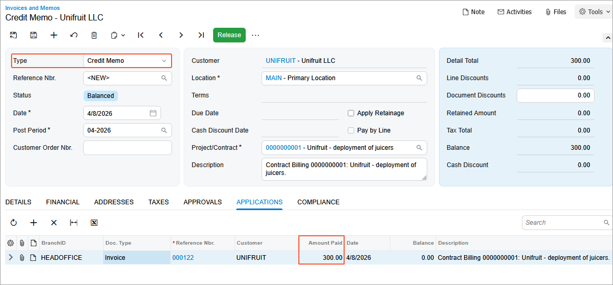
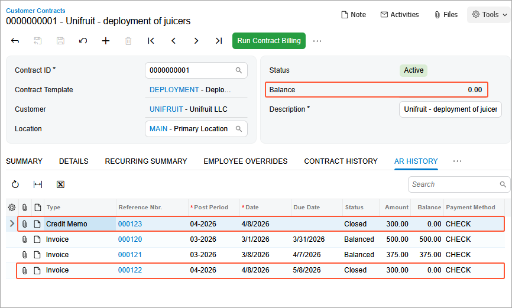

# Contract Management: To Cancel the Last Action {#_e79daa20-48d2-4ea6-a79c-60ad92ee352b .task}

In this activity, you will learn how to cancel the last action.

**Attention:** This activity is based on the *U100* dataset. If you are using another dataset or if any system settings have been changed in *U100*, these changes can affect the workflow of the activity and the results of the processing. To avoid issues, restore the *U100* dataset to its initial state.

## Story { .section}

The SweetLife Fruits &amp; Jams company supplies the Unifruit LLC customer with equipment for a juice production and provides deployment, maintenance support service and consulting. A regular deployment contract includes such terms as a two-month contract span, the activation date as the starting point of the billing schedule, a monthly billing period, a recurring billing amount of $300, the ability to be renewed, and a 10-day grace period.

According to the terms of the contract, the customer will be billed in the amount of $500 for the juicer deployment service and for the initial actions when contract setup takes place. In addition, the customer will be billed a fixed amount of $75, which is 15% of the deployment fee for a juicer maintenance at the moment of contract activation or on contract renewal. The customer will also be billed monthly in the amount of $300 at the beginning of each scheduled billing period for the consulting service that is to be provided during the duration of the contract.

Suppose that the contract was set up and activated in the beginning of March, 2026. On *4/1/2026*, an accountant has billed the customer for the consulting service and released the $300 invoice.

Meanwhile, during the fulfillment of the contract, the Unifruit LLC customer asked SweetLife to change the terms of the contract, add an additional consulting service to the contract, and define *4/2/2026* as the date when the additional consulting service begins. SweetLife's accountant should cancel the previous billing, change the terms of the contract \(upgrade it\), and then bill the customer using the new terms of the contract for both services.

Acting as an accountant, you need to cancel the most recent billing \(which was the last action performed on the contract\) and reverse the invoice.

## Configuration Overview { .section}

In the *U100* dataset, the following tasks have been performed to support this activity:

-   On the [Enable/Disable Features](CS_10_00_00.md) \(CS100000\) form, the *Contract Management* feature has been enabled.
-   On the [Accounts Receivable Preferences](AR_10_10_00.md) \(AR101000\) form on the **General** tab \(**Data Entry Settings** section\), the **Hold Documents on Entry** check box has been cleared.
-   On the [Customers](AR_30_30_00.md) \(AR303000\) form, the *UNIFRUIT \(Unifruit LLC\)* customer has been created.

## Process Overview { .section}

In this activity, on the [Invoices and Memos](AR_30_10_00.md) \(AR301000\) form, you will reverse the invoice and create the credit memo. Then on the [Customer Contracts](CT_30_10_00.md) \(CT301000\) form, you will cancel the last action \(billing\).

## System Preparation { .section}

To prepare to perform the instructions of this activity, do the following:

1.  As a prerequisite to this activity, the contract has been billed once and the invoice has been released, as described in Step 1 and Step 2 of the [Contract Billing: To Bill a Regular Contract on a Schedule](config_Contract_Management_Implem_Activity_To_Bill_Contract_by_Schedule.md) activity.
2.  Launch the Acumatica ERP website with the *U100* dataset preloaded, and sign in as the accountant Anna Johnson by using the *johnson* username and the *123* password.
3.  In the info area, in the upper-right corner of the top pane of the Acumatica ERP screen, make sure that the business date in your system is set to *4/2/2026*. For simplicity, in this activity, you will create and process all documents in the system on this business date.

## Step 1: Reverse the Released Invoice {#section_ynp_432_2tb .section}

To reverse the released invoice before the cancellation of the billing, do the following:

1.  On the [Customer Contracts](CT_30_10_00.md) \(CT301000\) form, open the *0000000001 \(Unifruit - deployment of juicers\)* contract.
2.  On the **Contract History** tab, view the log of actions performed upon the contract. Notice that the last action in the log is the contract billing.
3.  In the table on the **AR History** tab, click the reference number of the last invoice with the **Open** status in the amount of $300 to open the invoice for reversing. The invoice opens on the [Invoices and Memos](AR_30_10_00.md) \(AR301000\) form.
4.  On the More menu \(under **Corrections**\), click **Reverse**. The system creates a credit memo with the *Balanced* status for the invoice and opens it on the same form.

    **Tip:** If you instead click **Reverse and Apply to Memo**, then you do not need to apply the memo to the invoice manually.

5.  On the **Applications** tab of the credit memo, add a row. In the **Reference Nbr.** column, select the reference number of the invoice for the Unifruit LLC company that you want to reverse. In the **Amount Paid** column of the **Applications** tab, specify an amount that matches the invoice amount \($300\), as shown in the following screenshot.

    

6.  Save the credit memo.
7.  On the form toolbar, click **Release** to release the credit memo. Now the credit memo has the *Closed* status and the released invoice has been reversed.

Now you can proceed to the cancellation of the latest action, which was the billing.

## Step 2: Cancel the Last Action { .section}

In this step, you will cancel the latest billing for the contract, which resulted in a released invoice.

1.  On the [Customer Contracts](CT_30_10_00.md) \(CT301000\) form, again open the *0000000001 \(Unifruit - deployment of juicers\)* contract.
2.  On the **AR History** tab, click **Refresh** in the left corner of the table toolbar to refresh the data in the table.

    Now the credit memo that reverses the invoice is also listed in the table \(see below\). Both the invoice and the credit memo have the *Closed* status, because you have released the application of the credit memo to the invoice.

3.  Press F5 to refresh the form. In the Summary area of the [Customer Contracts](CT_30_10_00.md) form, review the contract balance, which is $0 now because you have reversed the released invoice.

    

4.  On the More menu \(under **Processing**\), click **Undo Last Action**.

    On the **Contract History** tab, notice that the bottom record \(with the *Bill* action\) has disappeared. However, the credit memo and the invoice remain listed in the table on the **AR History** tab.

    In the **Billing Schedule** section of the **Summary** tab, notice the date of the next billing, which is *4/8/2026*.

You have canceled the last billing, which resulted in the released invoice, and now you can proceed with other contract actions.

**Parent topic:**[Managing Contracts](../UserGuide/Contracts_Managing_Contracts_Mapref.md)

