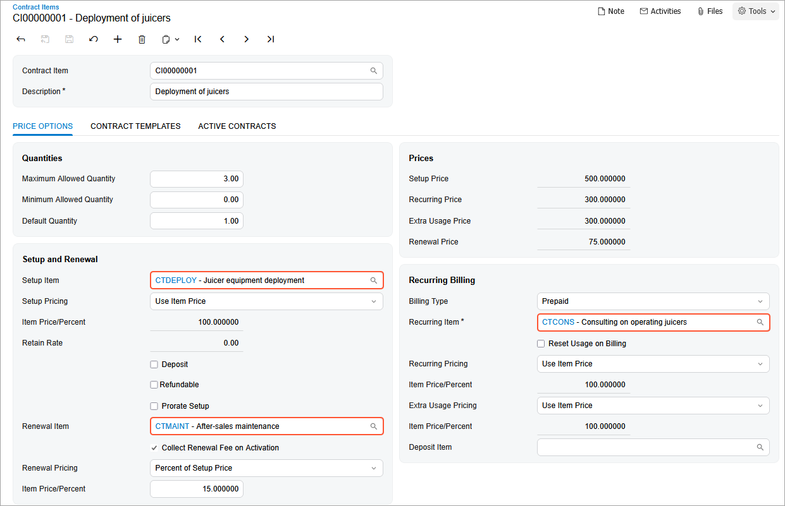

# Contract Item Creation: To Create a Renewal Contract Item \(Regular Contract\) {#_3d56d3f8-7935-4f6b-b4b6-425a1f1c22a6 .task}

In this activity, you will learn how to create a contract item for a regular contract. You will later use this contract item for creating a contract template.

**Attention:** This activity is based on the *U100* dataset. If you are using another dataset or if any system settings have been changed in *U100*, these changes can affect the workflow of the activity and the results of the processing. To avoid issues, restore the *U100* dataset to its initial state.

## Story { .section}

Suppose that the SweetLife Fruits &amp; Jams company supplies its Unifruit LLC customer with a piece of equipment for juice production and provides deployment service for the purchased equipment. A regular deployment fixed-price contract includes the deployment of equipment, a maintenance support service, and monthly consulting. In a fixed-price contract, payment amounts are constant and do not change depending on the costs incurred by SweetLife during the fulfillment of the contract. The start date of the contract is *3/1/2026*. The contract should span two months, with the possibility of renewal.

According to the terms of the contract, the customer will be billed in the amount of $500 for the juicer deployment service and the initial actions when contract setup takes place. In addition, the customer will be billed a fixed amount of $75, which is 15% of the deployment fee for a juicer maintenance at the moment of contract activation or on contract renewal. The customer will also be billed monthly in the amount of $300 at the beginning of each scheduled billing period for the consulting service that is to be provided during the duration of the contract.

Acting as a sales manager, you need to create a renewal contract item to establish the prices and settings for the included services.

## Configuration Overview { .section}

In the *U100* dataset, the following tasks have been performed to support this activity:

-   On the [Enable/Disable Features](CS_10_00_00.md) \(CS100000\) form, the *Contract Management* feature has been enabled.
-   On the [Customers](AR_30_30_00.md) \(AR303000\) form, the *UNIFRUIT \(Unifruit LLC\)* customer has been created.
-   On the [Chart of Accounts](GL_20_25_00.md) \(GL202500\) form, the *79000* \(*Contract Expenses*\) expense account, *40600* \(*Contracts - Deployment of equipment*\), and the *40800* \(*Contracts - Trainings*\) sales accounts have been created.

## Process Overview { .section}

In this activity, on the [Non-Stock Items](IN_20_20_00.md) \(IN202000\) form, you will create new non-stock items and specify setup, renewal, and recurring settings. On the [Stock Items](IN_20_25_00.md) \(202500\) form, you will then create a renewal contract item that you will use in the process of template creation.

## System Preparation { .section}

To prepare to perform the instructions of this activity, do the following:

1.  As a prerequisite to this activity, complete the [Contract Functionality Implementation: Implementation Activity](config_ContractMgmt_Implem_Activity.md) to activate the needed features to use the contract functionality.
2.  Launch the Acumatica ERP website with the *U100* dataset preloaded, and sign in as the sales manager David Chubb by using the *chubb* username and the *123* password.

## Step 1: Creating Non-Stock Items {#section_skm_dyf_dt .section}

To create non-stock items, do the following:

1.  On the [Non-Stock Items](IN_20_20_00.md) \(IN202000\) form, create the non-stock item for the deployment service as follows:
    1.  Add a new record.
    2.  Specify the following settings in the Summary area:
        -   **Inventory ID**: `CTDEPLOY`
        -   **Description**: `Juicer equipment deployment`
    3.  On the **General** tab, specify the following settings:
        -   **Type**: *Service*
        -   **Posting Class**: *NONSTOCK*
        -   **Tax Category**: *EXEMPT*
        -   **Require Receipt**: Cleared
        -   **Require Shipment**: Cleared
        -   **Base Unit**: *ITEM*
        -   **Sales Unit**: *ITEM*
        -   **Purchase Unit**: *ITEM*
    4.  On the **Price/Cost** tab, specify `500` \(the deployment fee\) in the **Default Price** box.
    5.  On the **GL Accounts** tab, specify the following settings:
        -   **Expense Account**: *79000* \(*Contract Expenses*\)

            This account accumulates the expenses that company spends to provide contract preparation.

        -   **Sales Account**: *40600* \(*Contracts - Deployment of equipment*\)

            This account accumulates the revenue earned when employees provide deployment services.

    6.  On the form toolbar, click **Save** to save the non-stock item.
2.  Create the non-stock item for the equipment maintenance service as follows:
    1.  Add a new record.
    2.  Specify the following settings in the Summary area:
        -   **Inventory ID**: `CTMAINT`
        -   **Description**: `After-sales maintenance`
    3.  On the **General** tab, specify the following settings:
        -   **Type**: *Service*
        -   **Posting Class**: *NONSTOCK*
        -   **Tax Category**: *EXEMPT*
        -   **Require Receipt**: Cleared
        -   **Require Shipment**: Cleared
        -   **Base Unit**: *ITEM*
        -   **Sales Unit**: *ITEM*
        -   **Purchase Unit**: *ITEM*
    4.  On the **GL Accounts** tab, specify the following settings:
        -   **Expense Account**: *79000* \(*Contract Expenses*\)
        -   **Sales Account**: *40600* \(*Contracts - Deployment of equipment*\)
    5.  On the form toolbar, click **Save** to save the non-stock item.
3.  Create the non-stock item for a consulting service as follows:
    1.  Add a new record.
    2.  Specify the following settings in the Summary area:
        -   **Inventory ID**: `CTCONS`
        -   **Description**: `Consulting on operating juicers`
    3.  On the **General** tab, specify the following settings:
        -   **Type**: *Non-Stock Item*
        -   **Posting Class**: *NONSTOCK*
        -   **Tax Category**: *EXEMPT*
        -   **Require Receipt**: Cleared
        -   **Require Shipment**: Cleared
        -   **Base Unit**: *ITEM*
        -   **Sales Unit**: *ITEM*
        -   **Purchase Unit**: *ITEM*
    4.  On the **Price/Cost** tab, specify `300` in the **Default Price** box.
    5.  On the **GL Accounts** tab, specify the following settings:
        -   **Expense Account**: *79000* \(*Contract Expenses*\)
        -   **Sales Account**: *40800* \(*Contracts - Trainings*\)
    6.  On the form toolbar, click **Save** to save the non-stock item.

## Step 2: Creating a Contract Item {#section_l3p_2yf_dt .section}

In this step, you will create a renewal contract item to establish the prices and settings for the included services.

To create a contract item, do the following:

1.  On the [Contract Items](CT_20_10_00.md) \(CT201000\) form, add a new record.
2.  In the **Description** box of the Summary area, type `Deployment of juicers`.

    **Tip:** The **Contract Item** box contains the `<NEW>` placeholder, which means that auto-numbering is enabled for the key segment and the identifier will be assigned automatically when you save the new record.

3.  On the **Price Options** tab, enter the following settings:
    -   **Maximum Allowed Quantity**: `3`
    -   **Minimum Allowed Quantity**: `0`
    -   **Default Quantity**: `1`

        Under a contract that includes this contract item, the customer will be able to deploy juicers. These settings are quantities of this contract item. In a contract template or a contract that includes this contract item, the value in the **Default Quantity** box can be modified in a template or a contract within the allowed limits \(which are defined by the **Maximum Allowed Quantity** and **Minimum Allowed Quantity**\). If the contract usage in a particular contract exceeds the included quantity, the excess is considered extra usage. The allowed quantity limits do not apply to extra usage.

4.  In the **Setup and Renewal** section of the tab, do the following:
    1.  In the **Setup Item** box, select *CTDEPLOY*. The customer will be billed for the juicer deployment \(which is represented by this non-stock item\) and initial actions when contract setup occurs.
    2.  In the **Setup Pricing** box, leave *Use Item Price* so that the base price of the specified non-stock item will be used for billing.
    3.  Make sure that the **Refundable** check box is cleared because you do not want to provide the ability to refund payments in this example.

        **Tip:** If this check box is selected, the amount the customer paid for setup will be refunded if the contract is terminated.

    4.  In the **Renewal Item** box, select *CTMAINT* so that when contract renewal occurs, the customer will be billed a fixed amount for juicer maintenance, which the selected non-stock item represents.
    5.  Select the **Collect Renewal Fee on Activation** check box so that the customer will be billed for maintenance both at the moment of contract activation and on contract renewal.
    6.  In the **Renewal Pricing** box, leave *Percent of Setup Price* so that the price is calculated by applying the percent specified in the **Item Price/Percent** box to the setup price of the contract item—that is, of the deployment fee.
    7.  In the **Item Price/Percent** box, type `15`. The contract renewal price \(the maintenance fee in this example\) will be calculated as 15 percent of the deployment fee \($75\).
5.  In the **Recurring Billing** section of this tab, do the following:
    1.  In the **Billing Type** box, select *Prepaid*. The *Prepaid* billing type indicates that the customer will be billed at the beginning of each scheduled billing period for the services that are to be provided during the period.

        **Tip:** If you had selected the *Postpaid* billing type, the customer would be billed at the end of the billing period for the services provided during the period.

    2.  In the **Recurring Item** box, select *CTCONS*. This is the non-stock item that represents the consulting services you want to provide and bill on a recurring basis.
    3.  Leave the **Reset Usage on Billing** check box cleared.

        When it is selected, the contract item usage will be reset after billing has been performed for a billing period.

    4.  In the **Recurring Pricing** box, select *Use Item Price*.
    5.  In the **Extra Usage Pricing** box, leave *Use Item Price*. No extra usage is planned for this item.
6.  On the form toolbar, click **Save** to save the created contract item, which should look as shown in the following screenshot.

    

You have created the *CI00000001 \(Deployment of juicers\)* renewal contract item, and now you can add this contract item to a contract template you will create in the next activity.

**Parent topic:**[Creating Contract Items](../UserGuide/Contracts_Configuring_Contract_Items_Mapref.md)

