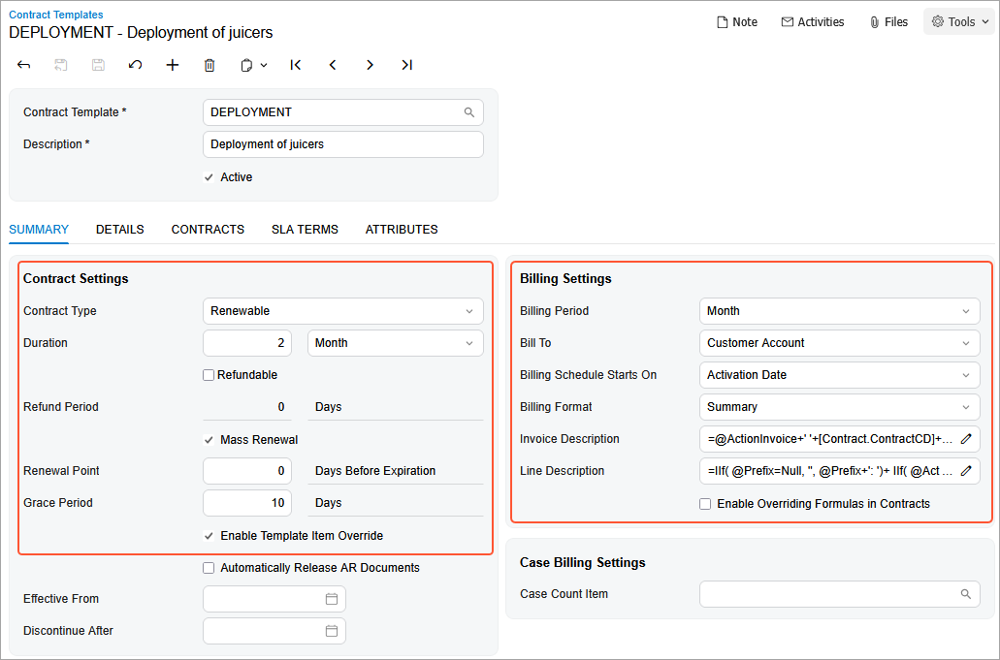
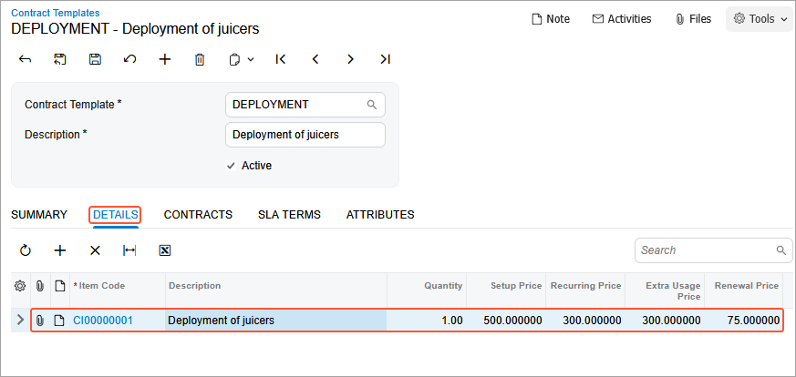

# Contract Template Creation: To Create a Regular Contract Template {#_056e6771-874e-4316-ba90-2014d0298deb .task}

In this activity, you will learn how to create a contract template for a regular contract.

**Attention:** This activity is based on the *U100* dataset. If you are using another dataset or if any system settings have been changed in *U100*, these changes can affect the workflow of the activity and the results of the processing. To avoid issues, restore the *U100* dataset to its initial state.

## Story { .section}

Suppose that from time to time, the SweetLife Fruits &amp; Jams company provides deployment, maintenance, and consulting services to different customers. In most cases, many of the terms of the contracts of SweetLife are the same. Thus, SweetLife needs to have one template in the system that the company's employees can use when creating an unlimited number of regular contracts.

A typical deployment fixed-price contract includes the deployment of equipment, a maintenance support service, and consulting. In a fixed-price contract, payment amounts are constant and do not change depending on the costs incurred by SweetLife during the fulfillment of the contract.

Suppose that on *3/1/2026*, Unifruit asks the company to deploy juicers in the newly opened restaurant. Because the contract agreement is standard, the deployment contract will be created based on the data included in the template, which holds as many settings as are necessary for a typical contract. Regular deployment contract includes such terms as a two-month contract span, the activation date as the starting point of billing schedule, a monthly billing period, renewability, a 10-day grace period, and the *CI00000001 \(Deployment of juicers\)* contract item.

Acting as a sales manager, you will create a contract template for a regular contract containing all the above terms. When you create a contract and select a contract template, the contract item or items specified for the template will be copied to the contract, along with other settings.

## Configuration Overview { .section}

In the *U100* dataset, the following tasks have been performed to support this activity:

-   On the [Enable/Disable Features](CS_10_00_00.md) \(CS100000\) form, the *Contract Management* feature has been enabled.
-   On the [Customers](AR_30_30_00.md) \(AR303000\) form, the *UNIFRUIT \(Unifruit LLC\)* customer has been created.

## Process Overview { .section}

In this activity, on the [Contract Templates](CT_20_20_00.md) \(CT202000\) form, you will create a contract template for a regular service contract. The contract template will include the contract item *CI00000001 \(Deployment of juicers\)* that you have created in the [Contract Item Creation: To Create a Renewal Contract Item \(Regular Contract\)](config_Contract_Management_Implem_Activity_To_Configure_Contract_Item.md) activity.

## System Preparation { .section}

To prepare to perform the instructions of this activity, do the following:

1.  As a prerequisite to this activity, complete the [Contract Item Creation: To Create a Renewal Contract Item \(Regular Contract\)](config_Contract_Management_Implem_Activity_To_Configure_Contract_Item.md) to create the *CI00000001 \(Deployment of juicers\)* contract item you will use during the creation on the contract template.
2.  Launch the Acumatica ERP website with the *U100* dataset preloaded, and sign in as the sales manager David Chubb by using the *chubb* username and the *123* password.

## Step: Creating a Contract Template {#section_bbw_kqp_dtb .section}

To create a contract template, do the following:

1.  On the [Contract Templates](CT_20_20_00.md) \(CT202000\) form, add a new record.
2.  In the **Contract Template** box of the Summary area, type `DEPLOYMENT`.

    **Tip:** The unique identifier of a contract template complies with the *TMCONTRACT* segmented key.

3.  In the **Description** box, type `Deployment of juicers`.
4.  On the **Summary** tab, in the **Contract Settings** section, do the following:
    1.  In the **Contract Type** box, leave *Renewable* because you want the ability to extend contracts based on this template.

        When you renew a contract of this type, the expiration date is changed and an invoice is generated for any renewal fees that have been specified for contract items included in the contract. A contract should be renewed during its grace period. If you renew the contract after the grace period, the status of the contract will be changed to *Expired*, and a copy of the contract will be created with the *Draft* status.

    2.  In the **Duration** boxes, enter `2` and *Month* to define the span during which a contract based on this template is valid.
    3.  Make sure that the **Refundable** check box is cleared.

        If it was selected, the setup and renewal fee would be refunded when a contract based on this template is terminated. The setup fee is refunded if both the contract and the applicable contract item are marked as refundable. If a renewal fee is collected on activation, it is refunded along with the setup fee. If the contract is terminated, the recurring charges are refunded in proportion to the unused services.

    4.  Select the **Mass Renewal** check box so that it is possible to later use the [Renew Contracts](CT_50_20_00.md) \(CT502000\) form to renew contracts based on this template.
    5.  Leave *0* in the **Renewal Point** box. This is the number of days before contract expiration when the contract becomes available for renewal on the [Renew Contracts](CT_50_20_00.md) form.
    6.  In the **Grace Period** box, type `10` to specify the number of days after the expiration date when services under a contract are still provided and the contract can be renewed. If you renew the contract after the end of the grace period, a copy of the contract with the *Draft* status will be created.
    7.  Select the **Enable Template Item Override** check box to allow users to modify the list of contract items or to adjust their included quantity for each contract based on this template \(for example, if the customer wants to include an additional consulting service in the contract\).
5.  In the **Billing Settings** section, do the following:
    1.  In the **Billing Period** box, leave *Month*. This divides the contract billing schedule into months because according to the terms of the contract, the customer is billed monthly.
    2.  In the **Bill To** box, leave *Customer Account*. This indicates that by default, a contract based on this template is to be billed to the customer account specified for the contract.

        For any contract based on the template, this setting can be overridden on the [Customer Contracts](CT_30_10_00.md) \(CT301000\) form.

    3.  In the **Billing Schedule Starts On** box, leave *Activation Date* to specify the starting point of the contract billing schedule. The contract expiration date is calculated based on this setting.
    4.  In the **Billing Format** box, leave *Summary* to define the format of invoices for billing contracts based on the template. With this format, contract item usage will be summed and shown as a single line that includes the total quantity and the total sum.

        **Tip:** If you had selected *Detail*, each occurrence of contract item usage would be shown as a separate line in the resulting invoices. You can change the billing format for a template at any time, and this change will affect the format of the invoices generated afterward for the existing contracts based on the template.

6.  On the form toolbar, click **Save**. The settings of the contract template should look like those shown in the following screenshot.

    

7.  To add the contract item to the contract template, on the **Details** tab, do the following:
    1.  On the table toolbar, click **Add Row**.
    2.  In the **Item Code** column, select *CI00000001 \(Deployment of juicers\)*. The system inserts the settings of the contract item in the corresponding columns \(as shown in the following screenshot\). You can change the item description and quantity within the allowed limits.

        

8.  In the Summary area, make sure the **Active** check box is selected. This indicates that contracts can be created based on the template.
9.  On the form toolbar, click **Save**.

You have created the contract template for a regular contract and now you can proceed to contract preparation.

**Parent topic:**[Creating Contract Templates](../UserGuide/Contracts_Configuring_Contract_Templates_Mapref.md)

