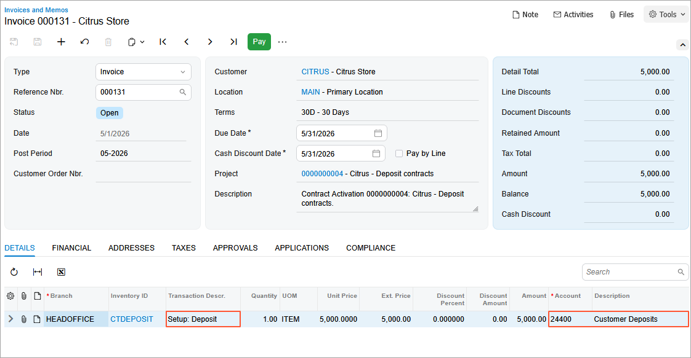

# Contract Setup and Activation: To Create and Activate a Deposit Contract {#_d572e98e-5552-4816-b1d8-ee243890c833 .task}

In this activity, you will learn how to create deposit contract draft and activate it.

**Attention:** This activity is based on the *U100* dataset. If you are using another dataset or if any system settings have been changed in *U100*, these changes can affect the workflow of the activity and the results of the processing. To avoid issues, restore the *U100* dataset to its initial state.

## Story { .section}

Suppose that the Citrus Store customer wants to purchase a fixed number of support hours in advance, for which the SweetLife Fruits &amp; Jams company offers a discount. According to the terms of the deposit contract, the customer pays a deposit in advance for work that will be performed later, and the total price of the provided service will be deducted from the deposit in parts upon completion of service.

According to the terms of the contract, SweetLife will receive an advance payment from the Citrus Store customer in the amount of $5,000. In May 2026, SweetLife's employees will provide consulting services in total on 50 support hours by discounted price in the amount of $100 per hour. All support hours beyond the included hours will be billed at a higher price in the amount of $120 per hour.

Acting as a sales manager, you will create a deposit contract and activate it.

## Configuration Overview { .section}

In the *U100* dataset, the following tasks have been performed to support this activity:

-   On the [Enable/Disable Features](CS_10_00_00.md) \(CS100000\) form, the *Contract Management* feature has been enabled.
-   On the [Customers](AR_30_30_00.md) \(AR303000\) form, the *CITRUS \(Citrus Store\)* customer has been created.

## Process Overview { .section}

In this activity, [Customer Contracts](CT_30_10_00.md) \(CT301000\) form, you will create a new deposit contract with *Draft* status and activate it.

## System Preparation { .section}

To prepare to perform the instructions of this activity, do the following:

1.  As a prerequisite to this activity, complete the [Contract Template Creation: To Create a Deposit Contract Template](config_Contract_Management_Implem_Activity_To_Configure_Deposit_Contract_Template.md) to create the template you will use during the creation of the contract.
2.  Launch the Acumatica ERP website with the *U100* dataset preloaded, and for Step 1 and Step 2 sign in to the system as a system administrator Kimberly Gibbs by using the *gibbs* username and the *123* password. For Step 3 and Step 4 sign in as the sales manager David Chubb by using the *chubb* username and the *123* password.
3.  In the info area, in the upper-right corner of the top pane of the Acumatica ERP screen, make sure that the business date in your system is set to *5/1/2026*. For simplicity, in this activity, you will create and process all documents in the system on this business date.

## Step 1: Enabling Auto-Numbering for Contracts {#section_it1_qf1_dt .section}

In Acumatica ERP, contract identifiers are created based on the *CONTRACT* segmented key. To configure the system to assign automatically numbered identifiers to contracts, on the [Segmented Keys](CS_20_20_00.md) \(CS202000\) form, do the following:

1.  On the Summary area in the **Segmented Key ID** box, select *CONTRACT*.
2.  Click **Edit** to the right of the **Numbering ID** box to review the configuration of the *CONTRACT* numbering sequence on the [Numbering Sequences](CS_20_10_10.md) \(CS201010\) form. This predefined numbering sequence is used in the *CONTRACT* segmented key by default.
3.  Close the [Numbering Sequences](CS_20_10_10.md) form.
4.  In the table on the [Segmented Keys](CS_20_20_00.md) form, select the **Auto Number** check box for the only row, which contains the settings of the single segment included in the segmented key.

    Contract identifiers can be defined to include multiple segments. However, automatic numbering can be enabled for only one segment. Note that the length of the auto-numbered segment must match the length of the numbering sequence specified in the **Numbering ID** box.

5.  On the form toolbar, click **Save**.

## Step 2: Configuring the Settings of the Accounts Receivable Functionality {#section_mss_4f1_dt .section}

To be able to use the needed accounts receivable functionality, on the [Accounts Receivable Preferences](AR_10_10_00.md) \(AR101000\) form, do the following:

1.  On the **General** tab, clear the **Hold Documents on Entry** check box.

    With this check box cleared, any invoice issued when a contract is billed will have the *Balanced* status.

2.  On the form toolbar, click **Save**.

## Step 3: Creating a Deposit Contract Draft {#section_qtc_1w3_ls .section}

To create a deposit contract draft, do the following:

1.  Sign in to the system as a sales manager by using the *chubb* username and the *123* password.
2.  On the [Customer Contracts](CT_30_10_00.md) \(CT301000\) form, add a new record.
3.  In the Summary area, do the following to specify the contract settings:
    -   In the **Contract Template** box, select *CTDEPOSIT*. The system automatically includes the contract items of the selected template and fills in the billing policy settings with those of the template.
    -   In the **Customer** box, select *CITRUS*.
    -   In the **Description** box, type `Citrus - Deposit contracts`.
4.  Click **Save** on the form toolbar to save the deposit contract. Note now the contract has the **Draft** status.

## Step 4: Setting up and Activating the Deposit Contract Simultaneously {#section_cks_bw3_ls .section}

To set up and activate the deposit contract simultaneously, while you are still viewing the deposit contract on the [Customer Contracts](CT_30_10_00.md) \(CT301000\) form, proceed as follows:

1.  On the More menu \(under **Processing**\), click **Set Up and Activate Contract**.
2.  In the **Activate Contract** dialog box, which opens, leave *5/1/2026* in the **Activation Date** box, and then click **OK**. The contract is assigned the *Active* status, and the setup and activation dates become unavailable for editing on the **Summary** tab. Also, when the contract is activated, the system generates and releases an invoice for the deposit.
3.  On the **AR History** tab, click the **Reference Nbr.** link in the only row of the table to open and review the invoice on the [Invoices and Memos](AR_30_10_00.md) \(AR301000\) form. The deposit fee has been posted to the *Customer Deposits* liability account.

    

You have created and activated the deposit contract. Now you can proceed to the creating manual contract usage.

**Parent topic:**[Setting Up and Activating Contracts](../UserGuide/Contracts_Setting_Up_Contracts_Mapref.md)

