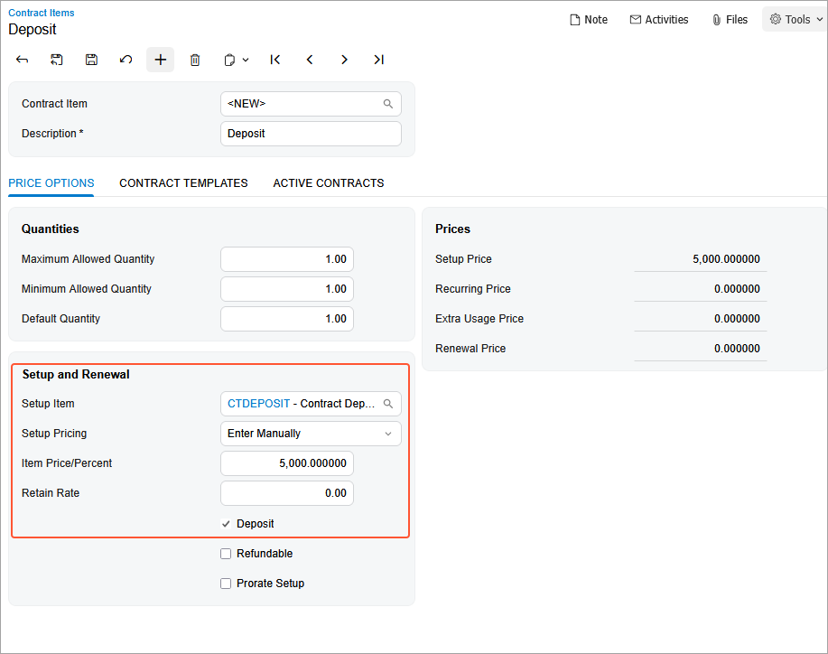
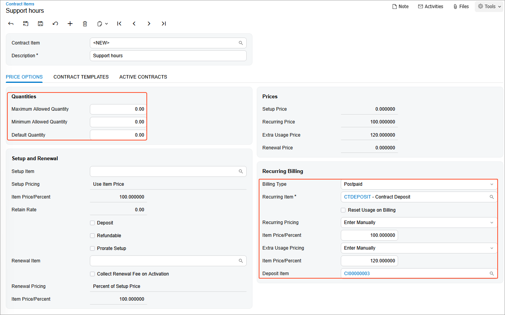

# Contract Item Creation: To Create a Deposit Contract Item \(Deposit Contract\) {#_cbb1f560-80f6-47ec-954e-52a5d8bc5da5 .task}

In this activity, you will learn how to create a deposit contract item.

**Attention:** This activity is based on the *U100* dataset. If you are using another dataset or if any system settings have been changed in *U100*, these changes can affect the workflow of the activity and the results of the processing. To avoid issues, restore the *U100* dataset to its initial state.

## Story { .section}

Suppose that the Citrus Store customer wants to purchase a fixed number of support hours in advance, for which the SweetLife Fruits &amp; Jams company offers a discount. According to the terms of the deposit contract, the customer pays a deposit in advance for work that will be performed later, and the total price of the provided service will be deducted from the deposit in parts upon completion of service.

According to the terms of the contract, SweetLife will receive an advance payment from the Citrus Store customer in the amount of $5,000. SweetLife's employees will provide consulting services in total on 50 support hours by discounted price in the amount of $100 per hour. All support hours beyond the included hours will be billed at a higher price in the amount of $120 per hour.

Acting as a sales manager to create a deposit contract, you need to create two contract items: a contract item marked as a deposit, and a contract item for a standard support service.

## Configuration Overview { .section}

In the *U100* dataset, the following tasks have been performed to support this activity:

-   On the [Enable/Disable Features](CS_10_00_00.md) \(CS100000\) form, the *Contract Management* feature has been enabled.
-   On the [Customers](AR_30_30_00.md) \(AR303000\) form, the *CITRUS \(Citrus Store\)* customer has been created.
-   On the [Chart of Accounts](GL_20_25_00.md) \(GL202500\) form, the *14000* expense account *\(Prepaid Expenses for Customers\)* and the *24400* *\(Customer Deposits\)* sales account have been created.

## Process Overview { .section}

In this activity, you will create a new deposit non-stock item on the [Non-Stock Items](IN_20_20_00.md) \(IN202000\) form, and specify deposit settings. On the [Stock Items](IN_20_25_00.md) \(202500\) form, you will then create a deposit contract item that you will use during the creation of the template for a deposit contract.

## System Preparation { .section}

To prepare to perform the instructions of this activity, launch the Acumatica ERP website with the *U100* dataset preloaded, and sign in as the sales manager David Chubb using the *chubb* username and the *123* password.

## Step 1: Creating a Deposit Non-Stock Item {#section_srd_gtg_2tb .section}

To create the deposit non-stock item, do the following:

1.  On the [Non-Stock Items](IN_20_20_00.md) \(IN202000\) form, add a new record.
2.  Specify the following settings in the Summary area:
    -   **Inventory ID**: `CTDEPOSIT`
    -   **Description**: `Contract Deposit`
3.  On the **General** tab, specify the following settings:
    -   **Type**: *Charge*
    -   **Posting Class**: *LABOR*
    -   **Tax Category**: *EXEMPT*
    -   **Require Receipt**: Cleared
    -   **Require Shipment**: Cleared
    -   **Base Unit**: *ITEM*
    -   **Sales Unit**: *ITEM*
    -   **Purchase Unit**: *ITEM*
4.  On the **GL Accounts** tab, specify the liability account on which you want to keep the amount of unused retainers:
    -   **Expense Account**: *14000 \(Prepaid Expenses for Customers\)*

        This account accumulates the expenses that the company spends to provide consulting services under a prepaid contract.

    -   **Sales Account**: *24400 \(Customer Deposits\)*

        This account accumulates the deposit that company gained from the contracting party \(the customer\) to whom the service will be provided in the future.

5.  On the form toolbar, click **Save** to save the non-stock item.

## Step 2: Creating a Deposit Contract Item { .section}

To create a deposit contract item, do the following:

1.  On the [Contract Items](CT_20_10_00.md) \(CT201000\) form, add a new record.
2.  In the **Description** box of the Summary area, type `Deposit`.
3.  On the **Price Options** tab, enter the following settings:
    -   **Maximum Allowed Quantity**: `1`
    -   **Minimum Allowed Quantity**: `1`
    -   **Default Quantity**: `1`

        Because you have specified the same minimum and maximum allowed quantity \(*1*\), you will be able to include only one deposit item in a contract.

4.  In the **Setup and Renewal** section of this tab, do the following:
    1.  In the **Setup Item** box, select *CTDEPOSIT*, which is the non-stock item you configured earlier with a designated liability account specified as the sales account in its GL account settings. Deposit-related transactions will be posted to this account.
    2.  In the **Setup Pricing** box, select *Enter Manually* because you want to be able to specify a contract-specific deposit amount.
    3.  In the **Item Price/Percent** box, type `5000`.
    4.  Select the **Deposit** check box to mark this contract item as a deposit.

        When you select this check box, the UI elements related to a renewal item and those in the **Recurring Billing** section become hidden.

        

5.  On the form toolbar, click **Save**.

## Step 3: Creating a Support Hours Contract Item {#section_rdx_1x2_ks .section}

Proceed as follows to create support hours contract item for the deposit contract:

1.  On the [Contract Items](CT_20_10_00.md) \(CT201000\) form, add a new record.
2.  In the **Description** box of the Summary area, type `Support hours`.
3.  On the **Price Options** tab, leave `0.00` as the **Maximum Allowed Quantity**, **Minimum Allowed Quantity**, and **Default Quantity**. For the quantity that can be purchased with the deposit amount, the system uses the price specified for the recurring item. When the deposit is exhausted, further usage of the recurring item is priced as extra usage.
4.  In the **Billing Type** box of the **Recurring Billing** section, select *Postpaid*. This setting means that at the end of a billing period, the customer will be billed for the services provided during the period.
5.  In the **Recurring Item** box, select *CTDEPOSIT*.
6.  In the **Recurring Pricing** box, select *Enter Manually*.
7.  In the **Item Price/Percent** box, leave `100`.

    The deposit amount, which is $5,000, covers the total price of 50 support hours \($100 x 50 hours\).

8.  In the **Extra Usage Pricing** box, select *Enter Manually*.
9.  In the **Item Price/Percent** box, type `120`.

    Thus, all support hours beyond the included hours will be billed at a higher price.

10. In the **Deposit Item** box, select contract item with description **Deposit** to indicate the deposit from which the price of usage will be deducted \(as shown in the following screenshot\).

    

11. On the form toolbar, click **Save**.

You have created the deposit non-stock item, deposit contract item, and support hours contract item for the deposit contract. Now you can create a contract template for deposit contracts and then add the required contract items to this template.

**Parent topic:**[Creating Contract Items](../UserGuide/Contracts_Configuring_Contract_Items_Mapref.md)

