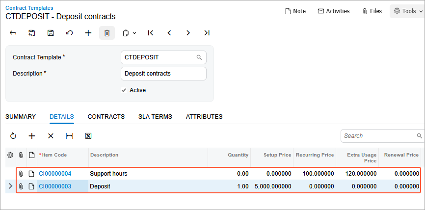

# Contract Template Creation: To Create a Deposit Contract Template {#_5ce53a8a-e5da-4c0e-afb7-fb872287c068 .task}

In this activity, you will learn how to create deposit contract template.

**Attention:** This activity is based on the *U100* dataset. If you are using another dataset or if any system settings have been changed in *U100*, these changes can affect the workflow of the activity and the results of the processing. To avoid issues, restore the *U100* dataset to its initial state.

## Story { .section}

Suppose that the Citrus Store customer wants to purchase a fixed number of support hours in advance, for which the SweetLife Fruits &amp; Jams company offers a discount. According to the terms of the deposit contract, the customer pays a deposit in advance for work that will be performed later, and the total price of the provided service will be deducted from the deposit in parts upon completion of service.

According to the terms of the contract, SweetLife will receive an advance payment from the Citrus Store in the amount of $5,000. SweetLife's employees will provide consulting services in total on 50 support hours by discounted price in the amount of $100 per hour. All support hours beyond the included hours will be billed at a higher price in the amount of $120 per hour. The billing of the contract will be performed on demand.

Acting as a sales manager, you will create a deposit contract template.

## Configuration Overview { .section}

In the *U100* dataset, the following tasks have been performed to support this activity:

-   On the [Enable/Disable Features](CS_10_00_00.md) \(CS100000\) form, the *Contract Management* feature has been enabled.
-   On the [Customers](AR_30_30_00.md) \(AR303000\) form, the *CITRUS \(Citrus Store\)* customer has been created.

## Process Overview { .section}

In this activity, on the [Contract Templates](CT_20_20_00.md) \(CT202000\) form, you will create a new deposit contract template.

## System Preparation { .section}

To prepare to perform the instructions of this activity, do the following:

1.  As a prerequisite to this activity, complete the [Contract Item Creation: To Create a Deposit Contract Item \(Deposit Contract\)](config_Contract_Management_Implem_Activity_To_Configure_Deposit_Contract_Item.md) to create the *Deposit* and *Support hours* contract items you will use during the creation of the deposit contract template.
2.  To prepare to perform the instructions of this activity, launch the Acumatica ERP website with the *U100* dataset preloaded, and sign in as the sales manager David Chubb using the *chubb* username and the *123* password.

## Step: Creating a Deposit Contract Template {#section_klq_4gh_2tb .section}

To create a template for deposit contracts, proceed as follows:

1.  On the [Contract Templates](CT_20_20_00.md) \(CT202000\) form, add a new record.
2.  In the **Contract Template** box of the Summary area, type `CTDEPOSIT`.
3.  In the **Description** box, type `Deposit contracts`.
4.  On the **Summary** tab, do the following:
    1.  In the **Contract Type** box, select *Unlimited*.

        A contract of this type has no expiration date, and you can terminate the contract at any time.

    2.  Select the **Automatically Release AR Documents** check box so that the invoices and credit memos are automatically released when the contract is billed.
    3.  In the **Billing Period** box, select *On Demand*, which indicates that billing is not scheduled for the contracts based on this template, and you will be able to run contract billing whenever you need to bill the customer for the services you have provided.
5.  On the **Details** tab, add a row, and select the contract item with description *Support hours*.

    When you add a contract item to a contract template, the system checks whether the contract item is associated with a deposit. If this association exists but the deposit is not yet included in the contract template, the deposit contract item\(*CI00000003 \(Deposit\)* contract item\) is added automatically.

    

6.  In the Summary area, make sure the **Active** check box is selected so that users can create contracts based on the template.
7.  On the form toolbar, click **Save**.

You have created the deposit contract template you will use to create and activate a deposit contract.

**Parent topic:**[Creating Contract Templates](../UserGuide/Contracts_Configuring_Contract_Templates_Mapref.md)

