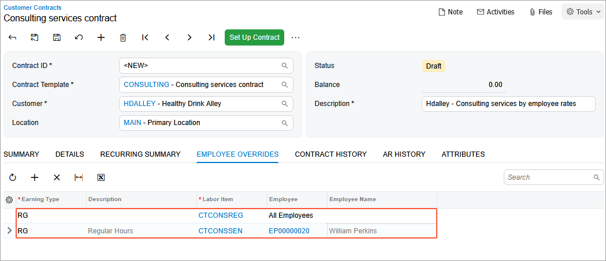
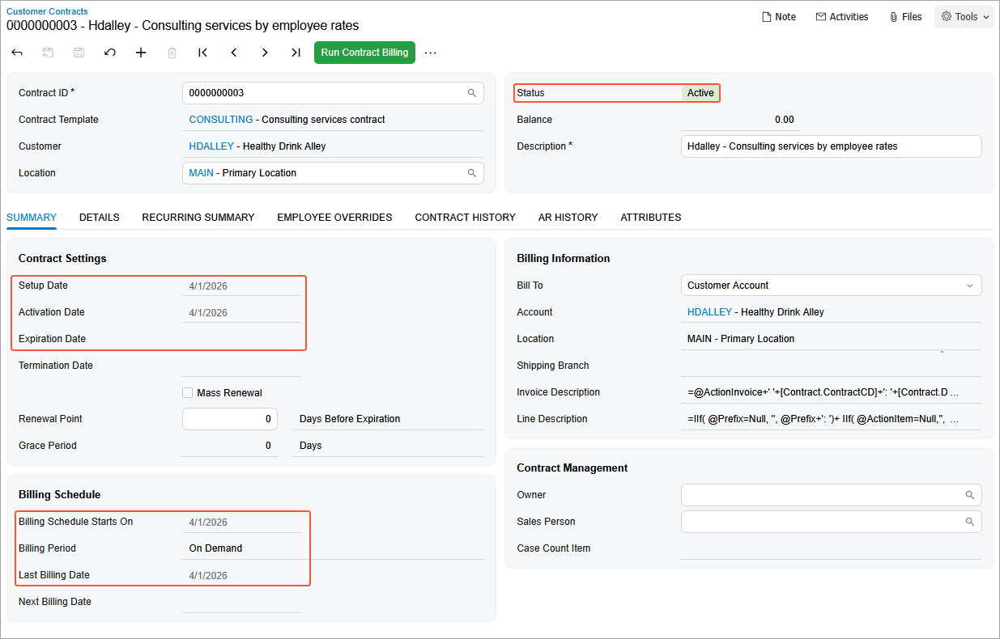

# Contract Setup and Activation: To Create and Activate an Empty Consulting Contract Draft {#_133c8b62-b7ea-43bf-b181-aba09969c1a9 .task}

In this activity, you will learn how to create an empty contract draft for consulting contract and activate it.

**Attention:** This activity is based on the *U100* dataset. If you are using another dataset or if any system settings have been changed in *U100*, these changes can affect the workflow of the activity and the results of the processing. To avoid issues, restore the *U100* dataset to its initial state.

## Story { .section}

Suppose that after purchasing the juicers, the Healthy Drink Alley customer needs a consulting contract to teach employees about the proper use of juicers and related equipment. This service is provided by the SweetLife Fruits &amp; Jams company's consultants of different qualifications: senior consultants, whose services cost $120 per hour, and regular consultants, whose services cost $100 per hour.

According to the terms of the contract, in April 2026, the customer obtains consulting in the amount of 20 hours from the senior consultant William Perkins, and in the amount of 4 hours from the consultant David Chubb for the total amount of $2,800. The billing of the contract will be performed on demand and on per-activity basis.

Acting as a sales manager, you will create an empty contract whose terms determine prices depending on the skills and position of the consulting specialist, who can be a regular specialist or a senior consultant. Then you will activate the contract.

## Process Overview { .section}

In this activity, on the [Segmented Keys](CS_20_20_00.md) \(CS202000\) form, you will first configure the system to assign automatically numbered identifiers to contracts. On the [Accounts Receivable Preferences](AR_10_10_00.md) \(AR101000\) form, you will configure the settings of the accounts receivable functionality.Then on the [Customer Contracts](CT_30_10_00.md) \(CT301000\) form, you will create an empty consulting contract with *Draft* status. Then you will set up and activate the contract simultaneously.

## Configuration Overview { .section}

In the *U100* dataset, the following tasks have been performed to support this activity:

-   On the [Enable/Disable Features](CS_10_00_00.md) \(CS100000\) form, the *Contract Management* feature has been enabled.
-   On the [Customers](AR_30_30_00.md) \(AR303000\) form, the *HDALLEY \(Healthy Drink Alley\)* customer has been created.

## System Preparation { .section}

To prepare to perform the instructions of this activity, do the following:

1.  As a prerequisite to this activity, complete [Contract Template Creation: To Create an Empty Consulting Contract Template](config_Contract_Management_Implem_Activity_To_Create_Empty_Template.md) activity to create the empty contract template you will use to create the contract draft.
2.  Launch the Acumatica ERP website with the *U100* dataset preloaded, and for Step 1 and Step 2 sign in to the system as a system administrator Kimberly Gibbs by using the *gibbs* username and the *123* password. For Step 3 and Step 4 sign in as the sales manager David Chubb by using the *chubb* username and the *123* password.
3.  In the info area, in the upper-right corner of the top pane of the Acumatica ERP screen, make sure that the business date in your system is set to *4/1/2026*.

## Step 1: Enabling Auto-Numbering for Contracts {#section_it1_qf1_dt .section}

In Acumatica ERP, contract identifiers are created based on the *CONTRACT* segmented key. To configure the system to assign automatically numbered identifiers to contracts, on the [Segmented Keys](CS_20_20_00.md) \(CS202000\) form, do the following:

1.  On the Summary area in the **Segmented Key ID** box, select *CONTRACT*.
2.  Click **Edit** to the right of the **Numbering ID** box to review the configuration of the *CONTRACT* numbering sequence on the [Numbering Sequences](CS_20_10_10.md) \(CS201010\) form. This predefined numbering sequence is used in the *CONTRACT* segmented key by default.
3.  Close the [Numbering Sequences](CS_20_10_10.md) form.
4.  In the table on the [Segmented Keys](CS_20_20_00.md) form, select the **Auto Number** check box for the only row, which contains the settings of the single segment included in the segmented key.

    Contract identifiers can be defined to include multiple segments. However, automatic numbering can be enabled for only one segment. Note that the length of the auto-numbered segment must match the length of the numbering sequence specified in the **Numbering ID** box.

5.  On the form toolbar, click **Save**.

## Step 2: Configuring the Settings of the Accounts Receivable Functionality {#section_mss_4f1_dt .section}

To be able to use the needed accounts receivable functionality, on the [Accounts Receivable Preferences](AR_10_10_00.md) \(AR101000\) form, do the following:

1.  On the **General** tab, clear the **Hold Documents on Entry** check box.

    With this check box cleared, any invoice issued when a contract is billed will have the *Balanced* status.

2.  On the form toolbar, click **Save**.

## Step 3: Creating an Empty Contract Draft {#section_tl3_2lr_dtb .section}

To create an empty contract draft for consulting contract, do the following:

1.  Sign in to the system as a sales manager by using the *chubb* username and the *123* password.
2.  On the [Customer Contracts](CT_30_10_00.md) \(CT301000\) form, add a new record.
3.  In the Summary area, specify the contract settings as follows:
    1.  In the **Contract Template** box, select *CONSULTING*.
    2.  In the **Customer** box, select *HDALLEY*.
    3.  In the **Description** box, type `Hdalley - Consulting services by employee rates`.
4.  On the **Employees Overrides** tab, add two rows to the table to specify the relations between the earning types, labor items, and employees. In the rows, enter the settings in the following table \(as shown in the following screenshot\). A relation determines which labor item will be used as the source of the service price and the sales accounts for recording the contract usage.

    |Earning Type|Labor Item|Employee|
    |------------|----------|--------|
    |*RG*|*CTCONSREG*|Leave empty \(when you leave this column empty, the system inserts the *All Employees* value\)|
    |*RG*|*CTCONSSEN*|*EP00000020 - William Perkins*|

    Thus, the *CTCONSREG* labor item will be used for recording contract usage based on the activities performed during regular hours by any consultant except William Perkins, a senior consultant, whose rate is defined by the *CTCONSSEN* labor item \(see the following screenshot\).

    

5.  On the form toolbar, click **Save**.

## Step 4: Setting Up and Activating the Contract Simultaneously { .section}

To set up and activate the consulting contract simultaneously, do the following:

1.  On the [Customer Contracts](CT_30_10_00.md) \(CT301000\) form, open the *Hdalley - Consulting services by employee rates* contract you have created in Step 3.
2.  On the More menu \(under **Processing**\), click **Set Up and Activate Contract** to activate the contract.
3.  In the **Activation Date** box of the **Activate Contract** dialog box, which opens, leave *4/1/2026* in the **Activation Date** box, and then click **OK**.

    After the contract is set up and activated, notice the following \(see the screenshot below\):

    -   The contract now has the *Active* status.
    -   The setup and activation dates have become unavailable for editing.
    -   The expiration date is empty because the contact template that you have specified for the contract is of the *Unlimited* type.
    -   The *Next Billing Date* box is empty because the contract template that you have specified for the consulting contract has *On Demand* billing period in the **Summary** tab \(**Billing Settings** section\) of the [Contract Templates](CT_20_20_00.md) \(CT202000\) form.
    -   The boxes in the **Billing Schedule** section have been populated based on the template settings and the activation date that you have specified.
    -   No invoice has been generated on initiation of an empty contract, so the table on the **AR History** tab of the form is still empty.
    

You have created the empty consulting contract and activated it.

**Parent topic:**[Setting Up and Activating Contracts](../UserGuide/Contracts_Setting_Up_Contracts_Mapref.md)

