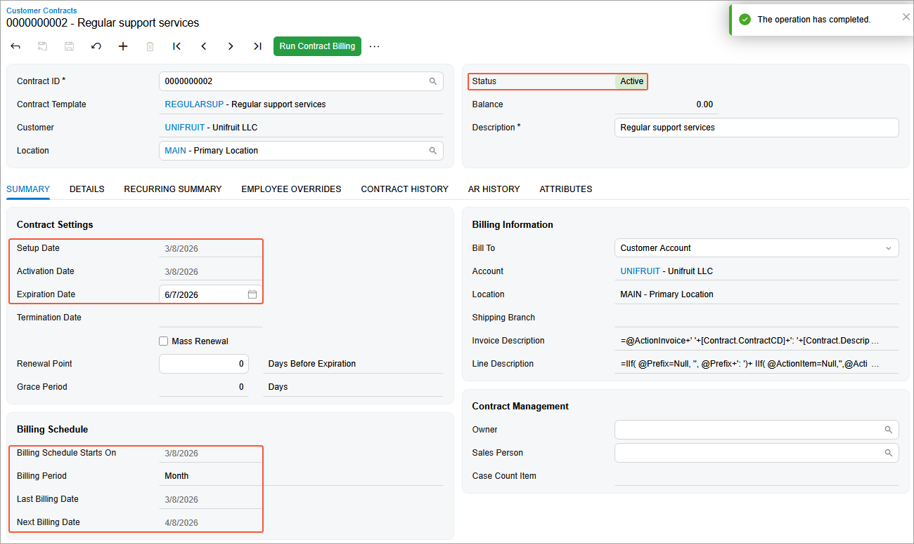

# Contract Setup and Activation: To Create and Activate an Empty Support Contract Draft {#_82afe9cb-d01a-4c10-9354-3c419e7be5db .task}

In this activity, you will learn how to create an empty contract draft for a support contract and activate it.

**Attention:** This activity is based on the *U100* dataset. If you are using another dataset or if any system settings have been changed in *U100*, these changes can affect the workflow of the activity and the results of the processing. To avoid issues, restore the *U100* dataset to its initial state.

## Story { .section}

Suppose that the SweetLife Fruits &amp; Jams company, in addition to deploying juicers, also specializes in providing maintenance. The Unifruit LLC customer previously purchased juicers and now needs to enter into a maintenance support contract. On *3/8/2026*, the support contract was signed by both parties.

According to the terms of the contract, it has the *Expiring* type, and the contract span is three months. On *3/10/2026*, the service under the contract was provided by one regular specialist for four hours for a total sum of $480. This service was reflected in the system in a separate case.

The service of maintenance specialists costs $120 per hour, and the price is not dependent on the skills and position of the employee. The billing of the contract will be performed monthly and on a per-case basis.

Acting as a sales manager, you will create an empty contract draft for a support contract and activate it.

## Process Overview { .section}

In this activity, on the [Segmented Keys](CS_20_20_00.md) \(CS202000\) form, you will first configure the system to assign automatically numbered identifiers to contracts. On the [Accounts Receivable Preferences](AR_10_10_00.md) \(AR101000\) form, you will configure the settings of the accounts receivable functionality. Then on the [Customer Contracts](CT_30_10_00.md) \(CT301000\) form, you will create an empty support contract with *Draft* status. Then you will set up and activate the contract simultaneously.

## Configuration Overview { .section}

In the *U100* dataset, the following tasks have been performed to support this activity:

-   On the [Enable/Disable Features](CS_10_00_00.md) \(CS100000\) form, the *Contract Management* feature has been enabled.
-   On the [Customers](AR_30_30_00.md) \(AR303000\) form, the *UNIFRUIT \(Unifruit LLC\)* customer has been created.

## System Preparation { .section}

To prepare to perform the instructions of this activity, do the following:

1.  As a prerequisite to this activity, complete the [Contract Template Creation: To Create an Empty Support Contract Template](config_Contract_Management_Implem_Activity_To_Configure_Empty_Support_Contract.md) activity to create the empty contract template that you will use during the creation of the empty contract draft for the support contract.
2.  Launch the Acumatica ERP website with the *U100* dataset preloaded, and for Step 1 and Step 2 sign in to the system as a system administrator Kimberly Gibbs by using the *gibbs* username and the *123* password. For Step 3 and Step 4 sign in as the sales manager David Chubb by using the *chubb* username and the *123* password.
3.  In the info area, in the upper-right corner of the top pane of the Acumatica ERP screen, make sure that the business date in your system is set to *3/8/2026*.

## Step 1: Enabling Auto-Numbering for Contracts {#section_it1_qf1_dt .section}

In Acumatica ERP, contract identifiers are created based on the *CONTRACT* segmented key. To configure the system to assign automatically numbered identifiers to contracts, on the [Segmented Keys](CS_20_20_00.md) \(CS202000\) form, do the following:

1.  On the Summary area in the **Segmented Key ID** box, select *CONTRACT*.
2.  Click **Edit** to the right of the **Numbering ID** box to review the configuration of the *CONTRACT* numbering sequence on the [Numbering Sequences](CS_20_10_10.md) \(CS201010\) form. This predefined numbering sequence is used in the *CONTRACT* segmented key by default.
3.  Close the [Numbering Sequences](CS_20_10_10.md) form.
4.  In the table on the [Segmented Keys](CS_20_20_00.md) form, select the **Auto Number** check box for the only row, which contains the settings of the single segment included in the segmented key.

    Contract identifiers can be defined to include multiple segments. However, automatic numbering can be enabled for only one segment. Note that the length of the auto-numbered segment must match the length of the numbering sequence specified in the **Numbering ID** box.

5.  On the form toolbar, click **Save**.

## Step 2: Configuring the Settings of the Accounts Receivable Functionality {#section_mss_4f1_dt .section}

To be able to use the needed accounts receivable functionality, on the [Accounts Receivable Preferences](AR_10_10_00.md) \(AR101000\) form, do the following:

1.  On the **General** tab, clear the **Hold Documents on Entry** check box.

    With this check box cleared, any invoice issued when a contract is billed will have the *Balanced* status.

2.  On the form toolbar, click **Save**.

## Step 3: Configuring an Empty Contract {#section_a3r_2zs_dtb .section}

To create an empty support contract, do the following:

1.  Sign in to the system as a sales manager by using the *chubb* username and the *123* password.
2.  On the [Customer Contracts](CT_30_10_00.md) \(CT301000\) form, add a new record.
3.  In the Summary area, do the following:
    1.  In the **Contract Template** box, select *REGULARSUP*. The system will automatically fill in the billing policy settings with those of the selected template.
    2.  In the **Customer** box, select *UNIFRUIT*.
4.  On the form toolbar, click **Save**.

## Step 4: Setting Up and Activating the Contract Simultaneously { .section}

To set up and activate the consulting contract simultaneously, do the following:

1.  On the [Customer Contracts](CT_30_10_00.md) \(CT301000\) form, open the *Regular support services\)*contract you have created in Step 3.
2.  On the More menu \(under **Processing**\), click **Set Up and Activate Contract** to activate the contract.
3.  In the **Activation Date** box of the **Activate Contract** dialog box, which opens, leave *3/8/2026*, and then click **OK** \(see the screenshot below\). After the contract is set up and activated, notice the following:

    -   The contract now has the *Active* status.
    -   The setup and activation dates have become unavailable for editing.
    -   The **Expiration Date** is *6/7/2026* and the boxes in the **Billing Schedule** section have been populated based on the template settings and the activation date that you have specified.
    -   The next billing date is *4/8/2026*.
    -   No invoice has been generated on the initiation of an empty contract, so the table on the **AR History** tab of the form is still empty.
    

You have created the empty support contract and activated it. Now you can proceed to creating the case usage for the support contract.

**Parent topic:**[Setting Up and Activating Contracts](../UserGuide/Contracts_Setting_Up_Contracts_Mapref.md)

